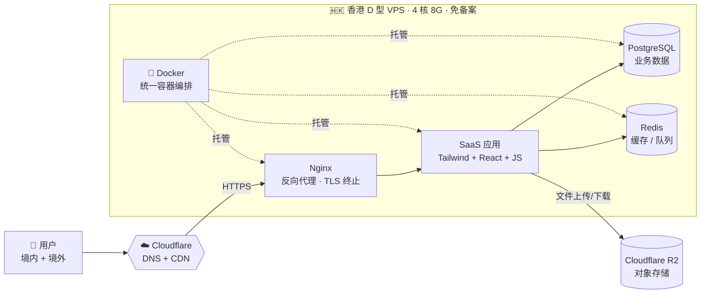

# AGENTS.md — MESA Recruit

面向 AI 代理（**Claude Code / Codex CLI / Cursor 等**）与人工贡献者的项目工作守则。
读完这一份就能上手干活，不要在没读完之前动文件。

> 📌 **本文件是双 AI 共用守则**：
> - **Claude Code** 同时读取 `CLAUDE.md` 与本文件。两份冲突时以**更严格**的为准；Claude 特有的工作流偏好（如必须用浏览器 MCP 验证 UI）见 `CLAUDE.md §4 / §9`。
> - **Codex CLI** 默认**只读本文件**，所以任何对 Codex 也成立的约束，必须写进本文件，不要只写在 `CLAUDE.md` 里。
> - SaaS 演进的分阶段 checklist **以 [`demo.md`](./demo.md) 为权威**，本文件 §10 只补充 AI 协作守则。

---

## 1. 项目是什么

**MESA Recruit · UI Kit** —— 一个 AI 原生招聘产品的高保真前端原型。
设计参考 Horizon UI / Tailwind React，配色和组件样式直接对齐 `MESA/src/*`（外部仓库）。

当前阶段：纯前端点击通 demo，所有数据来自 `data.js` 里的 mock。
未来阶段：`data.js` 的候选人数据来自 LLM（Kimi / DeepSeek）解析简历的真实结果，并最终演进为一套部署在香港 VPS 上的 SaaS 应用。

主要演示流程：侧栏导航 → 概览 → 候选人列表 → 候选人详情 → 岗位流水线 → 简历上传。

### 1.1 当前阶段 vs 最终目标

| 维度 | 当前（UI Kit demo） | 最终（SaaS 生产形态） |
|------|---------------------|------------------------|
| 前端栈 | React 18 UMD + Tailwind Play CDN + Babel Standalone（无构建） | **Tailwind CSS + React + JS**（产物形态待定，技术语义不变） |
| 数据 | `data.js` mock | PostgreSQL 持久化 + LLM 解析结果 |
| 部署 | `index.html` 直开 / `python3 -m http.server` | 香港 D 型 VPS（4 核 8G，免备案） |
| 接入层 | 无 | Cloudflare DNS + CDN → Nginx 反向代理 |
| 存储 | 无 | PostgreSQL（结构化）+ Redis（缓存/队列）+ Cloudflare R2（文件） |
| 运行方式 | 浏览器 | Docker 容器化 |

> 当前任何对 `ui_kits/mesa-recruit/` 的改动**仍然按 §2 「无构建」约束执行**。
> 目标架构只用于规划与对齐，**不要因为「最终要上 SaaS」就提前引入构建工具 / 后端依赖**。
> 任何向最终架构迁移的动作，都需要用户明确确认范围。

### 1.2 目标部署架构（最终形态）



### 1.3 双 AI 协作差异（Claude Code vs Codex CLI）

两类 AI 代理可能同时在本仓库工作，能力与默认行为不一致，**AI 自己要清楚自己「能做什么」**：

| 维度 | Claude Code | Codex CLI |
|------|-------------|-----------|
| 默认读取项目指令 | `CLAUDE.md` + `AGENTS.md`（本文件） | **只读 `AGENTS.md`** |
| 浏览器自动化 | Playwright MCP / `dev-browser` / `webapp-testing` 技能 | 通常无浏览器 MCP，需用户终端配合或手动截图 |
| 文档查询 | Context7 MCP / `WebFetch` | 一般依赖搜索/curl，无 Context7 |
| 长任务 | `run_in_background` + 事件回灌 | shell `&` 自管，无事件回灌 |
| 技能 (Skills) | 丰富（`pretty-mermaid` / `docx` / `pdf` / `webapp-testing` …） | 无 Skills，等价能力需脚本化 |
| 子代理 (Subagents) | 支持 `Agent` 工具拆分调研/实现 | 不支持，靠多轮对话或本地分支 |

**对两类 AI 共同生效的硬约束**：
1. **UI 改动不能只靠静态检查**。Claude Code 必须按 §5 在浏览器里点一遍；Codex CLI 如果**无法**在浏览器里验证，必须在交付说明里**显式写出**「未在浏览器验证 + 原因 + 风险」，由用户人工补验。
2. **不主动** `git commit` / `git push` / 创建 PR / 启动 ultrareview / 执行 SSH 到生产 / 调用 Cloudflare 写接口 —— 全部需用户明确指令。
3. 长驻进程统一用各自的后台机制（Claude: `run_in_background`；Codex: `nohup … &` 或 tmux），并在交付时说明如何停止。
4. 任何凭证、Token、密码、API Key **永远**不写入代码、注释、commit message、mock 数据。

**为什么是这套组合**：
- **香港 D 型 VPS（4C8G，免备案）**：单节点能同时服务中国大陆和海外用户，免去 ICP 备案周期；规格够跑「Nginx + 应用 + Postgres + Redis」全套容器。
- **Cloudflare DNS + CDN**：静态资源走 CDN 边缘节点，减轻 VPS 出口压力；同时承担域名解析、WAF、HTTPS 边缘卸载。
- **Cloudflare R2**：简历 / 头像 / 附件等大文件不入库，零出口流量费，跟 Cloudflare 边缘网络直连。
- **Docker**：所有进程统一以容器形态运行，方便整机迁移与回滚。
- **PostgreSQL + Redis**：前者承载候选人 / 岗位 / 员工等强一致业务数据；后者承载会话、限流、解析任务队列。

---

## 2. 技术栈与「无构建」约定（重要）

> 📌 **范围说明（demo.md 阶段① 完成后更新）**：以下「无构建」约束**只适用于 `ui_kits/mesa-recruit/`**。
> 阶段① 后新增的两个目录走标准 npm + 构建工具,不在此约束内:
> - `server/` — Fastify + Prisma + PostgreSQL + Redis(详见 `server/README.md`)
> - `web/` — Vite + React 18 + Tailwind 生产前端(详见 `web/README.md`)
>
> 两套前端**并存**: `ui_kits/mesa-recruit/` 继续作为设计参考与点击通 demo;`web/` 是 SaaS 演进路径上的真实生产前端,组件会逐步从 UI Kit 移植过去。

### 2.0 `ui_kits/mesa-recruit/` 仍然遵守的约定

| 维度 | 选择 |
|------|------|
| React | 18.3.1 via `unpkg` UMD（开发版） |
| JSX 编译 | `@babel/standalone` 浏览器内即时编译 |
| 样式 | Tailwind Play CDN + `colors_and_type.css` 设计令牌 |
| 图标 | Lucide CDN（替代真实仓库的 `react-icons`，视觉接近但非 1:1） |
| 字体 | Google Fonts（DM Sans + Poppins）+ 本地 `Gill Sans Nova` |
| 包管理 | **无** — 没有 `package.json`、`node_modules`、`vite`、`webpack` |
| 构建 | **无** — 直接用浏览器打开 `index.html` 即可运行 |

> ⛔ **不要**擅自把 `ui_kits/mesa-recruit/` 引入 npm / pnpm / vite / 任何打包器。
> ⛔ **不要**把 UI Kit 里的 `.jsx` 改写成 ESM `import/export`。
> ⛔ **不要**替换 CDN 为 npm 依赖。
> ✅ 如果你认为有充分理由把 UI Kit 也工程化（替代而非新建 `web/`），先在结果里写清动机、影响范围、回滚路径，等用户确认。

### 2.1 运行时结构图（一图看懂「无构建 + 全局命名空间」）

```mermaid
flowchart TB
    Browser(["🌐 浏览器打开 index.html"])

    subgraph CDN["运行时依赖（CDN · 零安装 · 零构建）"]
        direction LR
        R["React 18 UMD"]
        B["Babel Standalone<br/>浏览器内 JSX → JS"]
        T["Tailwind Play CDN<br/>+ 内联 tailwind.config"]
        L["Lucide Icons"]
    end

    subgraph Load["脚本加载顺序 = 依赖顺序（index.html 按序声明）"]
        direction TB
        L1["1 · data.js"]
        L2["2 · Primitives.jsx"]
        L3["3 · ShareModal / ProfileMenu"]
        L4["4 · Sidebar / Topbar"]
        L5["5 · 页面组件<br/>Dashboard · Candidates · CandidateDetail<br/>Jobs · Upload · Staff · NewHire<br/>Departments · EmployeeDetail"]
        L6["6 · App.jsx"]
        L7["7 · ReactDOM.createRoot(#root)"]
        L1 --> L2 --> L3 --> L4 --> L5 --> L6 --> L7
    end

    subgraph Win["window 全局命名空间（唯一跨文件通讯方式）"]
        direction LR
        Data["📊 window.MESA_*<br/>━━━━━━━━━━<br/>CANDIDATES · JOBS · EMPLOYEES<br/>DEPARTMENTS · ACCOUNTS<br/>STATUS_ORDER · STATUS_TONE<br/>HIRE_STAGES · HIRE_STAGE_TONE<br/>TASK_STATUS_TONE · …"]
        Comps["🧩 window.{Components}<br/>━━━━━━━━━━<br/>Card · Button · Input · I<br/>StatusPill · AiBadge · MatchRing<br/>Sidebar · Topbar · App<br/>Dashboard · Candidates · …"]
    end

    Browser --> CDN
    Browser --> Load
    L1 -. 写入 .-> Data
    L2 -. Object.assign .-> Comps
    L3 -. Object.assign .-> Comps
    L4 -. Object.assign .-> Comps
    L5 -. Object.assign .-> Comps
    L6 -. Object.assign .-> Comps
    L7 ==读取==> Data
    L7 ==读取==> Comps
```

**读这张图的三条结论**：
1. 整个项目的「构建」就是浏览器装一次 CDN + Babel 现场编译，**改完 .jsx 刷新页面即可**，没有任何中间产物；
2. `index.html` 的 `<script>` 顺序就是依赖图 —— 新增组件**必须**插对位置（原子在前、组合在后），否则 `Object.assign` 之前的引用会拿到 `undefined`；
3. 跨文件通讯**只走 `window`**，没有 `import` / `export`。新增组件记得在文件尾 `Object.assign(window, { Foo })`，新增数据记得 `window.MESA_FOO = …`。

---

## 3. 目录结构

```
mesa/
├── colors_and_type.css        # 设计令牌（颜色 / 字体 / 阴影 / 圆角）— 唯一样式真相源
├── fonts/                     # 自带字体（Gill Sans Nova）
├── assets/                    # 头像、logo、profile banner 等静态图
├── uploads/                   # 产品参考素材（CSV/XLSX/PNG），LLM 简历解析的样例输入
└── ui_kits/
    └── mesa-recruit/          # 唯一可运行的 UI Kit
        ├── index.html         # 入口；定义 Tailwind 配置 + 加载所有脚本
        ├── data.js            # window.MESA_* 全局 mock 数据
        ├── App.jsx            # 顶层 shell：Sidebar + Topbar + 路由
        ├── Sidebar.jsx / Topbar.jsx
        ├── Primitives.jsx     # 共享原子组件（Card/Button/Input/AiBadge/MatchRing/…）
        ├── Dashboard.jsx / Candidates.jsx / CandidateDetail.jsx
        ├── Jobs.jsx / Upload.jsx
        ├── Staff.jsx / NewHire.jsx / Departments.jsx / EmployeeDetail.jsx
        ├── ProfileMenu.jsx / ShareModal.jsx
        └── README.md          # UI Kit 自身的说明（点击通契约、组件清单）
```

---

## 4. 代码约定（**必读**）

### 4.1 全局命名空间约定
- 每个 `.jsx` 文件结尾通过 `Object.assign(window, { Foo, Bar })` 暴露组件。
- 跨文件**不要 import**，直接读 `window.Foo` 即可（顶层作用域里也能直接用 `Foo`）。
- 数据全部挂在 `window.MESA_*`：
  - `MESA_CANDIDATES` · `MESA_JOBS` · `MESA_EMPLOYEES` · `MESA_DEPARTMENTS`
  - `MESA_STATUS_ORDER` · `MESA_STATUS_TONE` · `MESA_HIRE_STAGES` · `MESA_HIRE_STAGE_TONE`
  - `MESA_TASK_STATUS_TONE` · `MESA_HIRE_CHECKLIST_KEYS` · `MESA_DEPT_MIGRATION`
  - `MESA_ACCOUNTS` · `MESA_CURRENT_USER_ID`
- React Hooks 在 `Primitives.jsx` 顶部解构：`const { useState, useEffect, useRef } = React;`，其余文件直接用。

### 4.2 脚本加载顺序很关键
`index.html` 的脚本加载顺序就是依赖顺序：`data.js → Primitives → ShareModal/ProfileMenu → Sidebar/Topbar → 页面 → App`。
**新增组件时**：在 `index.html` 的对应位置插入 `<script type="text/babel" data-presets="react" src="…">`，原子在前、组合在后。

### 4.3 样式 / Tailwind / 颜色
- 优先用 `colors_and_type.css` 的 CSS 变量；Tailwind 工具类里可以直接写品牌色十六进制（与现有代码一致）。
- 品牌色：`#422AFB`（primary）/ `#3311DB`（hover）/ `#2111A5`（active）。
- 文本主色：`#1B254B`（navy-700）；次级 `#707EAE`；占位 `#A0AEC0`；分割线 `#E9ECEF`。
- 页面背景：`#F4F7FE`（lightPrimary）。
- 圆角：组件卡片 `rounded-[20px]`，按钮/输入 `rounded-xl`。
- 阴影：卡片统一 `shadow-[14px_17px_40px_4px_rgba(112,144,176,0.08)]`。
- 字体：UI 文本 DM Sans；标题 / wordmark Poppins；品牌 accent `Gill Sans Nova`。

### 4.4 组件 API 习惯
- 卡片类组件接受 `className` 与 `extra` 两个 prop（`extra` 是 Horizon UI 留下的传统，用于追加间距类）。
- 图标统一用 `<I name="lucide-icon-name" size={…} />`（定义在 `Primitives.jsx`）。
- 状态色调用 `MESA_STATUS_TONE[status]` / `MESA_HIRE_STAGE_TONE[stage]` 取，**不要再手写色值**。

### 4.5 路由 / 状态
- `App.jsx` 是唯一的路由真相：`page` / `candidateId` / `employeeId` / `uploadOpen` 都在这里。
- 跳转通过 props 回调（`onNavigate`、`onOpenCandidate`、`onOpenEmployee`）。
- 当前用户：`window.MESA_CURRENT_USER_ID` + 自定义事件 `mesa-user-changed`。

### 4.6 中文/UI 文案
- UI 文案以中文为主，技术术语保留英文（JD、AI、Kimi、DeepSeek 等）。
- 不要随手把中文文案改成英文。

---

## 5. 怎么运行 / 怎么验证

```bash
# 方式 A：直接打开（最简单）
open ui_kits/mesa-recruit/index.html

# 方式 B：本地静态服务器（推荐，避免某些浏览器对 file:// 的字体/CORS 限制）
cd ui_kits/mesa-recruit && python3 -m http.server 5173
# 然后访问 http://localhost:5173
```

**自检清单**（改完代码请至少跑完这条路径）：
1. 打开页面默认进入 `candidates`，列表能渲染、过滤、搜索；
2. 点任意候选人 → 进入 `CandidateDetail`，AI 区块（核心技能 / 风险与缺项 / 亮点）正常；
3. 点 `Push to JD` → 状态按 `MESA_STATUS_ORDER` 推进；
4. 侧栏切到 `jobs` / `upload` / `staff` / `newhire` / `departments`，页面不报错；
5. 浏览器 Console 无红色错误（Babel/JSX 编译错误会在这里露馅）。

UI/前端改动 **不能只靠类型检查或单元测试声称完成**，必须在浏览器里点一遍。

---

## 6. 数据 schema 与变更原则

- `data.js` 的字段映射 `uploads/简历_简历_总览.csv`（候选人字段）与部门 / 岗位的内部约定。
- 字段示例：`id / name / education / school / major / yearsExp / appliedFor / jdMatch / status / source / parser / parserConfidence / tags / skills / risks / highlights / experience[] / educationHistory[] / attachment`。
- **不要**随意改字段名或裁剪字段 —— 多个组件按字段名直接读，改名会静默断裂。
- 新增字段：先在 `data.js` 里给所有现有记录填默认值，再消费。

---

## 7. 改动边界与默认范围（与全局 CLAUDE.md 一致）

✅ 做：
- 完成用户明确要求的功能 / 修复 / 视觉调整；
- 最小改动达成目标；
- 复用 `Primitives.jsx` 的现成组件，而非新建相似件。

❌ 默认不做（除非用户明确要求）：
- 重构目录结构 / 拆分文件；
- 引入构建工具 / 包管理器 / TypeScript；
- 替换 CDN / 升级 React 主版本；
- 改 `uploads/` 里的源素材；
- 大段重写 `colors_and_type.css`；
- 创建无人请求的 README/Docs。

---

## 8. 安全与敏感信息

- `Upload.jsx` 中有「自带 Key」入口（Kimi/DeepSeek API Key）。**永远不要**把任何示例 Key、token、密码写进代码、注释、提交信息或 mock 数据。
- 演示用 Key 字段保留为空字符串占位即可。

---

## 9. 交付时请输出

每次较大改动结束，给用户一份小结：
1. 改了哪些文件；
2. 关键变更摘要（为什么这么改）；
3. 在浏览器里验证了什么、看到什么；
4. 已知未验证项、潜在风险与建议。

---

## 10. SaaS 演进路线图（基于 `demo.md` 6 阶段）

> **权威来源**：[`demo.md`](./demo.md) 是从「无构建 UI Kit demo」演进到「云端容器化 SaaS」的完整 checklist。本节只补充 **AI 代理在每个阶段的协作守则与边界**，不复制 demo.md 的具体勾选项；交付时请按 demo.md 原条目对账。

### 10.1 阶段总览（与 demo.md 一一对应）

| 阶段 | demo.md 目标摘要 | 跨阶段动作 | AI 默认行为 |
|------|------------------|------------|--------------|
| ① 本地全栈闭环 | React 路由守卫 / 后端骨架 / PostgreSQL+Redis / 本地 JWT + 代理联调 | **首次引入构建工具 + 后端运行时** | 不主动开工；用户确认后再做选型 |
| ② R2 对象存储接入 | 创建 Bucket / 后端预签名 URL / 前端直传 | 引入 Cloudflare R2 凭证 | 不主动；凭证操作必须用户在场 |
| ③ Docker & Nginx 容器化 | 多阶段 Dockerfile / `nginx.conf` / `docker-compose.yml` | 引入容器化运行 | 改完必须 `docker-compose up --build -d` 本地跑通 |
| ④ Cloudflare 边界 + VPS 加固 | DNS/CDN/WAF + SSL Strict + UFW + 端口不外暴 | 接触**生产服务器与生产 DNS** | 全部需用户明确授权后再执行 |
| ⑤ CI/CD + 数据灾备 | GitHub Actions + `pg_dump` + R2 备份桶 + crontab | 引入生产 secrets | 永不把真实凭证写入代码或日志 |
| ⑥ 交付物打包 | `delivery-docs/*.docx` 4 件套 | 产出正式交付文档 | 文档生成走 `docx` 工具链；交付前与用户对清单 |

### 10.2 跨阶段动作的硬约束

`§7「改动边界与默认范围」` 的「默认不做」清单在阶段 ①~⑥ **仍然有效**。任何想跨越约束的动作，AI 必须：

1. **先在回复里写明**：本次属于 demo.md 哪个阶段、要碰哪些文件、影响范围、回滚路径；
2. **取得用户「继续」**之后再动手；
3. **完成后按 demo.md 原条目对账**：列出本次完成、未完成、跳过的项，不要凭印象写「都做完了」。

### 10.3 各阶段额外守则

- **阶段 ①（本地全栈）**
  - 后端框架与 ORM 是架构决策，**必须由用户决定选型**；AI 只在用户给出选型后落实。
  - `.env` **绝对不入 Git**；`.env.example` 只保留键名 + 注释，不写真实值。
  - 引入构建工具时（例如 Vite / Next）相当于事实上结束「无构建」阶段，必须在 `CLAUDE.md` 与本文件里同步更新 §2 的约束描述。

- **阶段 ②（R2 对象存储）**
  - R2 Access Key / Secret 不写入任何文件、注释、commit message；
  - 上传统一走「后端签发预签名 URL → 前端 `PUT` 直传」，**前端不持有长期凭证**；
  - CORS 白名单严格限制到当前实际域名，不要图省事写 `*`。

- **阶段 ③（Docker & Nginx）**
  - Dockerfile / `nginx.conf` / `docker-compose.yml` 是高风险配置，改完必须本地 `docker-compose up --build -d` 跑通；
  - 端口映射只暴露 `80/443`；**PostgreSQL `5432` 与 Redis `6379` 严禁映射到宿主机公网**；
  - 前端 Nginx 必须配置 `try_files $uri $uri/ /index.html;` 做 SPA 路由兜底（详见 demo.md §3.2）。

- **阶段 ④（Cloudflare 边界 + VPS 加固）**
  - 这是**生产环境改动**。AI 在没有用户明确授权前：
    - **不执行任何 SSH 到生产服务器的命令**；
    - **不调用 Cloudflare 写接口**（DNS / SSL / WAF）；
    - **不修改 UFW 规则**；
  - 用户授权后，所有命令在执行前先 `echo` 一遍给用户确认，再实际跑。

- **阶段 ⑤（CI/CD + 灾备）**
  - 流水线密钥统一走 GitHub Actions Secrets / 服务器 `.env`；占位符要明显（如 `__SET_BY_OPS__`），不要写成可猜测的伪真实值；
  - 备份脚本提交前至少 `bash -n` 做语法检查；建议同时跑一次 `--dry-run` 模式；
  - `crontab` 改动必须 `crontab -l` 备份原表 → 写入新表 → 验证生效。

- **阶段 ⑥（交付物打包）**
  - 4 份 `.docx`（架构 / API / 部署 / 运维灾备）的生成**优先调用 Claude Code 的 `docx` 技能**（Codex 无对应技能时改用 `pandoc` 等命令行工具，但要保留可重复脚本）；
  - 目录固定为仓库根 `/delivery-docs/`；
  - 交付前与用户确认每份文档的覆盖范围；
  - 生产数据库 Seed / 清理脏数据是不可逆动作，**必须在用户授权后操作**，并先备份 (`pg_dump`)。

### 10.4 演进与「无构建 UI Kit」的关系

§2「无构建」约束在阶段 ① 真正落地之前**继续有效**。任何打算把 `ui_kits/mesa-recruit/` 改成 ESM / 构建产物 / 引入 npm 的动作，都必须**显式声明这是阶段 ① 或阶段 ③ 的一部分**，并先取得用户确认。否则按 §7 的「默认不做」拒绝执行。
