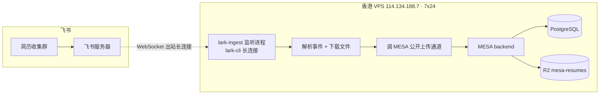
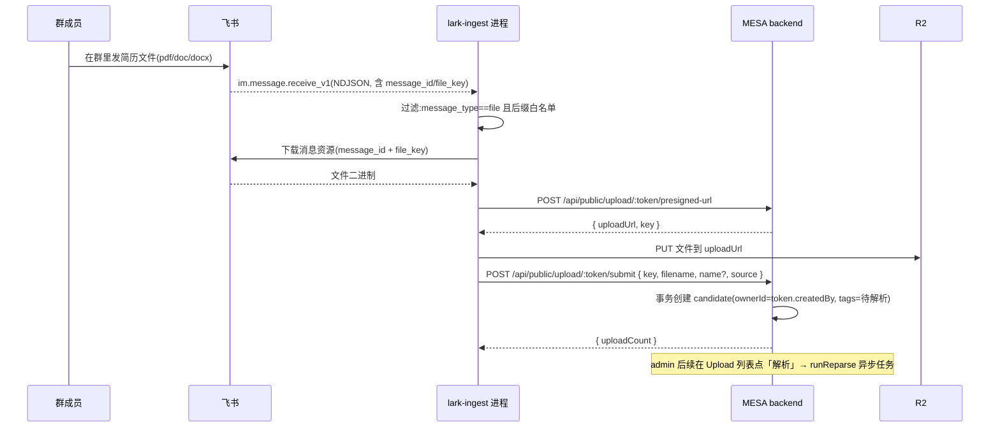
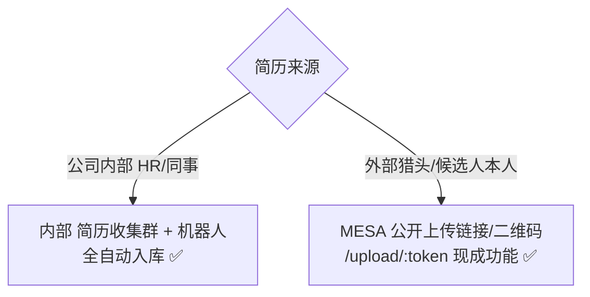

# 飞书群简历自动入库 · 落地方案

> 目标读者:MESA 运维 / 后端 / 招聘业务方
> 状态:**已生产化**(第 6 容器 `mesa-lark-ingest`) · 方案初稿 2026-05-30 · as-built 修订 2026-07-17
> 关联系统:MESA Recruit(`server/` Fastify + R2 + 现有公开上传通道)· 交互助手见 CLAUDE.md §1.1

---

## 1. 背景与目标

### 1.1 需求

招聘过程中,简历经常通过飞书从同事 / 猎头 / 候选人本人处流转过来。当前入库要人工:下载附件 → 打开 MESA Upload 页 → 上传 → 解析。希望把这一步自动化:

> **简历文件被发进指定飞书群 → 自动进入 MESA 待解析候选人池。**

### 1.2 目标(本期 · 已落地)

- 内部「简历收集群」内,任何成员发的 **pdf / doc / docx** 文件 → 自动入库为候选人(`tags=["待解析","公开上传"]`),后续可解析。
- 复用现有公开上传通道;`lark-ingest` 内网直连 `backend:3001`。
- 不暴露新公网端口;卡片按钮回调走已有公网 `/api/feishu/card-callback`(Verification Token)。

### 1.3 边界说明(as-built 校正)

原方案「非目标」中部分能力已扩展上线,以生产代码为准:

| 原非目标 | 现状 |
|----------|------|
| 不监听个人私聊 | **已支持** `chat_type=p2p` 私聊转发文件入库 |
| 不在外部群入库 | **可支持**(需企业飞书认证 + 应用开对外共享) |
| 入库不跑 LLM | **仍成立**(降级入库);卡片「解析」触发异步 `runReparse` |

完整交互(关联/查看/新建 JD · 解析 · 完成后 ShareLink)见 CLAUDE.md §1.1「飞书简历自动入库」。本地调试见 `tools/lark-ingest/README.md`。
---

## 2. 方案选型

### 2.1 为什么不直接用 `shareAI-lab/lark-channel`

`lark-channel` 的定位是「把飞书群变成 **Claude Code agent 的工作区**」(Bun + Python claude-agent-sdk + lark-cli),核心是在群里跑 AI coding agent,**不是文件入库工具**。整体集成会引入 Bun / Python / claude-agent-sdk 等无关运行时,重且偏题。

**但它用的底层 CLI 是对的** —— 官方 `@larksuite/cli`(`larksuite/cli`,Go 二进制)。我们直接用这个 CLI + 少量胶水即可。

### 2.2 选定方案

| 组件 | 选择 | 理由 |
|------|------|------|
| 事件接入 | 官方 `lark-cli` 长连接(WebSocket)订阅 `im.message.receive_v1` | 出站连接,**无需公网回调 / 验签 / 开端口** |
| 文件下载 | `lark-cli` 拉取消息资源(`im:resource`) | 同一 CLI 搞定 |
| 入库 | 复用 MESA 现有**公开上传通道** `/api/public/upload/:token/*` | **后端零改动** |
| 运行宿主 | MESA 香港 VPS(已 7×24) | 不需额外保持开机的机器 |

---

## 3. 总体架构



**关键特性:长连接是 VPS 主动拨向飞书(outbound)**,飞书通过这条连接把事件推回。因此不需要入站端口、不需要 webhook URL、不动防火墙 / Cloudflare。

---

## 4. 数据流(端到端)



---

## 5. 三方配置详解

### 5.1 飞书侧(开放平台后台 open.feishu.cn)

1. 创建**企业自建应用**,开启「机器人」能力。
2. **权限(scope)**:
   | scope | 用途 |
   |-------|------|
   | `im:message.group_msg` | ⭐ 接收群内**全部**消息(无需 @) |
   | `im:resource` | ⭐ 下载消息中的文件资源 |
   | `im:message` | 消息基础读写 |
   | `im:chat:readonly`(可选) | 读取群信息(识别来源群) |
3. **事件订阅**:订阅方式选「**长连接**」(无需配置请求 URL);添加事件 `im.message.receive_v1`。
4. 将机器人**拉入「简历收集群」**(必须是内部群,见 §6)。
5. **发布应用版本**(`im:message.group_msg` 等高权限可能需企业管理员审批)。
6. 记录 **App ID** + **App Secret**(交给 lark-cli)。

### 5.2 lark-cli 侧(VPS 上)

- 安装:`npm install -g @larksuite/cli`(或随监听容器镜像内置)。
- 认证:`lark-cli config init` 填 **App ID / App Secret / region(feishu 国内)**。
- 身份:用 **bot/app 身份**(`--as bot`),`tenant_access_token` 由 CLI 用 App 凭证自动换取并续期。
- **无需** `lark-cli auth login`(那是 user 身份 OAuth,本场景用不上)。
- 凭证落地 VPS 环境变量 / config 文件,**绝不入 git**(遵循 CLAUDE.md §4)。

监听 / 下载命令(已对 lark-cli **v1.0.26** 实测确认):

```bash
# 长连接监听消息事件 —— 内部自动启动 event bus daemon,NDJSON 逐行输出到 stdout
lark-cli event consume im.message.receive_v1 --as bot
#   --quiet         抑制 stderr 提示;--output-dir <dir> 每条事件落一个文件(相对路径)
#   事件确认存在:`lark-cli event list | grep im.message.receive_v1`

# 下载消息里的文件资源(file 类型)
lark-cli im +messages-resources-download \
  --message-id om_xxx --file-key file_xxx --type file \
  --output <相对路径> --as bot
#   --output 省略时按服务端 Content-Disposition 文件名;仅允许相对路径(拒绝 .. 穿越)
```

> 辅助命令:`lark-cli event list`(列全部 EventKey)、`lark-cli event schema im.message.receive_v1`(看字段)、`lark-cli event status` / `event stop`(守护进程状态/停止)。胶水脚本如需更底层控制,可用 `lark-cli api` 直调 OpenAPI 兜底。

**事件 payload 关键字段**(`im.message.receive_v1`,用于胶水解析):
- `event.message.message_id`(`om_xxx`)→ 下载资源用
- `event.message.message_type` == `"file"`(只处理这类;`image`/`text`/`post` 忽略)
- `event.message.content`(JSON 字符串)→ 解析出 `file_key`、`file_name`
- `event.message.chat_id` / `event.sender.sender_id`(来源群 / 发送人,用于来源标注与去重键)

### 5.3 MESA 侧(几乎零代码)

复用现有 `UploadShareLink` 公开上传通道:

1. admin 在 MESA 创建一个**长期上传链接**(现有 UI 功能):
   - `defaultSource = "飞书群"`
   - `maxUploads = null`(不限)或设很大值
   - `expiresAt = forever`
   - `createdBy` = 指定招聘官 → 决定自动入库候选人的 `ownerId`(解决归属)
2. 把该 **token** 配给 VPS 监听进程(环境变量)。
3. 监听进程走现有两个端点:
   - `POST /api/public/upload/:token/presigned-url`
   - `POST /api/public/upload/:token/submit`

| MESA 侧工作 | 改动量 |
|-------------|--------|
| 建长期 UploadShareLink token | **零代码**(点 UI) |
| R2 / 文件白名单(pdf/doc/docx)/ 待解析降级入库 | 已有,复用 |
| 给监听进程的配置 | 2 个环境变量(MESA base url + token) |

> 可选(本期不做):新增带「服务密钥」的内部端点直调 `runParseAndCreate`,跳过公开 token。无必要,公开 token 路径已足够干净。

---

## 6. 外部联系人 / 外部群限制(重要)

飞书规则:**含外部联系人的「外部群」默认不支持添加应用机器人**。要在外部群用机器人,需「企业完成飞书认证 + 自建应用开启『对外共享』权限 + 管理员允许对外沟通」,流程较重。

**本方案采用双通道,绕开外部群限制:**



- **内部来源** → 内部群 + 机器人,全自动,无需任何认证。
- **外部来源** → 用 MESA 已有的公开上传链接 / 二维码(`UploadShareLink` 公开页,设计初衷即给外部人无登录上传)。两条通道最终汇入**同一待解析池**。

> 若未来确需外部群自动化,再单独评估「企业飞书认证 + 对外共享」流程,不在本期范围。

---

## 7. 平台能力边界(不能做的事)

- ❌ 机器人**无法监听用户私聊 DM**(别人发给你本人的消息)。飞书无任何 scope 开放此能力。
- ✅ 机器人能收:发给机器人的私聊、@机器人 的群消息、(开 `im:message.group_msg` 后)群内全部消息。
- ❌「群自定义机器人(webhook)」只能**往群里发**消息,**不能收**,不适用本场景。

---

## 8. 部署形态

推荐:**docker-compose 新增第 6 个常驻容器** `lark-ingest`,与现有 backend/frontend/pg/redis/uptime-kuma 并列。

| 维度 | 设计 |
|------|------|
| 镜像 | 内置 node + `@larksuite/cli` + 胶水脚本 |
| 重启策略 | `restart: unless-stopped` |
| 网络 | 同 compose bridge 网,内网直连 backend(也可走公网域名 + token) |
| 凭证 | 经 `.env`(App ID/Secret、MESA token)注入,**不入镜像、不入 git** |
| 实例数 | **必须单实例**(多实例 = 同一简历重复入库) |
| 断线重连 | 长连接断开自动重连 + 退避;进程崩溃由 compose 拉起 |
| 日志 | stdout → docker logs;关键事件(收到/入库/失败)结构化打印 |

替代形态:systemd service(`Restart=always`)。**不推荐**塞进 backend 进程(耦合,backend 重启会断监听)。

---

## 9. 关键实现要点

1. **事件过滤**:仅处理 `message_type == "file"`;按文件名后缀白名单 `pdf/doc/docx`(对齐 MESA `ALLOWED_MIME`),其余(文本/图片/表情/链接)忽略。
2. **文件大小**:>20MB 跳过并日志告警(对齐 MESA `MAX_SIZE`)。
3. **去重**:对文件内容做 hash(如 sha256),维护近期已处理集合(内存 + 可选落 Redis),防同一简历被多人转发重复入库。
4. **归属映射(user → owner)**:本期统一用 token.createdBy 决定 `ownerId`。若需「按发送人分派不同招聘官」,后续加一张飞书 open_id → MESA userId 映射表。
5. **来源标注**:`submit` 时传 `source="飞书群"` + 可选发送人姓名(`name`),便于 admin 识别。
6. **失败处理**:下载失败 / presigned 失败 / submit 失败 → 重试有限次,最终失败结构化告警(可推回飞书群一条提示卡 / 或写日志)。
7. **幂等**:以 `message_id` 为幂等键,避免事件重投导致重复入库。
8. **限流**:批量涌入时串行处理 + 轻微节流,避免压垮 R2 / backend。

---

## 10. 安全要点(遵循 CLAUDE.md §4)

- App Secret / MESA token / 任何凭证仅存 VPS `.env`,**绝不入 git / 镜像 / 日志**。
- 上传链接 token 泄露 = 任意人可往池子灌简历 → token 仅配给监听进程,不外发;必要时定期轮换。
- 监听进程只在**专用内部群**启用,避免误收日常工作群的隐私内容。
- 文件强制走 `resumes/public-uploads/` 前缀(现有公开上传逻辑已保证),便于审计。
- 改 `.env` 后需 `docker compose up -d --force-recreate lark-ingest`(对齐踩坑记录 #8)。

---

## 11. 风险与限制

| # | 风险 | 缓解 |
|---|------|------|
| 1 | `im:message.group_msg` 权限可能需企业管理员审批 | 提前与管理员沟通(行政流程,非技术) |
| 2 | 外部群无法加机器人 | 双通道:外部来源走公开上传链接(§6) |
| 3 | 长连接断线丢事件 | 自动重连 + compose 拉起;关键期人工抽查 |
| 4 | 重复入库 | message_id 幂等 + 文件 hash 去重 |
| 5 | 归属语义模糊(群简历投哪个岗) | 统一进待解析池,人工二次分派(同现有公开上传) |
| 6 | 噪音(群里非简历消息) | 严格类型 + 后缀白名单过滤 |
| 7 | 新增常驻进程的运维成本 | 纳入 compose + 日志 + 监控(可挂 Uptime Kuma) |

---

## 12. 工作量与里程碑

| 阶段 | 内容 | 估时 |
|------|------|------|
| M1 | 飞书自建应用申请 + 权限 + 长连接订阅调试(含审批等待) | 0.5–1 天 |
| M2 | lark-ingest 胶水:监听 → 过滤 → 下载 → 对接公开上传通道 | 1–1.5 天 |
| M3 | 去重 / 幂等 / 归属映射 / 失败告警 / 容器化 | 0.5 天 |
| M4 | 联调 + 内部群试运行 + 验收 | 0.5 天 |
| **合计** | | **约 2.5–3.5 人天** |

---

## 13. 验收标准

- [ ] 内部群发 pdf/doc/docx → 5s 内出现在 MESA Upload 列表,`source=飞书群`、`tags` 含「待解析」。
- [ ] 非简历消息(文本/图片)不入库。
- [ ] 同一文件被多人转发,只入库一次。
- [ ] 入库候选人 `ownerId` = 指定招聘官,出现在其候选人池。
- [ ] 监听进程重启 / 断网恢复后能自动重连继续工作。
- [ ] admin 点「解析」可正常触发 LLM 联评(走现有 reparse 流程)。

---

## 14. 回滚方案

- 监听进程独立,**停掉 `lark-ingest` 容器即完全回滚**,不影响 MESA 主站任何功能。
- MESA 侧零代码改动(仅多一个 UploadShareLink token,可随时删除)。
- 飞书应用可下架 / 收回权限,不影响其他系统。

---

## 附:涉及的 MESA 现有实现(便于对接)

- 公开上传端点:`server/src/routes/upload-links.js`
  - `POST /api/public/upload/:token/presigned-url`
  - `POST /api/public/upload/:token/submit`
- 异步解析:`server/src/routes/resumes.js`(`runReparse` / `runParseAndCreate`)
- R2 直传:`server/src/routes/storage.js`(`ALLOWED_MIME`、`MAX_SIZE`、月度分桶)
- 数据模型:`UploadShareLink` / `Candidate`(见 CLAUDE.md §10、§11.5)
