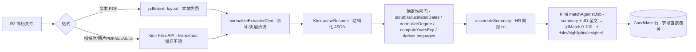
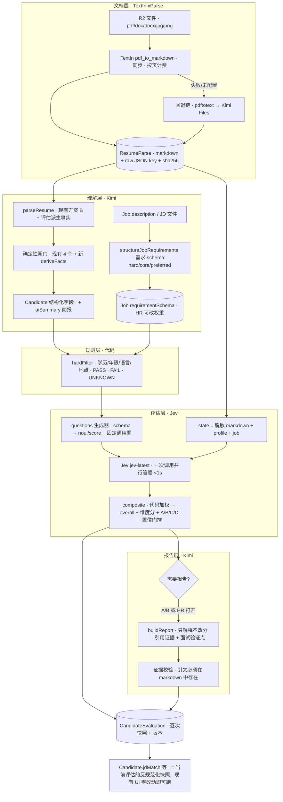

## 0. 一页结论

| 项 | 结论 |
|---|---|
| 可行性 | **可行,且大部分是"加层"而非"重写"**。现有方案 B(Kimi 只出结构化 JSON + 后端确定性拼装)天然就是目标架构的第 2 层,`assembleSummary` / `normalizeDegree` / `computeYearsExp` / `scrubHallucinatedDates` / `parseTaskStore` 全部保留复用 |
| 最大收益 | ① 文档层:扫描件 / 图片 / `.doc` 从「Kimi Files API 90s+ 且不稳定」变成 TextIn 秒级同步解析,顺带支持手机拍照简历(校招扫码场景) ② 评估层:JD 匹配从「一句 LLM 心算 0-100」变成「代码硬筛 + Jev 逐项判定 + 代码加权 + Kimi 解释」,**可解释、可追溯、可批量**(500 份 Jev 判定成本约 0.1 美元、每份 <1s) ③ 切 JD 重评从 10-30s Kimi 变成 <1s Jev + 按需报告 |
| 最大风险 | Jev 是 2026-09-15 才发布的新模型(TypeSafe AI),API 需申请 key、定价标注"可能补贴后调整";**必须保留 legacy `matchAgainstJob` 作为 Jev 不可用时的自动回退**。两家新供应商都会接触简历 PII(TextIn 在中国、TypeSafe 在海外),需做脱敏与合规说明 |
| 建议路线 | 5 个阶段、**每阶段独立可上线、可回滚**(feature flag + shadow 双写),总工作量约 **25-32 人日**(单人),先花 3-5 人日做 Phase 0 校准再决定是否全量 |
| 对原始想法的关键修正 | 硬筛三态(PASS/FAIL/UNKNOWN,缺信息不判死)· 年龄/性别默认不硬筛(合规)· 证据不在抽取阶段要(防幻觉膨胀),放到报告阶段引用 + 代码校验 · Jev 问题由 JD 需求 schema 自动生成 + 固定通用问题,严禁让 Jev 算数/比日期 · 报告按需生成(批量时只对 A/B 自动写报告) · 三档"重新解析"粒度(重识别 / 重抽取 / 重评估)避免重复计费 |

---

## 1. 现状盘点(As-Is)

### 1.1 现有流水线



关键文件:`server/src/lib/kimi.js`(1061 行)、`server/src/routes/resumes.js`(612 行)、`server/src/lib/parseTaskStore.js`、`server/src/lib/derived.js`。

### 1.2 与目标架构的差距(逐层)

| 层 | 现状 | 差距 |
|---|---|---|
| 文档层 | pdftotext 优先,失败/扫描件回退 Kimi Files API | 扫描件、图片、`.doc` 走 Kimi Files 常 >90s(坑 #33),不支持 jpg/png 上传(`upload-links.js` `ALLOWED_MIME` 仅 pdf/doc/docx);多栏/表格简历的阅读顺序噪音靠 prompt 规则 3 硬扛;**原始抽取结果不落库**,每次 reparse 全部重来 |
| 理解层(简历) | ✅ 方案 B 已是"LLM 只产 JSON + 代码拼装",带反幻觉闸门 | 缺少评估所需的派生事实(管理经验 / 海外经验 / 行业 / 当前所在地是否可到岗);`parser="Kimi"` `parserConfidence=92` 硬编码,不反映真实置信度 |
| 理解层(JD) | `parseJobDescription` 只在"上传 JD 文件新建"时跑,产出 `requirements[]/nice[]` 等展示字段 | 没有**带类型、条件、权重的需求 schema**;手填 JD(仅 `description` 文本)从不结构化;权重无处配置 |
| 规则层 | 无 | 没有硬筛;学历 / 年限 / 语言 / 地点全靠 LLM 在 `matchAgainstJob` 里"顺便看" |
| 评估层 | Kimi 单次输出 `jdMatch` 整数 + 文本列表 | 无维度拆分、无逐项判定、无置信度、无证据;不存 model/prompt 版本(无法回答"为什么上月 A 这月 B");切 JD 每次都要 10-30s Kimi;批量不可行 |
| 报告层 | 与评估层合在一次 Kimi 调用里 | 分数与解释同源,LLM"偷偷改分"无法防 |
| 存储 | 评估结果直接覆盖 `Candidate.jdMatch/risks/highlights/insights/matchedFor/againstFor/aiSuggestedTags` | 无历史、无 (candidate, job) 多对多评估记录;`Employee.jdMatch` 只是入职时快照 |

### 1.3 现有能直接复用的资产(不重写)

- 异步任务框架 `parseTaskStore.js`(Redis + 内存回退,202 + 轮询,绕 CF 100s)→ 新流水线只是在 task 上加 `stages`
- `assembleSummary` / `buildResumeDisplayFields` / `normalizeDegree` / `computeYearsExp` / `deriveLanguages` / `scrubHallucinatedDates` / `stripResumeNoise` → 原样用
- `settings.js` 的 DB > env > 默认 三级配置 + AES 加密 + `system.js` 的 `requireLlmAccess` / `adminOnlyForApiKey` → 加 key 即可
- `kimiRequest` 的 429/5xx 指数退避 + AbortController 模式 → `textin.js` / `jev.js` 照抄
- 前端 `LiquidLoader`、`ReparseConfirmModal`、`JdDescModal`、Upload 页 `pollParseTask` + sessionStorage 持久化 → 扩展不替换
- 飞书卡片链路(`feishu.js` 「解析」按钮 → `runReparse` → `notifyCandidateReady`)→ 入口不变

---

## 2. 目标架构(To-Be)

### 2.1 总览



### 2.2 职责矩阵(对原始想法的最终定稿)

| 模块 | 工具 | 只做 | 绝不做 |
|---|---|---|---|
| 文档层 | TextIn xParse | 任意格式 → Markdown(阅读顺序、表格、标题层级、OCR) | 判断内容好坏 |
| 理解层 | Kimi(non-reasoning,`moonshot-v1-32k` 或 admin 选) | 简历 → 结构化事实 JSON;JD → 需求 schema;评估结果 → 人话报告 | 出分、排序、决定分类 |
| 规则层 | MESA 代码 | 硬筛(仅机器可判项)、年限/学历归一、加权、阈值分类、置信门控、证据校验 | 语义判断 |
| 评估层 | Jev | 每个需求项的 noul / score 判定 + 置信度;稳定性 / 信息充分性 / 夸大风险 | 算数、比日期、抽取字段、写字 |
| 决策层 | HR | 看证据、复核 C 类、安排面试 | — |

---

## 3. 外部依赖核实(2026-09-20)

### 3.1 TextIn xParse(合合信息)

| 项 | 核实结果 | 对方案的影响 |
|---|---|---|
| 端点 | `POST https://api.textin.com/ai/service/v1/pdf_to_markdown`(xParse 新版)· 旧版 `x_to_markdown` 仍在 | 用 `pdf_to_markdown`;实施时以控制台当天文档为准 |
| 鉴权 | Header `x-ti-app-id` + `x-ti-secret-code` | 两个值都进 `SystemSetting` 加密 + env fallback |
| 请求 | body 二进制(`application/octet-stream`)或 URL 文本;≤500MB;1000 页 | 直接把 R2 buffer 发过去;简历 1-5 页 |
| 格式 | pdf / doc / docx / png / jpg / jpeg / bmp / tiff / webp / html / xls(x) / ppt(x) / txt / ofd / rtf | **新增图片上传**(公开上传页 + 飞书白名单 + Upload 页) |
| 关键参数 | `parse_mode=auto`(自动判文本层/扫描)· `table_flavor=md` · `apply_document_tree=1` · `markdown_details=1` · `get_image=none` · `page_count` | `page_count` 上限设 10 防止有人传 200 页 PDF 烧额度 |
| 返回 | `result.markdown` + `result.pages[]`(含 `status`)+ `result.detail[]`(元素级坐标/页码)+ `metrics` + `duration` | 存 markdown 进 DB,raw JSON 存 R2;`detail[].page_id` 可给证据回溯页码 |
| 计费 | 文档解析 **0.05 T币/页**,仅成功页计费;新用户 100 页 + 关注公众号 1000 页;有报道称每日 1000 页免费额度(以控制台为准) | 每份简历 ≈ 0.1-0.25 T币,可忽略;**reparse 必须复用已存 markdown,否则重复计费** |
| 同步 | 同步返回,官方 duration 毫秒级到数秒 | 仍放在异步 task 里跑(统一体验),但不再是瓶颈 |
| 限制 | 错误码 40003 余额不足 / 4030x QPS 超限 | `textinRequest` 对 4030x 与 5xx 指数退避;余额不足直接回退本地链 |

### 3.2 Jev(TypeSafe AI System One)

| 项 | 核实结果 | 对方案的影响 |
|---|---|---|
| 发布 | 2026-09-15 发布,作者含 InstructGPT 合著者;Recruitly 当天上生产 | **供应商极新**,必须保留 legacy 回退 |
| 端点 | `POST https://api.typesafe.ai/v1/systemone` · `Authorization: Bearer <key>` · `model: "jev-latest"` | key 从 TypeSafe 控制台申请(可能有 waitlist) |
| 替代接入 | Cloudflare Workers AI / AI Gateway 列有 `typesafe/jev`;Vercel AI Gateway `typesafe-ai/jev`(`experimental_evaluate`)。另有报道称 gateway 不可用,**信息冲突** | 优先直连;若 waitlist 卡住,MESA 已有 Cloudflare 账号,可走 Workers AI 作为 B 方案,实施 Phase 0 时二选一验证 |
| 三种题型 | `noul`(是/否概率 0-1)· `choice`(≤255 选项,带 probabilities + confidence)· `score`(2-10 个有序等级描述,带 score/legend/probabilities/confidence) | 硬性项 → noul;核心/加分项 → score(4-5 级情境描述);分类 → **不用 choice,由代码算** |
| 请求 | `state`(string / object / array)+ `questions`(map);一次请求所有题并行,加题几乎不加延迟 | 一个 (candidate, job) = 一次调用,10-20 题 |
| 限制 | 单题 + state ≈ 32K token;整请求 ≈ 64K;限流约 1200 req/min、250K token/s | 简历 md 2-5K token + profile + JD 1-2K + 题 1-2K,余量充足 |
| 定价 | $0.042 / 1M 输入 token,输出免费;官方称价格可能是补贴价 | 每次评估 ≈ $0.0002-0.0004;500 份 ≈ $0.1-0.2 |
| 延迟 | 70-500ms 典型,中位 ~100ms;中文分类独立测评 ~890ms | 切 JD 重评从 10-30s → ~1s |
| 错误 | 401 / 422 / 429 / 529,官方建议指数退避 | `jevRequest` 复刻 `kimiRequest` 退避 |
| 中文 | 第三方独立测评 130 条中文分类样本 97.7%,3 次跑完全确定;开源项目 `nanami-0713/jev-resume-screening` 做中英简历-JD 初筛,判据 v1→v3 迭代可复现 | 可用,但**必须用自家 golden set 校准判据措辞**(见 §6 Phase 0) |
| 官方明确不能做 | 生成文本、算数、数数、比日期、抽取值、看图 | 年限/学历/日期全在代码算(已有);证据引用交给 Kimi 报告层 |
| 判据写法最佳实践 | 一题一判 · 描述情境而非程度 · 用反引号引用 state 字段 · 给"未提及/其他"逃生选项 · 置信 <0.5 转人工、0.5-0.9 谨慎、>0.9 自动 | §5.4 题库模板照此写 |

### 3.3 Kimi(不变)

沿用 `api.moonshot.cn`,模型策略不变(`pickParseModel` 强制 non-reasoning)。新增用途:JD 需求 schema 结构化、评估报告生成。海外 VPS → 三家 API 出站均可达(Kimi 现已跑通;TextIn 在国内、TypeSafe 在海外,延迟可接受,均放异步任务)。

---

## 4. 对原始想法的评估与优化(Diff)

| # | 原始想法 | 评估 | 定稿做法 |
|---|---|---|---|
| 1 | TextIn 输出保存 `textin_raw_result / textin_markdown / parse_version` | ✅ 完全同意,且是最重要的一条 | 新表 `ResumeParse`;raw JSON 存 R2(`parses/<candidateId>/<sha256>.json`)避免撑爆 PG,markdown 存 DB(截 200KB);以 `fileSha256 + parserVersion` 做幂等 |
| 2 | Kimi 抽取每个字段都带 `{value, evidence, source_page}` | ⚠️ 输出体积翻 2-3 倍、JSON 抖动概率上升、evidence 本身也会幻觉 | 抽取阶段**不要 evidence**,保持现有 schema;证据放到**报告阶段**由 Kimi 引用原文 1-2 句,代码用子串匹配校验引文确实存在于 markdown(与 `scrubHallucinatedDates` 同思路),校验失败的引文丢弃并标 `evidenceVerified:false` |
| 3 | 硬筛:年龄 / 学历 / 专业 / 年限 / 语言 / 地点 / 出差 / 证书 / 硬技能,不满足 → FAIL | ⚠️ 两个问题:① 简历没写 ≠ 不满足 ② 年龄、性别作为硬筛在中国《就业促进法》与欧盟法域下有歧视风险,MESA 有海外研究院候选人 | 三态 `PASS / FAIL / UNKNOWN`,只对**机器可判、候选人字段非空**的项判 FAIL;`UNKNOWN` 不扣分只降置信 → 进 C 类人工复核。**年龄/性别默认不进硬筛**,`requirementSchema` 里若 HR 手动加,UI 显示合规提示。证书 / 硬技能 / 出差意愿属语义判断 → 交 Jev noul,不放代码硬筛 |
| 4 | Jev 逐项匹配表 + 多维分 + A/B/C/D | ✅ 同意 | 题目由 `Job.requirementSchema` **自动生成**(每条需求一题)+ 固定通用题(稳定性 / 信息充分性 / 夸大风险 / 到岗可能),分数与分类由代码算,**Jev 不出总分、不出分类** |
| 5 | 最终分 = 规则分 + JEV 评估分 + 人工修正 | ✅ 同意 | `composite.js` 加权公式见 §5.5;人工修正 = HR 在详情页覆盖分类并留 note(记入 `CandidateEvaluation.manualOverride`),不改 AI 原始分 |
| 6 | Kimi 第二次:整理成人话报告 | ✅ 同意 | 输入只给 Jev 答案 + 硬筛结果 + 简历事实,prompt 明令"不得给出与输入不同的分数";输出继续填现有 `highlights/risks/insights/matchedFor/againstFor/aiSuggestedTags` 字段,**前端零改动即可跑**;新增 `interviewProbes[]`(重点验证问题)供面试准备 |
| 7 | 500 份批量分流 | ✅ Jev 使之可行 | **报告按需**:批量时只给 A/B 自动跑 Kimi 报告,C/D 在 HR 打开详情时再生成(省 60-80% Kimi 成本、批量时间从 N×20s 降到 N×1s) |
| 8 | 三种结果:直接面试 / 人工复核 / 暂不进入 | ✅ 同意,与 Jev 置信门控天然契合 | `reviewPriority: HIGH / REVIEW / LOW` 与 `classification: A/B/C/D` 双字段;C 类 = 任一核心题 confidence <0.5 或"信息不足" noul >0.6 |
| 9 | 存 `model + prompt_version` | ✅ 同意 | `CandidateEvaluation` 存 `{textinVersion, kimiModel, kimiPromptHash, jevModel(响应里的 jev-1.x.y), questionTemplateVersion, schemaVersion}` |
| 10 | (未提)重新解析怎么计费 | — | 三档粒度:**重新评估**(只跑 L2-L4,切 JD 默认,秒级免 TextIn 费)/ **重新抽取**(从已存 markdown 起跑 Kimi)/ **重新识别**(文件 sha 变了或 admin 强制,才重新调 TextIn) |
| 11 | (未提)Jev 挂了怎么办 | — | `jev.enabled=false` 或调用失败 → 自动走 legacy `matchAgainstJob`,`CandidateEvaluation.engine="legacy"`,UI 显示"基础评估" |
| 12 | (未提)隐私 | — | 发给 Jev 的 state **默认脱敏**(姓名/电话/邮箱/照片链接替换为占位,Jev 判定不需要身份);TextIn 必须收原文件(无法脱敏)→ 隐私政策与交付文档需写明第三方处理者 |

---

## 5. 详细设计

### 5.1 数据模型变更(Prisma)

```prisma
// 文档层产物 — 一份文件一条(按 sha256 幂等),reparse 优先复用
model ResumeParse {
  id            String    @id @default(uuid()) @db.Uuid
  candidateId   String    @map("candidate_id") @db.Uuid
  candidate     Candidate @relation(fields: [candidateId], references: [id], onDelete: Cascade)
  attachmentKey String    @map("attachment_key")        // R2 key(与 candidate.attachment 对应)
  fileSha256    String    @map("file_sha256")
  provider      String                                  // "textin" | "pdftotext" | "kimi-files"
  providerVersion String? @map("provider_version")      // TextIn 返回 version
  markdown      String    @db.Text                      // ≤200KB,超出截断并置 truncated=true
  truncated     Boolean   @default(false)
  rawResultKey  String?   @map("raw_result_key")        // R2: parses/<candidateId>/<sha>.json
  pageCount     Int?      @map("page_count")
  durationMs    Int?      @map("duration_ms")
  charCount     Int?      @map("char_count")
  createdAt     DateTime  @default(now()) @map("created_at")

  @@unique([candidateId, fileSha256, provider])
  @@index([candidateId])
  @@map("resume_parses")
}

// 评估层产物 — (candidate, job) 每次评估一条快照,isCurrent 标当前
model CandidateEvaluation {
  id             String    @id @default(uuid()) @db.Uuid
  candidateId    String    @map("candidate_id") @db.Uuid
  candidate      Candidate @relation(fields: [candidateId], references: [id], onDelete: Cascade)
  jobId          String    @map("job_id") @db.Uuid
  job            Job       @relation(fields: [jobId], references: [id], onDelete: Cascade)
  resumeParseId  String?   @map("resume_parse_id") @db.Uuid
  engine         String                                  // "jev" | "legacy"
  isCurrent      Boolean   @default(true) @map("is_current")

  hardFilter     Json      // { result:"PASS"|"FAIL"|"UNKNOWN", items:[{key,label,required,candidate,result,reason}] }
  jevRequest     Json?     @map("jev_request")           // 脱敏后的 questions(便于复现,不存 state 全文)
  jevAnswers     Json?     @map("jev_answers")           // 原样答案
  dimensions     Json      // [{key:"hard"|"core"|"preferred"|"stability", score:0-100, weight, confidence}]
  items          Json      // 逐项:[{reqKey,label,tier,weight,type,normalized,confidence,verdict:"满足|部分|不满足|未提及"}]
  overallScore   Int       @map("overall_score")         // 0-100(代码加权)
  classification String                                  // "A"|"B"|"C"|"D"
  reviewPriority String    @map("review_priority")       // "HIGH"|"REVIEW"|"LOW"
  minConfidence  Float?    @map("min_confidence")

  report         Json?     // { highlights[], risks[], insights[], matchedFor[], againstFor[], aiSuggestedTags[], matchReason, interviewProbes[], evidence:[{reqKey,quote,page,verified}] }
  reportStatus   String    @default("pending") @map("report_status") // "pending"|"done"|"failed"|"skipped"

  manualOverride Json?     @map("manual_override")       // { classification, by, at, note }

  versions       Json      // { schema, questionTemplate, kimiModel, kimiPromptHash, jevModel, textinVersion }
  costs          Json?     // { textinPages, kimiTokens, jevTokens }
  evaluatedAt    DateTime  @default(now()) @map("evaluated_at")

  @@index([candidateId, jobId, evaluatedAt])
  @@index([jobId, isCurrent, classification])
  @@map("candidate_evaluations")
}

// Job 增量
model Job {
  // ...现有字段...
  requirementSchema          Json?     @map("requirement_schema")            // §5.3
  requirementSchemaVersion   Int       @default(0) @map("requirement_schema_version")
  requirementSchemaUpdatedAt DateTime? @map("requirement_schema_updated_at")
  requirementSchemaSource    String?   @map("requirement_schema_source")     // "kimi" | "manual"
  evaluations                CandidateEvaluation[]
}

// Candidate 增量(其余现有字段保持,作为"当前评估"的反规范化快照)
model Candidate {
  // ...现有字段...
  resumeParses   ResumeParse[]
  evaluations    CandidateEvaluation[]
  classification String?   // 当前评估 A/B/C/D(冗余,列表筛选用,加 @@index)
  reviewPriority String?   @map("review_priority")
  // parser 语义调整:"textin+kimi+jev" / "kimi"(legacy);parserConfidence 改为 Jev minConfidence*100 或抽取质量分
}
```

迁移手写(坑 #30 经验):三张表纯新增列 / 新表,无类型转换,`prisma migrate dev --create-only` 生成后核对即可。**不动历史 migration**。

### 5.2 配置项(`settings.js` + env + compose)

| key | 加密 | env fallback | 说明 |
|---|---|---|---|
| `textin.app_id` | ✅ | `TEXTIN_APP_ID` | |
| `textin.secret_code` | ✅ | `TEXTIN_SECRET_CODE` | |
| `textin.enabled` | — | `TEXTIN_ENABLED`(默认 `false`) | 关 = 走旧回退链,零行为变化 |
| `textin.max_pages` | — | 默认 `10` | 防烧额度 |
| `jev.api_key` | ✅ | `JEV_API_KEY` | |
| `jev.base_url` | — | `JEV_BASE_URL`(默认 `https://api.typesafe.ai/v1`) | 切 Cloudflare Workers AI 时改这里 + `jev.provider` |
| `jev.provider` | — | `direct` / `cloudflare` | |
| `jev.model` | — | `jev-latest` | |
| `jev.enabled` | — | 默认 `false` | 关 = legacy `matchAgainstJob` |
| `jev.mode` | — | `shadow` / `primary` | shadow = 双写不切 UI(Phase 3 灰度) |
| `eval.thresholds` | — | JSON `{A:85,B:70,C:55}` | |
| `eval.default_weights` | — | JSON `{hard:25,core:45,preferred:15,stability:15}` | |
| `eval.confidence_gate` | — | 默认 `0.5` | 核心题低于此 → C |
| `eval.report_policy` | — | `auto_ab` / `auto_all` / `on_demand` | 报告按需策略 |
| `eval.pii_strip` | — | 默认 `true` | 发 Jev 前脱敏 |
| `kimi.report_prompt` | — | 代码 `DEFAULT_REPORT_PROMPT` | admin 可改 |
| `kimi.jd_schema_prompt` | — | 代码默认 | admin 可改 |

- `ENCRYPTED_KEYS` 增 4 个;`system.js` 的 `adminOnlyForApiKey` 改为对所有 `*.api_key / *.secret_code / *.app_id` 生效;`/settings/:key/full` 对这些 key 同样拒绝明文回显
- 新增探活:`POST /api/system/settings/textin/test`(拿 1 页示例 PDF 试解析)、`POST /api/system/settings/jev/test`(1 道 noul 题)
- `docker-compose.yml` backend `environment` 加 8 个 `${...:-}`;`.env.example` 全部 `__SET_BY_OPS__`;CLAUDE.md §4「永不入 Git」表加 TextIn / Jev 凭证两行

### 5.3 JD 需求 schema(`Job.requirementSchema`)

```jsonc
{
  "version": 1,
  "position": "海外 HRBP",
  "requirements": [
    // tier: hard(硬性,可 FAIL) / core(核心) / preferred(加分)
    // type 决定谁来判:code(规则层机器判) / jev(评估层语义判)
    { "key": "edu_min",   "tier": "hard", "type": "code", "field": "education", "op": ">=", "value": "本科", "weight": 10, "label": "本科及以上" },
    { "key": "years_min", "tier": "hard", "type": "code", "field": "yearsExp",  "op": ">=", "value": 5,      "weight": 10, "label": "5 年以上经验" },
    { "key": "lang_en",   "tier": "hard", "type": "jev",  "weight": 10, "label": "英语可作为工作语言",
      "criteria": { "true": "简历有明确证据:海外工作/英文授课学历/雅思托福分数/明确写英语工作语言", "false": "无任何英语能力证据,或仅写'英语一般'" } },
    { "key": "overseas",  "tier": "core", "type": "jev",  "weight": 25, "label": "海外业务经验",
      "levels": ["无海外相关经历", "仅有海外出差/短期项目或海外客户对接", "1-3 年海外常驻或负责海外区域业务", "3 年以上海外常驻并独立负责区域"] },
    { "key": "hrbp",      "tier": "core", "type": "jev",  "weight": 20, "label": "HRBP 经验", "levels": ["…4 级…"] },
    { "key": "semicon",   "tier": "preferred", "type": "jev", "weight": 10, "label": "半导体行业", "levels": ["…"] },
    { "key": "mgmt",      "tier": "preferred", "type": "jev", "weight": 5,  "label": "团队管理", "levels": ["…"] }
  ],
  "location": { "city": "上海", "mode": "onsite" },      // 供 code 判到岗 + jev 判搬迁意愿
  "notes": "…HR 补充的判断口径…"
}
```

- **来源 A**:`parseJobDescription`(上传 JD 文件)prompt 增一节输出 `requirementSchema`,和现有字段一起回填新建 JD 弹窗
- **来源 B**(新):`POST /api/jobs/:id/structure-requirements` — 对已有 JD 的 `description + requirements + nice + educationRequirement + languageRequirement + yearsExpRange` 跑 Kimi `structureJobRequirements`,返回草稿,HR 在 `JdDescModal` 新 tab「评估标准」里改 tier / weight / 措辞后 `PATCH /api/jobs/:id { requirementSchema }`
- 规则:`type=code` 只允许 `education / yearsExp / location / language(level 枚举)` 四个 field(机器可判);Kimi 产出的其他 hard 项一律 `type=jev`
- schema 变更 → `requirementSchemaVersion++`,已有评估在 UI 标「评估标准已更新,建议重评」,不自动重跑(避免批量计费)
- 无 schema 的 JD:评估时临时生成"仅通用题"版本(见 5.4 固定题),`items` 为空、维度只有 stability,并提示 HR 补充评估标准

### 5.4 Jev 题库生成(`lib/evaluation/questions.js`)

**state**(object,便于用反引号引用):

```jsonc
{
  "resume_markdown": "<TextIn markdown,脱敏:姓名→[候选人],手机/邮箱→[已隐藏],照片链接删除>",
  "profile": { "education": "硕士", "yearsExp": 7, "location": "上海", "skills": "- …", "experience": "- …", "languages": [...] },  // Kimi 事实字段(已归一)
  "job": { "title": "…", "responsibilities": [...], "requirements": [...], "location": {...} }
}
```

**题目**(全部一次调用):

| 来源 | 题型 | 生成规则 |
|---|---|---|
| schema `type=jev, tier=hard` | `noul` | `instructions`: "根据 \`resume_markdown\` 与 \`profile\`,候选人是否满足:<label>?" + `criteria` 直接取 schema |
| schema `tier=core / preferred` | `score` | `criteria` = `levels`(4-5 级情境描述,禁用"一般/较好/优秀"这类程度词);末级之前插入"简历未提及相关信息"作为 level 0 逃生口 |
| 固定 · 稳定性 | `score` | 4 级:频繁跳槽(近 5 年 ≥4 段且多数 <1 年)/ 有 1-2 段短任职 / 任职稳定 / 长期稳定且有晋升 |
| 固定 · 信息充分性 | `noul` | "简历信息是否**不足以**判断与 \`job.requirements\` 的匹配(经历只有职位没有内容、大量空白)" |
| 固定 · 夸大风险 | `noul` | "是否存在关键词堆砌但无具体事例支撑的技能声明"(来自 nanami 项目的陷阱样本经验) |
| 固定 · 到岗可能 | `noul` | 仅 schema 有 `location` 时生成:"候选人当前所在地或简历意向是否与 \`job.location\` 一致或明确表示可搬迁" |

题量 8-20 题,单次 token ≈ 4-8K,**严禁**出现"共 X 年""是否超过 5 年"这类算数题(Jev 官方明确不擅长)。`questionTemplateVersion` 常量随模板改动递增。

### 5.5 加权与分类(`lib/evaluation/composite.js`,纯函数 + 单测)

```
每题归一化 n ∈ [0,1]:
  noul  → n = p(yes)
  score → n = score / (levels-1),若 argmax 为 level 0(未提及)则 n=0 且 verdict="未提及"
  code(hardFilter) → PASS=1 / FAIL=0 / UNKNOWN=不计入分母,只记 unknownCount

维度分 dim_k = 100 × Σ(w_i × n_i) / Σ(w_i)   (i ∈ 该维度题;权重来自 schema,默认权重表兜底)
overall     = 100 × Σ_k(W_k × dim_k/100) / Σ W_k   (W 来自 eval.default_weights,schema 可覆盖)

分类(顺序判定,先命中先出):
  1. hardFilter.result == "FAIL"(代码判定,确定事实)          → D · LOW
  2. 任一 hard noul p < 0.3                                    → D · LOW
  3. 信息不足 p > 0.6 或 任一 core 题 confidence < gate(0.5)   → C · REVIEW
  4. hardFilter 有 UNKNOWN 且 overall ≥ B 线                   → C · REVIEW(硬性项待确认)
  5. overall ≥ A → A · HIGH;≥ B → B · HIGH;≥ C → C · REVIEW;否则 D · LOW
verdict 文本:n ≥ 0.75 满足 / 0.4-0.75 部分满足 / < 0.4 不满足 / level0 未提及
minConfidence = min(所有 choice/score 题 confidence)  → 写回 Candidate.parserConfidence = round(minConfidence×100)
```

规则 3、4 保证"硬性条件不满足不会被总分掩盖"且"缺信息不判死"。阈值全部走 `eval.thresholds` 配置。

### 5.6 硬筛(`lib/evaluation/hardFilter.js`,纯函数 + 单测)

| field | 比较方式 | 复用 |
|---|---|---|
| `education` | `degreeRank(normalizeDegree(candidate)) >= degreeRank(value)`;候选人为 `Other`/空 → UNKNOWN | `kimi.js` 已有 `normalizeDegree` / `degreeRank`(需 export) |
| `yearsExp` | `computeYearsExp` 结果 ≥ value;null → UNKNOWN | 已有 |
| `location` | 城市名归一(去"市"、别名表)相等 → PASS;不等 → **不 FAIL**,记 `MISMATCH` 交 Jev「到岗可能」题;空 → UNKNOWN | 新增小别名表 |
| `language` | `candidate.languages[]` 中 name 命中且 level 归一(母语/精通/流利/CEFR≥B2/雅思≥6.5/托福≥90 → 达标) → PASS;未列 → UNKNOWN(不 FAIL,交 Jev noul 找证据) | 新增 level 归一 |

输出 `{ result, items[] }`;`result = FAIL` 当且仅当存在 FAIL 项;全 PASS → PASS;其余 UNKNOWN。

### 5.7 报告层(`lib/evaluation/report.js` + Kimi)

输入:`profile` 摘要(aiSummary)+ `items[]`(含 verdict / confidence)+ `hardFilter` + `dimensions` + `resume_markdown`(供引用)。
Prompt 硬约束:
1. "分数与结论已由系统确定,你只解释,不得改写或给出新的分数/等级"
2. 每条 highlight / risk 必须附 `evidence: { reqKey, quote }`,quote 为简历原文 ≤60 字**逐字**片段
3. `interviewProbes[]` 3-6 条:针对 verdict=部分满足 / 未提及 / 低置信项写"重点验证问题"
4. 输出与现有 `matchAgainstJob` 同形 JSON(+ `interviewProbes` + `evidence`)

后处理:每条 quote 在 markdown 里做归一化子串匹配(去空白/全半角),命中记 `verified:true` 并从 TextIn `detail[]` 反查页码;未命中丢弃 quote 保留文案。Kimi 失败 → `reportStatus=failed`,分数照常入库,UI 显示"报告生成失败,重试"。

### 5.8 流水线编排(`routes/resumes.js` 重构点)

```
runPipeline(app, task, { candidateId | createPayload, jobId, mode })
  mode ∈ "full"(新建/重识别) | "reextract"(重抽取) | "reevaluate"(仅重评) | "report"(只补报告)

  stage extract   : ResumeParse 查 (candidateId, sha256, provider=textin) 命中 → 复用;否则 textin → 失败 → pdftotext → kimi-files;写 ResumeParse
  stage structure : parseResume(markdown)(改 extractResumeTextForLlm 接受 preExtractedText)→ 闸门 → assembleSummary → 写 Candidate 事实字段
  stage hardFilter: 无 jobId 跳过
  stage evaluate  : jev.enabled && schema? → jev → composite;否则 legacy matchAgainstJob → 包装成同形 CandidateEvaluation(engine=legacy)
  stage report    : 按 eval.report_policy 决定立即 / skipped
  finalize        : 事务:CandidateEvaluation 旧 isCurrent=false + 新行;Candidate 快照字段(jdMatch=overall, classification, reviewPriority, risks/highlights/... 来自 report 或空)+ parsingStartedAt=null;换 JD 逻辑不变(status 回待筛选 + cleanupEmployeeOnJobChange)
  task.stages = { extract:{status,ms,provider}, structure:{...}, evaluate:{...,engine}, report:{...} }  → 前端进度条分段显示
```

端点变化:

| 端点 | 变化 |
|---|---|
| `POST /api/resumes/parse` | body 增 `mode`(默认:新建=full,reparse=reextract;文件 sha 变化自动升 full);响应不变(202 + task) |
| `POST /api/resumes/match` | 内部改走 `mode=reevaluate`,**同步改异步**(返回 202 + task,前端 `pollParseTask` 已有)— Jev 快但 Kimi 报告仍可能 >10s |
| `POST /api/resumes/evaluate-batch` | 新:`{ jobId, candidateIds[] ≤200 }` → 每人一个 task,串行限并发 3(Jev 1200 rpm 远够,瓶颈是 Kimi 报告 → 用 `auto_ab`);返回 `batchId`,`GET /api/resumes/batches/:id` 汇总 |
| `POST /api/resumes/evaluations/:id/report` | 新:按需生成报告(HR 打开 C/D 详情时前端自动调) |
| `GET /api/candidates/:id/evaluations` | 新:历史列表(供"为什么上月 A 这月 B") |
| `PATCH /api/candidates/:id/evaluations/current/override` | 新:HR 人工改分类 + note |
| `POST /api/jobs/:id/structure-requirements` / `PATCH /api/jobs/:id`(增 `requirementSchema`) | 新 / 扩 |
| `GET /api/resumes/llm-status` | 增 `providers: { textin:{configured,enabled}, jev:{configured,enabled,mode} }` |
| 公开 `GET /api/public/share/:token` | 增 `evaluation: { classification, dimensions, items(去 confidence 细节) }`,受现有 toggle 体系(建议复用 `showNotes` 同级新 toggle `showEvaluation`,默认开) |
| 飞书 `/api/feishu/card-callback` 与 `notifyCandidateReady` | 卡片增 A/B/C/D + overall + 前 2 条 risk |

### 5.9 前端改造点(`web/`)

| 页面/组件 | 改造 |
|---|---|
| `CandidateDetail.jsx` JD 匹配卡 | LiquidLoader 保留显示 overall;下方新增:分类 chip(A 绿/B 蓝/C 琥珀/D 灰)+ 维度条形(recharts,shadcn 风格,与 Reports 一致)+ 硬筛清单(✓/✗/?)+ 逐项表(需求 / 判定 / 置信 / 证据 popover 跳原文)+「重点验证问题」区 + 「查看历史评估」抽屉 + 「人工调整分类」;C/D 无报告时自动调 `/report` 并显示"生成报告中" |
| `ReparseConfirmModal.jsx` | 增单选:重新评估(默认,秒级)/ 重新抽取 / 重新识别文档(会重新计费提示) |
| `Candidates.jsx` / `Upload.jsx` / `Dashboard.jsx` 列表 | 行内增分类 chip;筛选增「分类」「查看优先级」;批量勾选 → 「批量评估到 JD」按钮 → `/evaluate-batch` + 进度 |
| `Upload.jsx` 解析进度 | 由单一「解析中」改为 4 段 stepper(识别 → 抽取 → 评估 → 报告),读 `task.stages`;文件类型接受 `image/*` |
| `PublicUpload.jsx` | 接受 jpg/png(手机拍照),前端压缩到 ≤5MB(TextIn 图片 20-10000px 限制) |
| `Jobs.jsx` + `JdDescModal.jsx` | 新 tab「评估标准」:一键「AI 生成」→ 可编辑表格(tier / 类型 / 权重 / 措辞 / 等级描述)+ 权重合计校验 + 版本号;年龄/性别项显示合规提示 |
| `SharedCandidate.jsx` | 分类 + 维度 + 逐项(只读),受 `showEvaluation` toggle |
| `Sidebar.jsx` LLM 配置弹窗 | 增 TextIn / Jev 两组(key 输入 mask、启用开关、探活按钮、模式 shadow/primary、报告策略、阈值/默认权重 JSON 编辑) |
| `Primitives.jsx` `AiBadge` | parser 映射:`textin+kimi+jev` → 「AI 三层评估」,`kimi` → 「Kimi」;confidence 改真实值 |
| `Reports.jsx` | 漏斗增按分类分布;JD 维度表增 A/B 数 |
| `lib/iconMap.js` | 新图标后重跑 `node scripts/gen-icon-map.mjs`(坑 #48) |

### 5.10 新增/修改文件清单(后端)

| 文件 | 动作 | 要点 |
|---|---|---|
| `server/src/lib/textin.js` | 新 | `textinRequest`(退避 + AbortController 60s)、`parseDocument({buffer, filename}) → {markdown, raw, pages, version, durationMs}`、`isTextinConfigured`、`ping` |
| `server/src/lib/jev.js` | 新 | `jevRequest`(429/529 退避)、`evaluate({state, questions}) → answers`、provider 适配(direct / cloudflare 两种 URL 与 body 形状)、`isJevConfigured`、`ping` |
| `server/src/lib/evaluation/hardFilter.js` | 新 | §5.6,纯函数 |
| `server/src/lib/evaluation/questions.js` | 新 | §5.4,`buildQuestions(schema, opts)` + `buildState(...)` + `stripPii(markdown, candidate)` |
| `server/src/lib/evaluation/composite.js` | 新 | §5.5,纯函数 |
| `server/src/lib/evaluation/report.js` | 新 | §5.7,Kimi 调用 + 引文校验 |
| `server/src/lib/evaluation/legacyAdapter.js` | 新 | 把 `matchAgainstJob` 输出包成 `CandidateEvaluation` 同形(engine=legacy) |
| `server/src/lib/evaluation/pipeline.js` | 新 | §5.8 `runPipeline`,从 `resumes.js` 抽出 `runReparse` / `runParseAndCreate` 共用主体 |
| `server/src/lib/kimi.js` | 改 | `extractResumeTextForLlm` 增 `preExtractedText` 短路;export `degreeRank`;`parseJobDescription` prompt 增 `requirementSchema`;新 `structureJobRequirements(text)`;新 `DEFAULT_REPORT_PROMPT` / `generateReport`;`matchAgainstJob` **保留不动** |
| `server/src/lib/settings.js` | 改 | §5.2 keys / env / 加密集合 |
| `server/src/lib/derived.js` | 改 | `withDerivedCandidate` 透传 `classification/reviewPriority`(已是列,无需算) |
| `server/src/routes/resumes.js` | 改 | 瘦身为编排入口 + 新端点(§5.8) |
| `server/src/routes/system.js` | 改 | 允许 key 集合、探活端点、敏感 key 门禁扩展 |
| `server/src/routes/jobs.js` | 改 | `requirementSchema` 校验 schema(Fastify JSON schema:tier/type/weight 范围、code 型 field 白名单)+ structure 端点 |
| `server/src/routes/candidates.js` | 改 | list 支持 `classification` / `reviewPriority` 过滤与排序;evaluations 子路由 |
| `server/src/routes/share.js` | 改 | 公开 payload 增 evaluation(受 toggle) |
| `server/src/routes/upload-links.js` | 改 | `ALLOWED_MIME` 增 `image/jpeg` `image/png`(仅 textin.enabled 时) |
| `server/src/routes/feishu.js` / `lib/feishuNotify.js` | 改 | 卡片字段 |
| `tools/lark-ingest` | 改 | 后缀白名单增 jpg/png(受 env 开关) |
| `server/prisma/schema.prisma` + 新 migration | 改 | §5.1 |
| `server/prisma/backfill-evaluations.js` | 新 | 把存量 `Candidate.jdMatch` 等包成 `engine=legacy` 的 `CandidateEvaluation`,保证历史可见 |
| `server/src/lib/evaluation/*.test.js` | 新 | hardFilter / composite / questions / 引文校验 单测(`node --test`) |
| `server/Dockerfile` | 不变 | poppler 留作回退;无新静态目录 |
| `docker-compose.yml` / `.env.example` | 改 | §5.2 |
| `.github/workflows/ci.yml` | 改 | `node --test` 已含新测试;无新镜像 |
| `CLAUDE.md` / `delivery-docs/src/06_ai_evaluation.md`(新)/ `02_api.md` | 改 | 架构表、数据模型、API、坑 |

---

## 6. 实施路线(每阶段独立可上线可回滚)

| 阶段 | 内容 | 开关 / 回滚 | 验收 | 工作量 |
|---|---|---|---|---|
| **P0 校准(先做,决定去留)** | ① 申请 TextIn + Jev key(TypeSafe 若 waitlist 则同步试 Cloudflare Workers AI)② 从生产 R2 抽 30-50 份**已脱敏**历史简历(含扫描件 / .doc / 多栏 / 英法文)做 golden set,HR 对 2-3 个真实 JD 手标 A/B/C/D ③ 离线脚本(`scratch/`,不入库)对比 pdftotext vs TextIn markdown 的 Kimi 抽取字段准确率 ④ 用 §5.3-5.5 规则对 golden set 跑 Jev,迭代判据措辞 2-3 轮 | 无生产改动 | TextIn 抽取字段准确率 ≥ pdftotext 且扫描件/.doc 成功率 >95%;Jev 分类与 HR 标注一致率 ≥80%,硬性 noul 在事实题上 confidence ≥0.9;**不达标则只做 P1,不做 P3** | 3-5 人日 |
| **P1 文档层** | `textin.js` + `ResumeParse` 表 + 回退链 + reparse 复用 markdown + 图片格式放开 + LLM 配置 UI 加 TextIn 组 | `textin.enabled=false` 即回到现状 | 生产 10 份混合格式简历 reparse:全部 provider=textin,耗时 <10s;关开关后行为与现状一致;R2 raw JSON 落地 | 3-4 人日 |
| **P2 JD schema + 硬筛** | `requirementSchema` 字段与 UI tab、`structureJobRequirements`、`hardFilter.js` + 单测;评估仍走 legacy,但详情页先显示硬筛清单 | 无 schema 的 JD 行为不变 | 3 个真实 JD 生成 schema HR 认可;硬筛 FAIL 零误杀(golden set) | 4-5 人日 |
| **P3 Jev 评估 + 报告(shadow → primary)** | `jev.js` / `questions.js` / `composite.js` / `report.js` / `pipeline.js` / `CandidateEvaluation` 表 + backfill;先 `jev.mode=shadow`(双写、UI 仍显 legacy)跑 1-2 周对比,再切 primary | `jev.enabled=false` 或 `mode=shadow` | shadow 期 Jev 分类与 legacy jdMatch 的分布对比无系统性偏移;切 primary 后 HR 抽检 20 份认可;报告引文校验通过率 >90% | 6-8 人日 |
| **P4 UI 升级 + 批量 + 按需报告 + 分享/飞书** | §5.9 全部;`/evaluate-batch`;三档 reparse 粒度 | 前端按 `llm-status.providers` 降级渲染 | 100 份批量评估到一个 JD:Jev 阶段 <3 分钟,A/B 报告自动生成,C/D 点开 <15s 出报告;Playwright 走通详情 / 列表 / JD 标准 / 公开页 | 6-8 人日 |
| **P5 收尾** | 移除 Kimi Files 抽取为默认(保留为最后回退)、文档 / 交付 docx 更新、CLAUDE.md 坑记录、成本看板(costs 字段聚合进 Reports) | — | 文档与代码一致 | 2 人日 |

**总计 ≈ 25-32 人日**(单人串行;P1 与 P2 可并行 worktree:`.worktrees/feature/textin-doc-layer`、`.worktrees/feature/jd-requirement-schema`,按 §7.0.1 登记端口)。

---

## 7. 成本与性能对比(单份简历,2 页)

| 项 | 现状 | 目标 | 说明 |
|---|---|---|---|
| 文档抽取 | pdftotext 免费;扫描/.doc 走 Kimi Files(按 token 计费 + 20-90s) | TextIn 0.05 T币/页 ≈ 0.1 T币/份,1-5s | 与控制台 T币汇率核对;reparse 复用不重复计费 |
| 简历结构化 | Kimi ≈ 6-8K in / 1.5K out,10-20s | 不变 | 输入更干净,预计 JSON 抖动下降 |
| JD 评估 | Kimi ≈ 4K in / 1K out,10-30s | Jev ≈ 5-8K in,$0.0002-0.0004,<1s | |
| 报告 | 含在上一项 | Kimi ≈ 4-5K in / 1K out,10-20s,**按需** | 批量场景只对 A/B 跑 |
| 切 JD 重评 | 10-30s + 1 次 Kimi | ~1s Jev(+ 报告按需) | HR 体感最大改善 |
| 500 份批量到 1 个 JD | 不可行(500 × 20s 串行 ≈ 3h,且无优先级) | Jev 阶段 ≈ 500 × 1s;Kimi 报告仅 A/B(假设 30% ≈ 150 份 × 15s / 并发 3 ≈ 12 分钟) | |
| 每份总成本 | ≈ 1 次 Kimi 抽取 + 1 次 Kimi 评估(+扫描件 Files 费) | ≈ 0.1 T币 + 1 次 Kimi 抽取 + $0.0003 + (A/B 时)1 次 Kimi 报告 | **基本持平,扫描件场景更便宜** |

---

## 8. 风险与对策

| # | 风险 | 等级 | 对策 |
|---|---|---|---|
| 1 | Jev 上线 5 天,API / 定价 / 可用性可能变动;key 需申请 | 高 | legacy 回退常驻;`jev.provider` 可切 Cloudflare;P0 先验证再投入 P3;定价"补贴"写进交付风险 |
| 2 | 简历 PII 流向新增两家第三方(TextIn 国内、TypeSafe 海外) | 高(合规) | Jev state 默认脱敏(`eval.pii_strip`);TextIn 无法脱敏 → 隐私政策/候选人告知与交付文档 04 补「第三方处理者」清单;评估 PIPL 跨境要求(海外 VPS 本身已是跨境,需确认企业已有合规基础) |
| 3 | 硬筛 / 权重设计不当造成歧视性筛选 | 中(合规) | 年龄/性别默认不入 hard;UI 合规提示;AI 结果定位为「查看优先级」而非淘汰(密歇根大学 HR AI 指南口径);HR 人工覆盖 + 审计日志(现有 `audit.js`) |
| 4 | Jev 判据措辞敏感(nanami 项目 v1→v3 显示同一证据 3.0→2.18 分差) | 中 | golden set + `questionTemplateVersion`;判据改动需重跑 golden set 对比;`CandidateEvaluation` 保历史可解释漂移 |
| 5 | TextIn 额度耗尽 / QPS 限 → 40003 / 4030x | 中 | 回退链 + `textin.max_pages` + 每日用量计数进 Reports;告警接 Uptime Kuma 探活 |
| 6 | 双写 shadow 期数据库膨胀 | 低 | `CandidateEvaluation` 每次评估 ~5-20KB JSON;1 万次 ≈ 200MB,可接受;raw TextIn JSON 走 R2 |
| 7 | 前端老页面读 `Candidate.jdMatch` 等快照字段的一致性 | 低 | 快照在同一事务里写;`isCurrent` 单一;backfill 让历史候选人也有 evaluation 行 |
| 8 | `.doc` 老格式 TextIn 解析质量未知 | 低 | P0 golden set 必含 .doc;失败走回退链 |
| 9 | 海外 VPS → TextIn(国内)延迟/丢包 | 低 | 异步任务 + 60s AbortController + 退避;P0 实测 |
| 10 | Kimi 报告"偷偷改分" | 低 | 分数不由 Kimi 输出;报告 JSON 中若出现数字分数字段直接忽略;引文校验 |

---

## 9. 验收清单(全量上线前)

- [ ] `textin.enabled=false && jev.enabled=false` 时,全部现有 e2e 行为与 main 一致(回归)
- [ ] golden set:分类一致率 ≥80%、硬筛零误杀、引文校验 >90%、扫描件/.doc/jpg 成功率 >95%
- [ ] 三档 reparse:重评不产生 TextIn 计费(ResumeParse 复用);文件替换后自动重识别
- [ ] 切 JD:`status` 回待筛选 + employee 清理逻辑不变(坑 #40 回归测试)
- [ ] 公开分享页 / 飞书卡片 / 面试评价预填 读取的 `Candidate` 快照字段正确
- [ ] `git diff --cached` 无 `x-ti` / `sk-` / `Bearer` 真实值;`.env.example` 全占位
- [ ] Dockerfile 无新静态目录(坑 #38);CI `node --test` 覆盖 4 个纯函数模块
- [ ] 文档:CLAUDE.md §1.1 / §4 / §8 / §10、delivery-docs 06 新篇、02 API 增补、04 运维增第三方处理者与额度监控

---

## 10. 参考

- TextIn xParse 快速启动 <https://docs.textin.com/xparse/parse-quickstart> · 计费 <https://docs.textin.com/xparse/charge> · 旧版通用解析 API <https://www.textin.com/document/x_to_markdown> · SDK <https://github.com/intsig-textin/xparse-sdk>
- TypeSafe Jev API 参考 <https://docs.typesafe.ai/api> · 索引 <https://docs.typesafe.ai/llms.txt> · Cloudflare 模型页 <https://developers.cloudflare.com/ai/models/typesafe/jev/> · Vercel AI SDK 指南 <https://vercel.com/kb/guide/typesafe-jev-and-ai-sdk>
- 实践案例:Recruitly 上生产 <https://recruitly.io/resources/decision-model-in-production-the-day-it-was-released> · 中英简历-JD 初筛判据迭代 <https://github.com/nanami-0713/jev-resume-screening> · 中文分类独立测评 <https://github.com/typesafe-ai/skills/issues/3>
- 现有代码:`server/src/lib/kimi.js` · `server/src/routes/resumes.js` · `server/src/lib/parseTaskStore.js` · `server/src/lib/settings.js` · `server/src/routes/system.js` · `server/prisma/schema.prisma`

---

## 11. 配套详细设计(2026-09-20 追加)

- 《02_Jev接入详细设计》— api.typesafe.ai 直连:客户端 / state 脱敏 / 题目生成 / 加权分类 / 回退 / 灰度 / 校准
- 《03_简历与JD信息抽取详细设计》— 数据协议 V1:简历 Schema / JD Schema(jdFacts + evaluationModel,取代本文 §5.3 的 requirementSchema)/ 派生指标 / 词表 / 映射表

- 《04_实施记录与验收》— as-built:实际代码结构、与设计差异、本地真实链路验证、上线步骤、成本与限制
