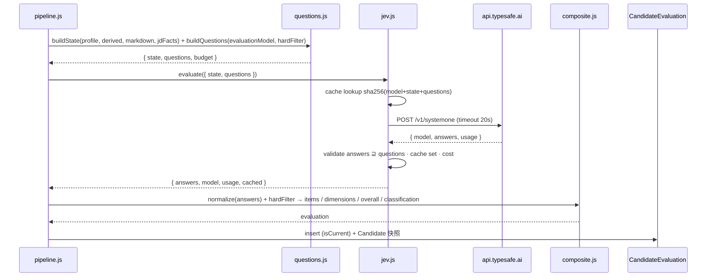

## 0. 结论与边界

- **接入方式**:直连 `POST https://api.typesafe.ai/v1/systemone`,`Authorization: Bearer <key>`,`model: "jev-latest"`。不引入官方 SDK,用 Node 20 原生 `fetch` 复刻 `kimiRequest` 的退避 / AbortController 模式(零新依赖,与项目风格一致)。
- **Jev 只做判定**:每个评价模型条目 → 一道 `noul` 或 `score` 题;分类、加权、算数、日期比较全部在代码;报告文字由 Kimi 生成。
- **默认脱敏**:发给 Jev 的 state 不含姓名 / 电话 / 邮箱 / 链接 / 照片,判定不需要身份。
- **可回退**:`jev.enabled=false` 或调用失败 → legacy `matchAgainstJob`,评估记录 `engine="legacy"`。
- **可复现**:同一 `(model, state, questions)` 的答案缓存 7 天(Jev 输出确定,第三方测评 3 次跑完全一致);评估记录存题目与答案原文 + 版本号。



---

## 1. API 契约(核实于 docs.typesafe.ai,2026-09-20)

### 1.1 请求

```jsonc
POST https://api.typesafe.ai/v1/systemone
Authorization: Bearer <JEV_API_KEY>
Content-Type: application/json
{
  "model": "jev-latest",
  "state": <string | object | array>,          // 评估对象;对象字段可在 instructions 里用反引号引用
  "questions": {
    "<id>": { "type": "noul",   "instructions": "string|object|array", "criteria": { "true": "…", "false": "…" } },
    "<id>": { "type": "choice", "instructions": "…", "criteria": { "optA": "…", "optB": "…", "other": "以上皆非" } },
    "<id>": { "type": "score",  "instructions": "…", "criteria": [ "level0 情境", "level1 情境", "…" ] }
  }
}
```

### 1.2 响应

```jsonc
{
  "model": "jev-1.13.0",                       // 实际模型版本,入库
  "answers": {
    "<id>": { "type": "noul",   "noul": 0.93 },
    "<id>": { "type": "choice", "choice": "optA", "probabilities": { "optA": 0.84, "optB": 0.15, "other": 0.01 }, "confidence": 0.71 },
    "<id>": { "type": "score",  "score": 1.7, "legend": { "0": "…", "1": "…", "2": "…" }, "probabilities": { "0": 0.0, "1": 0.3, "2": 0.7 }, "confidence": 0.88 }
  },
  "usage": { "input_tokens": 4210, "output_tokens": 31 }
}
```

### 1.3 限制与错误

| 项 | 值 | 设计响应 |
|---|---|---|
| choice 选项 | ≤255 | 本方案不用 choice 出分类;仅固定题「稳定性」可选 score |
| score 等级 | 2-10 | 统一 4-5 级,level 0 = 未提及 |
| 单题 + state | ≈32K token(≈150K 字符) | state 预算 12K token(§3.3) |
| 整请求 | ≈64K token | 题目 8-25 道,预算 6K token |
| 限流 | ≈1200 req/min · 250K token/s | 进程内并发信号量 5;批量按 task 串行化 |
| 延迟 | 70-500ms 典型 | 超时 20s(远超,留给网络抖动) |
| 401 | key 无效 | 不重试;抛 `jev_unauthorized`(424) |
| 422 | 请求校验失败 | 不重试;记录 body(不含 state)+ 抛 `jev_bad_request`(422) |
| 429 / 529 | 限流 / 过载 | 指数退避 1s → 2.5s → 6s,最多 3 次 |
| 5xx / 网络 | | 同上退避 |
| 定价 | $0.042 / 1M 输入 token,输出免费 | `usage.input_tokens × 0.042 / 1e6` 记 `costs.jevUsd` |

---

## 2. 客户端 `server/src/lib/jev.js`

```js
// 对外 API(与 kimi.js 同风格)
export async function isJevConfigured();                       // key 非空且 jev.enabled
export async function evaluate({ state, questions, meta });    // → { answers, model, usage, cached, latencyMs }
export async function ping(apiKey?);                           // 1 道 noul 探活,给 /api/system/settings/jev/test
export const JEV_ERROR_CODES = { unauthorized:"jev_unauthorized", badRequest:"jev_bad_request", rateLimited:"jev_rate_limited", timeout:"jev_timeout", upstream:"jev_upstream_error", notConfigured:"jev_not_configured" };
```

### 2.1 配置读取

| key | 来源优先级 | 说明 |
|---|---|---|
| `jev.api_key` | DB(AES)> `JEV_API_KEY` | `ENCRYPTED_KEYS` 加入;`adminOnlyForApiKey` 扩展为匹配 `/\.(api_key|secret_code|app_id)$/`;`/settings/:key/full` 拒回显 |
| `jev.base_url` | DB > `JEV_BASE_URL` > `https://api.typesafe.ai/v1` | 仅用于测试环境 mock |
| `jev.model` | DB > `JEV_MODEL` > `jev-latest` | |
| `jev.enabled` | DB > `JEV_ENABLED` > `false` | |
| `jev.mode` | DB > `shadow` | `shadow / primary` |
| `jev.timeout_ms` | 默认 20000 | |
| `jev.concurrency` | 默认 5 | |
| `jev.cache_ttl_s` | 默认 604800(7 天) | 0 = 关缓存 |
| `eval.pii_strip` | 默认 `true` | |

### 2.2 请求流程

1. `assertConfigured()` → 无 key 抛 `jev_not_configured`(424,CF 透传 JSON,坑 #20 口径)。
2. 构造 body;`JSON.stringify` 后估算 token(中文 ≈ 1 token / 1.5 字,英文 ≈ 1 / 4 字符,取保守 `chars/1.5`),超 60K 抛 `jev_bad_request`(在发出前失败,不计费)。
3. 缓存键 `sha256(model + JSON(state) + JSON(questions))` → Redis `mesa:jev:ans:<hash>`(无 Redis 时内存 LRU 500 条);命中直接返回 `cached:true`(shadow 双跑、重试、报告重生成都不重复计费)。
4. 信号量获取(并发 5)→ `fetch` + AbortController 20s。
5. 状态码矩阵(§1.3);退避重试仅 429 / 529 / 5xx / 网络错误;`Retry-After` 头存在时优先。
6. 响应校验:`answers` 的 key 必须 ⊇ `questions` 的 key,类型一致,数值在 [0,1] / [0, levels-1];缺题 → 抛 `jev_upstream_error` 并记录缺失 key(不重试,交调用方决定 legacy 回退)。
7. 记录 `usage`、`latencyMs`、`model`;写缓存;返回。
8. 日志(pino):`{ taskId, questionCount, inputTokens, latencyMs, cached, model }`,**永不打印 state**。

### 2.3 探活 `ping`

```jsonc
{ "model": "jev-latest", "state": "候选人:硕士,汽车行业 6 年。", "questions": { "ok": { "type": "noul", "instructions": "state 是否提到汽车行业?" } } }
```
期望 `answers.ok.noul > 0.8`;用于 admin 「测试连接」与 Uptime Kuma 定时探活(经 `/api/health/providers`,见 §9)。

---

## 3. state 构造 `lib/evaluation/questions.js` → `buildState()`

### 3.1 结构

```jsonc
{
  "resume": "<脱敏后的 TextIn markdown,按 §3.3 预算截断>",
  "profile": {
    "education": [ { "school": "…", "degree": "硕士", "major": "车辆工程", "period": "2016-09 ~ 2019-06" } ],
    "experience": [ { "company": "…", "title": "海外产品质量工程师", "period": "2021-03 ~ 至今", "isOverseas": true, "teamSize": 4,
                      "duties": ["…"], "achievements": ["…"], "domainTags": ["quality.product"], "industryTags": ["auto.nev"] } ],
    "projects": [ { "name": "…", "role": "…", "stage": "mass_production", "region": ["europe"], "contributions": ["…"] } ],
    "skills": { "professional": ["海外质量问题分析", "…"], "tools": ["8D", "SPC"], "soft": [{ "name": "跨部门协作", "behaviors": ["…"] }] },
    "languages": [ { "name": "英语", "level": "working", "exams": ["IELTS 7.0"] } ],
    "certificates": ["PMP"]
  },
  "derived": { "totalYears": 6.2, "industryYears": { "auto": 6.2, "auto.nev": 3.1 }, "overseasYears": 2.8, "managementYears": 1.5, "maxTeamSize": 4,
               "jobHopping": { "segmentsLast5y": 2, "shortSegmentsLast5y": 0 }, "languageLevels": { "en": "working" }, "isFreshGraduate": false },
  "job": { "title": "海外产品质量工程师", "responsibilities": ["…"], "requirements": ["…"], "locations": ["上海", "斯图加特"], "travel": "每年 ≥150 天海外出差" }
}
```
- `profile` 是 03 号 Schema 的**投影**(去掉 identity / intent 联系方式 / evidenceRefs / meta),字段名保持,题目里用反引号引用如 `` `profile.experience` ``、`` `derived.overseasYears` ``;
- `derived` 让 Jev **不必算数**:题目直接说"结合 `derived.industryYears.auto`=6.2";
- `job` 只放判定需要的原文要点,不放福利 / 薪资。

### 3.2 脱敏 `stripPii(markdown, profile)`

| 项 | 处理 |
|---|---|
| 姓名 | `identity.name` 及其无空格 / 拼音变体 → `[候选人]` |
| 手机 / 邮箱 | 正则(国际格式兼容,沿用 `pickPhone` 的模式)→ `[已隐藏]` |
| URL / 邮箱域名 | → `[链接]` |
| 图片 markdown `` | 删除 |
| 身份证 / 出生日期 / 住址行 | 关键词行删除(`身份证|出生|住址|籍贯|民族|婚姻|政治面貌`) |
| 年龄 / 性别 | 保留(INFO 展示需要;评估题不引用)— 可由 `eval.pii_strip_demographics=true` 一并抹除 |

脱敏后文本只存在于内存与 Jev 请求,不入库(`jevRequest` 列只存 questions)。

### 3.3 token 预算与截断

总预算 18K token:`resume` ≤ 10K,`profile+derived` ≤ 4K,`job` ≤ 1K,questions ≤ 3K。`resume` 超预算时按段落优先级截断:工作经历 > 项目 > 技能 > 教育 > 语言 / 证书 > 校园 > 其他(用 TextIn 的标题层级切段;无标题时按 `profile` 段落文本反查定位)。截断记 `budget.truncated=true` 入 `CandidateEvaluation.jevRequest.meta`。

---

## 4. 题目生成 `buildQuestions(evaluationModel, hardFilterResult, options)`

### 4.1 生成规则

| evaluationModel 条目 | 生成 | 备注 |
|---|---|---|
| `method=code` 且硬筛已出 PASS/FAIL | **不出题** | 已确定 |
| `method=code_then_jev` 且硬筛 UNKNOWN | 出 `jev.type` 指定的题 | 只为缺信息的项花 token |
| `method=jev_noul` | `noul` | 用 `jev.instructions / criteria` |
| `method=jev_score` | `score` | `criteria = jev.levels`,强制 level 0 为「简历未提及相关信息」(缺则代码插入) |
| `tier=INFO` / `method=none` | 不出题 | |
| 固定题(`fixedQuestions`) | §4.3 | 受 evaluationModel 开关 |

题目 id 命名:`req_<key>`(评价模型条目)/ `meta_<name>`(固定题),响应按 id 回填。

### 4.2 措辞规范(校验器 `lintQuestion()` 在保存 evaluationModel 时执行)

1. 一题一判:`instructions` 不含「且 / 并且 / 同时」连接两个判断(启发式 lint,warning);
2. 情境描述:`levels` 不得只含「一般 / 良好 / 优秀」等程度词(lint error);
3. 引用字段:建议至少引用一个反引号字段(warning);
4. 禁止算数:`instructions` 含「共 / 合计 / 超过 N 年 / 是否大于」且未引用 `derived.*` → warning,并提示改为引用派生指标;
5. 逃生口:noul 的 `criteria.false` 必须覆盖「未提及」;score level 0 必须是「未提及」;
6. 长度:单题 ≤ 600 字符。

### 4.3 固定通用题(模板)

```jsonc
{
  "meta_stability": { "type": "score", "instructions": "结合 `derived.jobHopping` 与 `profile.experience`,判断候选人任职稳定性。",
    "criteria": ["近 5 年 4 段以上经历且多数不足 1 年", "有 1-2 段不足 1 年的短任职", "任职稳定,每段 2 年以上", "长期稳定且在同一公司有晋升"] },
  "meta_sufficiency": { "type": "noul", "instructions": "`resume` 的信息是否不足以判断与 `job.requirements` 的匹配?",
    "criteria": { "true": "经历只有公司和职位没有内容、大段空白、或与岗位相关的经历完全缺失", "false": "工作/项目内容有具体职责与成果,可据此判断" } },
  "meta_inflation": { "type": "noul", "instructions": "`resume` 是否存在关键词堆砌而无具体事例支撑的技能声明?",
    "criteria": { "true": "技能栏罗列大量工具/能力,但工作与项目描述中找不到对应使用场景", "false": "声明的技能在经历中有具体使用案例" } },
  "meta_relocation": { "type": "noul", "instructions": "候选人当前所在地或求职意向是否与 `job.locations` 一致,或明确表示可搬迁/派驻?",
    "criteria": { "true": "现居地在岗位城市,或简历写明接受异地/海外/派驻", "false": "现居地不同且未提及搬迁意愿,或明确只考虑本地" } }
}
```
`meta_relocation` 仅在硬筛 `location` 为 MISMATCH 或 UNKNOWN 时出题。

### 4.4 完整示例(海外产品质量工程师,硬筛后)

硬筛结果:`edu_min PASS`,`years_auto PASS(6.2≥5)`,`major_rel PASS(major.vehicle)`,`lang_en UNKNOWN(简历只写"英语良好")`,`tool_8d_spc PASS(词表命中)`,`years_oq UNKNOWN(无 quality.overseas 标签)`,`cond_travel UNKNOWN`。生成 8 题:

```jsonc
{
  "req_lang_en":     { "type": "noul",  "instructions": "根据 `resume` 与 `profile.experience`,候选人是否有英语可作为工作语言的证据?", "criteria": { "true": "海外常驻工作、英文授课学历、雅思≥7/托福≥100、或明确写英语工作语言", "false": "无上述证据,或仅写英语良好/CET-4;简历未提及也算 false" } },
  "req_years_oq":    { "type": "score", "instructions": "候选人海外质量相关工作的深度(参考 `derived.overseasYears`=2.8)。", "criteria": ["简历未提及海外或质量相关工作", "仅有海外出差或短期项目支持", "1-3 年负责海外市场质量问题处理", "3 年以上常驻或独立负责海外区域质量"] },
  "req_cap_pq":      { "type": "score", "instructions": "候选人产品质量管理能力,以 `profile.experience[].duties` 与 `achievements` 为准。", "criteria": ["未提及", "参与质量相关工作但无独立负责内容", "独立负责某产品线质量问题分析与闭环", "主导质量体系或跨产品线质量改进并有量化成果"] },
  "req_cap_project": { "type": "score", "instructions": "候选人海外项目管理经验。", "criteria": ["未提及", "作为成员参与海外项目", "负责海外项目中的某个模块并对接客户/供应商", "作为负责人推动海外项目按期交付"] },
  "req_tool_8d_spc": { "type": "score", "instructions": "8D / SPC 的实际使用深度(词表已命中,请判断证据强度)。", "criteria": ["仅列在技能栏", "有具体使用案例", "主导过基于 8D/SPC 的质量改进并有结果"] },
  "req_pref_europe": { "type": "score", "instructions": "欧洲市场项目经验。", "criteria": ["未提及", "有欧洲客户对接或出差", "参与欧洲项目并有明确职责", "负责欧洲项目认证/上市并有成果"] },
  "req_cond_travel": { "type": "noul",  "instructions": "简历是否显示候选人接受或已适应高频海外出差/派驻?", "criteria": { "true": "有海外常驻/高频出差经历,或意向写明接受出差/海外", "false": "无相关经历且未表态,或明确不接受" } },
  "meta_stability":  { "…": "见 4.3" }, "meta_sufficiency": { "…": "" }, "meta_inflation": { "…": "" }
}
```
预计 state 5-7K token + 题目 1.2K token ≈ $0.0003,延迟 <1s。

---

## 5. 答案归一与加权 `lib/evaluation/composite.js`

### 5.1 逐题归一

| 来源 | normalized n | verdict | confidence |
|---|---|---|---|
| 硬筛 PASS / FAIL | 1 / 0 | 满足 / 不满足 | 1.0(代码确定) |
| 硬筛 UNKNOWN(未出 Jev 题,`unknownPolicy=ignore`) | 不计入 | 未提及 | — |
| `noul` p | p | p≥0.7 满足 · 0.3-0.7 部分 · <0.3 不满足 | `abs(p-0.5)*2`(自定义,noul 无官方 confidence) |
| `score` s,L 级 | `s/(L-1)`;argmax=0 → n=0 | level≥0.75L 满足 · 0.4-0.75 部分 · <0.4 不满足 · argmax 0 未提及 | 官方 `confidence` |

### 5.2 分数

```
维度 k ∈ {MUST, CORE, PREFERRED}:dim_k = 100 × Σ(w_i·n_i) / Σ w_i(该 tier 内,UNKNOWN-ignore 项不入分母)
STABILITY 维度 = 100 × meta_stability 归一
overall_base = Σ_k tierWeights[k]·dim_k / Σ tierWeights
bonus = min(bonusCap, Σ_{BONUS 项} bonus_i × n_i)
overall = round(min(100, overall_base + bonus))
```

### 5.3 分类(顺序判定,先命中先出)

1. 任一 MUST 项 verdict=不满足(代码 FAIL,或 Jev noul p<0.3) → **D · LOW**(`reason: "hard_fail:<key>"`)
2. `meta_sufficiency` p>0.6 → **C · REVIEW**(`reason: "insufficient_info"`)
3. 任一 CORE 项 confidence < `confidenceGate`(0.5) → **C · REVIEW**(`reason: "low_confidence:<key>"`)
4. 任一 MUST 项 UNKNOWN 且 `unknownPolicy=review` → 上限 **C · REVIEW**(`reason: "must_unknown:<key>"`)
5. `meta_inflation` p>0.7 → 分类降一级(A→B,B→C),`flags += "inflation"`
6. 按 thresholds:≥A → A · HIGH;≥B → B · HIGH;≥C → C · REVIEW;否则 D · LOW
7. `unknownPolicy=interview` 的 UNKNOWN 项 → `interviewProbes` 候选(交报告层)

`minConfidence = min(CORE/PREFERRED 题 confidence)` → `Candidate.parserConfidence = round(minConfidence×100)`(与 03 号 `profileQuality` 二选一展示:评估存在时显示评估置信度)。

### 5.4 输出结构(写入 `CandidateEvaluation`)

```jsonc
{
  "engine": "jev", "hardFilter": { "result": "UNKNOWN", "items": [ … ] },
  "items": [ { "key": "lang_en", "label": "英语工作语言", "tier": "MUST", "method": "code_then_jev", "source": "jev", "normalized": 0.91, "verdict": "满足", "confidence": 0.82, "raw": { "noul": 0.91 } }, … ],
  "dimensions": [ { "key": "MUST", "score": 96, "weight": 25 }, { "key": "CORE", "score": 78, "weight": 45 }, { "key": "PREFERRED", "score": 50, "weight": 15 }, { "key": "STABILITY", "score": 67, "weight": 15 } ],
  "overallScore": 81, "bonus": 3, "classification": "B", "reviewPriority": "HIGH", "reasons": [], "flags": [],
  "minConfidence": 0.71,
  "jevRequest":  { "questions": { … }, "meta": { "stateTokensEst": 6100, "truncated": false, "piiStripped": true } },
  "jevAnswers":  { … 原样 … },
  "versions": { "schema": "eval.v1", "questionTemplate": "qt.v1", "evaluationModel": 3, "jevModel": "jev-1.13.0", "kimiModel": "moonshot-v1-32k", "kimiPromptHash": "…", "textinVersion": "3.17.12" },
  "costs": { "jevInputTokens": 7300, "jevUsd": 0.00031, "cached": false, "latencyMs": 640 }
}
```

---

## 6. 错误矩阵与回退

| 场景 | 处理 | 用户可见 |
|---|---|---|
| `jev.enabled=false` | 直接 legacy | 「基础评估」标签 |
| 无 evaluationModel | 只出固定题 + STABILITY;`items=[]`;分类只可能 C(信息不足)或按 overall;UI 提示补评估标准 | 「未配置评估标准」 |
| `jev_not_configured / unauthorized` | legacy;`app.log.error` 一次/10 分钟去重 | 「AI 评估暂不可用,已用基础评估」 |
| `jev_rate_limited / timeout / upstream`(退避后仍失败) | legacy;task.stages.evaluate = `{ status:"fallback", error }` | 同上 |
| `jev_bad_request`(422) | **不回退**,标 failed(多半是题目模板问题,回退会掩盖 bug);告警 | 「评估失败,请联系管理员」 |
| 答案缺题 | 视为 upstream 错误 → legacy | |
| Kimi 报告失败 | 分数入库,`reportStatus=failed`,可重试 | 「报告生成失败,重试」 |
| Redis 不可用 | 缓存旁路,内存 LRU | 无 |

legacy 适配器把 `matchAgainstJob` 输出映射成同形:`overallScore=jdMatch`,`classification` 按 thresholds,`items=[]`,`dimensions=[{CORE: jdMatch}]`,`engine="legacy"`。

---

## 7. shadow 灰度与切换

| 阶段 | 行为 | 观察指标(Reports 页新增「AI 评估」卡,或先 SQL) |
|---|---|---|
| `jev.mode=shadow` | 每次评估同时跑 legacy(主,写 Candidate 快照)与 Jev(副,只写 CandidateEvaluation `engine=jev, isCurrent=false, shadow=true`) | 分类分布对比;`overall` 与 `jdMatch` 的 Spearman 相关;D 类中 legacy ≥70 的比例(潜在误杀);C 类占比(应 <30%);缓存命中率;P95 延迟;失败率 |
| 切 `primary` 条件 | 连续 2 周:失败率 <2%、误杀候选 HR 抽检认可、C 类占比合理 | |
| `jev.mode=primary` | Jev 主;legacy 仅回退 | |
| 回滚 | 改 setting 即时生效(30s 缓存),无需部署 | |

---

## 8. 安全与隐私

- key:仅 DB(AES-256-GCM,HKDF 自 JWT_SECRET)或 VPS `.env`;`.env.example` 占位 `__SET_BY_OPS__`;CLAUDE.md §4 表增行;
- state 不入库、不入日志;`jevRequest` 只存 questions + meta;
- 脱敏默认开;关闭需 admin 且写审计日志(`lib/audit.js` 现有);
- 出站仅 `api.typesafe.ai:443`;VPS UFW 出站不限,无需改;
- 交付文档 04 增「第三方处理者:TypeSafe AI(美国)— 处理内容:脱敏简历文本与岗位要求;不含身份信息」;
- Jev 结果定位为「查看优先级」,UI 文案不用「淘汰 / 拒绝」;HR 人工覆盖走 `manualOverride` + 审计。

---

## 9. 可观测性与运维

| 项 | 实现 |
|---|---|
| 健康 | `GET /api/health/providers`(登录态,admin)→ `{ kimi, textin, jev: { configured, enabled, mode, lastOkAt, lastError } }`;Uptime Kuma 用 admin token 的 HTTP 监控(或公开只读 `/api/health` 增 `providers.jev.ok` 布尔) |
| 成本 | `CandidateEvaluation.costs` 聚合:Reports 页「本月 Jev 花费 / 次数 / 缓存命中」;超阈值(setting `jev.monthly_budget_usd`)时 admin 顶部 banner,不阻断 |
| 延迟 / 失败 | pino 结构化日志 + 任务 `stages.evaluate.ms`;`docker logs mesa-server | grep jev` 可查 |
| 配额告警 | 429 连续 3 次 → log error + 飞书 bot 通知(复用 `feishuNotify`,可选) |
| 缓存清理 | 评估模型版本变更不需要清缓存(questions 变则 hash 变);模板措辞热修后同理 |

---

## 10. 测试与校准

### 10.1 单测(`node --test`)

| 文件 | 覆盖 |
|---|---|
| `jev.test.js` | mock `fetch`:401 不重试;429 退避 3 次后抛;529 同;超时 abort;答案缺题抛;缓存命中不发请求;token 预估超限先抛;日志不含 state |
| `questions.test.js` | 硬筛 PASS 不出题;UNKNOWN 出题;level 0 自动插入;`lintQuestion` 规则;脱敏正则(中英文姓名、国际手机号、邮箱、链接) |
| `composite.test.js` | §5 全部分支:hard_fail 优先;sufficiency;low_confidence;must_unknown 上限 C;inflation 降级;bonus 封顶;UNKNOWN-ignore 不入分母;阈值边界 |
| `legacyAdapter.test.js` | 同形映射 |

### 10.2 契约测试

固定 `fixtures/jev/*.json`(录制的真实响应,脱敏)→ 校验解析 / 归一稳定;CI 不访问外网。

### 10.3 golden set 校准(00 号 P0)

脚本 `server/scripts/jev-golden.mjs`(读本地目录,不入库):
1. 输入:30-50 份脱敏简历 markdown + 2-3 个 JD 的 evaluationModel + HR 标注(A/B/C/D + 每条 MUST 的人工 PASS/FAIL);
2. 跑硬筛 + Jev + composite,输出 CSV:每份的 items / overall / 分类 / 置信 / 成本;
3. 指标:分类一致率(目标 ≥80%)、MUST 零误杀(FAIL 中无人工 PASS)、事实型 noul 平均 confidence ≥0.9、C 类占比、每份成本;
4. 迭代:按 nanami 项目经验改判据措辞(加「不仅是参与 / 需具体事例 / 归属本人贡献」),每轮记录 `questionTemplate` 版本与指标,保留在 `textin+kimi+jev架构/calibration/`(HTML 报告,由 md2html 生成);
5. 中英文一致性:同一候选人中英两版简历分差 ≤0.05。

---

## 11. 文件与配置清单

| 文件 | 动作 |
|---|---|
| `server/src/lib/jev.js` | 新 |
| `server/src/lib/evaluation/questions.js` / `composite.js` / `legacyAdapter.js` / `hardFilter.js` / `pipeline.js` / `report.js` | 新(00 号 §5.10) |
| `server/src/lib/evaluation/templates/*.json` / `taxonomy/*.json` | 新(03 号) |
| `server/src/lib/settings.js` | `jev.* / eval.*` keys、加密集合、env fallback |
| `server/src/routes/system.js` | `POST /settings/jev/test`;敏感 key 门禁扩展 |
| `server/src/routes/resumes.js` | 评估阶段接入;`/match` 异步化;`/evaluate-batch`;`/evaluations/:id/report` |
| `server/src/routes/health.js`(或 index.js) | `/api/health/providers` |
| `docker-compose.yml` / `.env.example` | `JEV_API_KEY / JEV_BASE_URL / JEV_MODEL / JEV_ENABLED / JEV_MODE` |
| `web/src/components/Sidebar.jsx`(LLM 配置弹窗) | Jev 组:key(mask)/ 启用 / 模式 / 测试连接 / 月预算 |
| `CLAUDE.md` | §4 密钥表、§8 坑、§10 数据模型、§1.1 子系统表 |

---

## 12. 未决事项(实施前确认)

1. TypeSafe key 申请是否有 waitlist 与企业协议;定价「补贴」是否有截止;
2. `noul` 无官方 confidence,§5.1 自定义 `abs(p-0.5)*2` 需在 golden set 上验证与人工判断的一致性;
3. state 的 token 估算系数(中文)需用真实 `usage.input_tokens` 回归校正;
4. 是否把脱敏后的 state 哈希入库以便审计复现(当前只存 questions + answers)。
