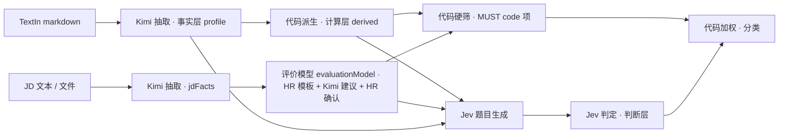

## 0. 本文定位与核心原则

《00 方案设计与评估》回答"要不要做、怎么分阶段";本文回答"三个环节之间**传什么数据**"。三条不可妥协的原则:

1. **抽取与评分分离**:Kimi 只产"忠于原文的事实",不出分、不判断;评分规则改动、换模型、合规审计互不牵连。
2. **事实 / 计算 / 判断 三层**:
   - 事实层(Facts)— Kimi 抽取,字段值必须能在原文找到;
   - 计算层(Derived)— 代码确定性派生(年限、行业年限、跳槽率、时间线冲突、最高学历、应届判定),可复现、可单测;
   - 判断层(Judgement)— Jev 只做语义判定,输入是上两层 + JD 评价模型。
3. **两侧 Schema 一一对应**:JD 的每一类要求都能指到简历 Schema 的某个字段或派生指标,否则这条要求就没法机器评估,只能交给 Jev 或人工。



与 00 号文档的名称对齐:00 号 §5.3 的 `Job.requirementSchema` 在本文拆成 **`Job.jdFacts`(事实层)+ `Job.evaluationModel`(评价模型层)**,后者即 00 号里的需求 schema,字段更细。

---

## 1. 现状对照(代码实读)

| 现状 | 位置 | 差距 |
|---|---|---|
| 简历抽取输出 16 个顶层键:`name / currentTitle / location / gender / age / phones / emails / languages / skills / awards / appliedFor / tags / yearsExp / educationHistory[] / experience[] / projects[]` | `kimi.js` `DEFAULT_PROMPT` | 无实习/校园/科研/证书/求职意向;工作经历没有行业/职能/地区标签,派生"汽车行业 5 年"不可能;`projects` 只有 `responsibility/output` 两字段 |
| 顶层扁平列:`education / school / major / yearsExp / phone / email / languages / skills(md) / experience(md) / educationHistory(md)` | `schema.prisma` Candidate | 结构化数组**不落库**,只留 markdown 字符串展示;二次计算必须重新调 Kimi |
| JD 抽取:`title / description / responsibilities[] / requirements[] / nice[] / benefits[] / employment / salary / levelRange / yearsExpRange / educationRequirement / languageRequirement` | `kimi.js` `parseJobDescription`,仅"上传 JD 文件"入口触发 | 要求是字符串数组,无类型/条件/权重;年限、语言、学历是自由文本("5-7 年"),不可机器比较;手填 JD 从不结构化 |
| 确定性闸门 | `scrubHallucinatedDates / normalizeDegree / computeYearsExp / deriveLanguages / stripResumeNoise` | 保留,并扩展到新字段 |

---

## 2. 简历 Schema V1(`Candidate.profile`)

### 2.1 顶层结构

```jsonc
{
  "schemaVersion": "resume.v1",
  "identity":     { /* 2.2 */ },
  "intent":       { /* 2.3 */ },
  "education":    [ /* 2.4 */ ],
  "experience":   [ /* 2.5 正式工作 */ ],
  "internships":  [ /* 2.5 同结构,实习单列 */ ],
  "projects":     [ /* 2.6 */ ],
  "skills":       { /* 2.7 */ },
  "languages":    [ /* 2.8 */ ],
  "certificates": [ /* 2.9 */ ],
  "campus":       { /* 2.10 */ },
  "research":     { /* 2.11 */ },
  "awards":       [ "照抄原文" ],
  "meta":         { "resumeParseId": "uuid", "extractedAt": "ISO", "model": "moonshot-v1-32k", "promptHash": "sha256:…" }
}
```

约定:
- 读不到 → `null` / `[]`,**不省略 key**(现有 prompt 规则沿用);
- 时间统一 `YYYY-MM`,只写原文有的一端,"至今" → `current:true` + `endDate:null`;
- 所有 `*Tags` 字段只能取 **词表 id**(§4),映射不上的写 `"other:<原文>"`;
- `evidenceRefs` 是**指针**不是引文:`{ "section": "experience", "index": 1 }`,零幻觉、零 token 膨胀;引文留给报告阶段。
- **不抽取**:身份证号、家庭住址、婚育、照片内容、民族、政治面貌(prompt 明令忽略;合规)。`gender / age` 保留在 `identity` 仅供展示与 INFO 记录,**不进任何评估**。

### 2.2 identity(基础身份)

| 字段 | 类型 | 说明 |
|---|---|---|
| `name` | string\|null | 读不到 null,严禁占位名(坑 #45) |
| `gender` | `male\|female\|unknown` | 仅展示 |
| `age` | int\|null | 仅展示 |
| `phones[]` / `emails[]` | string[] | 保留打码格式 |
| `currentCity` / `currentCountry` | string\|null | 现居地,原文写法 |
| `currentTitle` / `currentCompany` | string\|null | |
| `jobStatus` | `employed\|unemployed\|fresh\|null` | 在职/离职/应届 |
| `links[]` | `[{type:"github\|linkedin\|portfolio\|other", url}]` | |

### 2.3 intent(求职意向)

| 字段 | 类型 |
|---|---|
| `targetTitles[]` / `targetFunctions[]`(词表)/ `targetIndustries[]`(词表) | string[] |
| `targetCities[]` / `targetRegions[]` | string[] |
| `expectedSalary` | `{ min, max, unit:"k/month\|k/year", raw }`\|null(只在原文有数字时填) |
| `availability` | `{ raw, withinDays }`\|null |
| `employmentType` | `fulltime\|parttime\|intern\|contract\|null` |
| `acceptTravel` / `acceptOverseas` / `acceptRelocation` / `acceptOvertime` | `true\|false\|null`(只在原文明确写时非 null) |

### 2.4 education[](每段)

| 字段 | 说明 |
|---|---|
| `school` / `college` / `major` | 照抄原文 |
| `degree` | 枚举 `函授/专科/大专/本科/硕士/博士/博士后/教授/Other`(沿用 `normalizeDegree`) |
| `degreeTitle` | 原文学位名(如 "Master of Science") |
| `startDate` / `endDate` / `current` | 见约定 |
| `fullTime` | bool\|null |
| `overseas` | bool(学校所在国非中国;由代码按学校国家词表补,LLM 可先填) |
| `gpa` / `ranking` | `{ value, scale }` / string |
| `courses[]` / `researchDirection` / `thesis` / `scholarships[]` / `honors[]` | 照抄 |

### 2.5 experience[] / internships[](每段)

| 字段 | 说明 |
|---|---|
| `company` / `department` / `title` / `level` | 照抄 |
| `companyIndustryTags[]` | 词表 id(如 `auto.oem` / `auto.parts` / `semi`) |
| `companyType` | `oem\|tier1\|tier2\|internet\|consulting\|public\|startup\|other\|null` |
| `companySize` | `{ raw, bucket:"<50\|50-500\|500-5000\|>5000" }`\|null |
| `location` / `country` / `isOverseas` | 原文 + 代码按国家词表补 `isOverseas` |
| `startDate` / `endDate` / `current` | |
| `employmentType` | `fulltime\|parttime\|intern\|contract\|null` |
| `reportsTo` / `teamSize`(下属人数 int)/ `isManagement`(bool) | `teamSize>0` ⇒ `isManagement=true`,否则按原文"负责团队/带领" |
| `duties[]` | 核心职责(现有) |
| `achievements[]` | 关键成果(现有) |
| `quantified[]` | `[{ metric, value, unit, context }]` 量化成果,原文有数字才填 |
| `tools[]` / `technologies[]` | 词表 id 或 `other:` |
| `domainTags[]` / `functionTags[]` | 业务领域(如 `quality.product` / `cert.overseas`)、职能(如 `hr.bp`)词表 id |
| `regionTags[]` | `europe / north_america / sea / …` |
| `projectRefs[]` | 指向 `projects[]` 下标 |

### 2.6 projects[](每个)

| 字段 | 说明 |
|---|---|
| `name` / `type`(`mass_production\|rnd\|certification\|launch\|it\|research\|other`)/ `background` / `goal` | |
| `startDate` / `endDate` / `stage`(`concept\|development\|validation\|mass_production\|after_sales\|null`) | |
| `role` / `teamSize` / `collaborators[]`(部门/供应商)/ `client` | |
| `duties[]` / `contributions[]` / `outcomes[]` / `metrics[]`(同 quantified 结构) | |
| `technologies[]` / `tools[]` / `domainTags[]` / `regionTags[]` | 词表 |
| `experienceRef` | 所属工作经历下标 \| null |

### 2.7 skills(分层)

```jsonc
{
  "professional": [ { "name": "海外质量问题分析", "tag": "quality.analysis", "level": "proficient|familiar|expert|null", "evidenceRefs": [{"section":"experience","index":0}] } ],
  "tools":        [ { "name": "8D", "tag": "tool.8d", "level": null, "evidenceRefs": [] } ],
  "industry":     [ { "name": "新能源汽车", "tag": "auto.nev", "evidenceRefs": [] } ],
  "soft":         [ { "name": "跨部门协作", "tag": "soft.cross_team", "behaviors": ["协调研发/质量/供应商解决 X 问题"], "evidenceRefs": [] } ]
}
```
`level` 只在原文写了"熟练/精通/了解"时填;`soft[].behaviors` 必须是原文里的**可验证行为**,不是形容词。

### 2.8 languages[]

| 字段 | 说明 |
|---|---|
| `name` | 词表(`zh / en / ja / de / fr …`)+ `raw` |
| `level` | 归一枚举:`native / working(工作语言) / fluent / intermediate / basic / null`(代码由 `exams` 与原文词归一,阶梯见 §4.3) |
| `exams[]` | `[{ name:"IELTS", score:"7.0" }]` 照抄 |
| `businessCapable` | bool\|null(原文明确写"可作为工作语言/商务沟通") |
| `evidenceRefs[]` | 海外经历/英文授课学历等指针(代码补) |

### 2.9 certificates[]

`{ name, tag(词表 `cert.pmp` 等), type:"professional|language|industry|software|license|other", issuer, obtainedAt, validUntil, number:null }`。证书编号默认不抽。

### 2.10 campus(校园经历)

`{ roles[], clubs[], competitions:[{ name, level:"school|city|province|national|international", rank, award, role, contribution }], research[], volunteer[], scholarships[], honors[] }`

### 2.11 research(科研成果)

`{ papers:[{ title, venue, tier:"sci|ei|core|other|null", authorRole:"first|co-first|corresponding|co-author", year }], patents:[{ title, type:"invention|utility|design", status:"granted|pending" }], projects:[{ name, funder, role }], labs[] }`

---

## 3. 计算层 — 代码派生指标(`Candidate.derived`)

全部纯函数(`server/src/lib/profile/derive.js`),输入 `profile` + 词表,输出如下,**单测覆盖**:

| 指标 | 算法 | 复用 |
|---|---|---|
| `totalYears` | 所有 `experience[]` 区间合并去重 / 12(**不含实习**) | `yearsFromPeriods` |
| `industryYears{ [tag]: years }` | 对每个行业 tag,取 `companyIndustryTags` 含该 tag(含词表祖先,如 `auto.nev ⊂ auto`)的经历区间合并 | 同上 |
| `domainYears{ [tag] }` / `functionYears{ [tag] }` | 同上,按 `domainTags / functionTags` | |
| `overseasYears` | `isOverseas=true` 的经历区间合并 | |
| `managementYears` / `maxTeamSize` | `isManagement=true` 区间;`max(teamSize)` | |
| `highestDegree / highestSchool / highestMajor` | `degreeRank` 最大者 | `deriveEducationFromArray` |
| `latestGraduation` / `isFreshGraduate` | 最近 `education.endDate`;`jobStatus=fresh` 或 `endDate` 在 [今-6 月, 今+18 月] 且无全职经历 | |
| `graduationYear` | `latestGraduation.year`(校招批次匹配用) | |
| `jobHopping` | `{ segmentsLast5y, shortSegmentsLast5y(<12 月), avgTenureMonths }` | |
| `timelineIssues[]` | 经历重叠 >3 月、空档 >12 月、教育与工作重叠(全日制)、未来日期 | |
| `currentCityNorm` | 城市别名归一 | 词表 |
| `capabilityTags[]` | `skills.*[].tag ∪ experience[].domainTags ∪ projects[].domainTags`,按出现次数与经历时长加权排序,取前 20 | |
| `languageLevels{ en:"working", … }` | §4.3 阶梯归一 | |
| `certificateTags[]` | 证书词表 id 集合 | |
| `profileQuality` | 字段填充率 + 每段经历是否有 duties/achievements + 时间完整度 → 0-100;替代硬编码 `parserConfidence=92` | `computeProfileCompletion` 扩展 |

**为什么不让 Jev 或 Kimi 算**:官方明确 Jev 不做算数/日期;Kimi 心算年限已被坑 #（`computeYearsExp` 注释)证明不可靠。

---

## 4. 词表(Taxonomy)

位置 `server/src/lib/taxonomy/*.json`,启动时加载,后续可迁 DB 由 admin 维护。LLM prompt 里**只给 id 与中文名**,不给同义词(同义词由代码归一)。

| 词表 | 结构 | 初始规模 | 用途 |
|---|---|---|---|
| `industries.json` | 两级树 `{ id, name, aliases[], parent }`,如 `auto` → `auto.oem / auto.parts / auto.nev / auto.smart_cabin / auto.adas`;`semi`;`internet`;`finance`;`manufacturing`;`consumer_elec`;`ai` | 60-80 | 行业年限、行业匹配 |
| `functions.json` | 职能 `quality / rnd / pm / hr / hr.bp / sales / supply_chain / …` | 40-60 | 职能年限、岗位方向 |
| `domains.json` | 业务领域 `quality.product / quality.system / quality.analysis / cert.overseas / project.mass_production / supplier.mgmt / …` | 80-120 | 核心能力匹配 |
| `tools.json` | `tool.8d / tool.spc / tool.excel / tool.catia / lang.python …` | 150+ | 工具技能 |
| `soft.json` | `soft.cross_team / soft.problem_solving / soft.leadership …` | 20 | 通用能力 |
| `languages.json` + `language_levels.json` | 语言 id;等级阶梯(§4.3) | 15 / 5 级 | 语言硬筛 |
| `certificates.json` | `cert.pmp / cert.six_sigma_bb / cert.iso9001_auditor / cert.cpa …` + aliases | 60 | 证书匹配 |
| `majors.json` | 专业族 `major.vehicle / major.mech / major.ee / major.cs …` + aliases(含英文) | 80 | 专业匹配 |
| `cities.json` | 城市 + 别名 + 国家;国家 → 海外标记 | 300 | 地点匹配 |
| `degree_ladder`(代码内) | 现有 `DEGREE_RANK` | — | 学历比较 |

### 4.3 语言等级阶梯(归一规则)

`native(母语) > working(工作语言/商务流利) > fluent(流利) > intermediate(良好/一般) > basic(基础)`
考试映射:IELTS ≥7 → working;6.5 → fluent;6 → intermediate;TOEFL ≥100 → working;90-99 → fluent;CET-6 → intermediate;CET-4 → basic;CEFR C1+ → working;B2 → fluent;B1 → intermediate;JLPT N1 → working;N2 → fluent。原文"可作为工作语言"直接 working。**证据加成**由 Jev 判(海外常驻、英文授课),不在此阶梯里。

---

## 5. JD Schema V1

### 5.1 `Job.jdFacts`(事实层,Kimi 抽取,忠于原文)

```jsonc
{
  "schemaVersion": "jd.v1",
  "basics": { "title": "海外产品质量工程师", "direction": "产品质量", "functionTag": "quality", "department": "海外事业部", "level": "专员/主管", "openings": 3,
              "locations": [{ "city": "上海", "country": "CN" }, { "city": "斯图加特", "country": "DE" }], "reportsTo": "海外质量总监", "teamSize": { "min": 0, "max": 5 },
              "employmentType": "fulltime", "recruitType": "social|campus|both", "salary": { "min": 20, "max": 30, "unit": "k/month", "raw": "20–30K" }, "startBy": { "raw": "1 个月内", "withinDays": 30 } },
  "responsibilities": [ { "name": "海外产品质量管理", "description": "原文", "actions": ["质量问题分析", "客户反馈处理", "跨部门协调", "问题闭环"], "businessArea": "欧洲市场", "objects": ["客户反馈", "供应商"], "outcomes": ["问题闭环"], "importance": "core|normal", "domainTags": ["quality.product", "quality.analysis"], "regionTags": ["europe"] } ],
  "education": { "minDegree": "本科", "degreeTypes": [], "majors": [{ "raw": "车辆工程", "tag": "major.vehicle" }, { "raw": "机械工程", "tag": "major.mech" }], "majorType": "related|strict|any", "schoolRequirement": null, "acceptOverseasDegree": null, "acceptFresh": null },
  "experienceYears": { "total": { "min": 5, "max": null }, "industry": [{ "industryTag": "auto", "min": 5 }], "relevant": [{ "domainTag": "quality.overseas", "raw": "海外质量", "min": 3 }], "management": null, "overseas": null },
  "professionalSkills": [ { "name": "海外质量问题分析", "tag": "quality.analysis", "level": "proficient", "required": true, "evidenceHint": "有海外客户质量问题处理经历" } ],
  "tools":       [ { "name": "8D", "tag": "tool.8d", "level": "proficient", "required": true }, { "name": "SPC", "tag": "tool.spc", "required": true } ],
  "languages":   [ { "language": "en", "level": "working", "exams": [], "scenarios": ["speaking", "writing"], "required": true } ],
  "industries":  [ { "industryTag": "auto", "subIndustryTag": "auto.nev", "productType": null, "regionTags": ["overseas"], "experienceType": "project|work|any", "required": false } ],
  "projectRequirements": [ { "type": "mass_production", "domain": "vehicle", "regionTags": ["overseas"], "stage": null, "role": null, "required": false } ],
  "certificates": [ { "name": "PMP", "tag": "cert.pmp", "required": false } ],
  "softSkills":   [ { "name": "跨部门协作", "tag": "soft.cross_team", "behaviors": ["协调研发、质量、供应商共同解决复杂问题"] } ],
  "workConditions": { "locations": ["上海"], "relocation": null, "overseasPosting": { "required": true, "raw": "长期海外派驻" }, "travel": { "required": true, "frequency": "high", "daysPerYear": 150, "regions": ["europe"] }, "overtime": null, "shifts": null, "remote": null },
  "restrictions": { "age": { "min": null, "max": 35, "raw": "35 岁以下" }, "gender": null, "other": [] },
  "campus": { "candidateType": "fresh|experienced|any", "graduationYears": [2027], "degrees": ["本科", "硕士"], "internshipRequired": null, "batch": null },
  "preferred": [ { "raw": "有欧洲项目经验者优先", "mappedTo": "projectRequirements[0]" }, { "raw": "雅思 6.5 以上优先", "mappedTo": "languages[0].exams" } ],
  "benefits": [],
  "sourceQuotes": { "education.minDegree": "本科及以上", "experienceYears.industry[0]": "5年以上汽车行业工作经验" },
  "meta": { "model": "…", "promptHash": "…", "extractedAt": "…" }
}
```

规则:
- **MUST / PREFERRED 语义在事实层只用 `required: true|false` 记录原文语气**("必须/须/以上" → true;"优先/者优先/加分" → false);真正的 tier 在评价模型层定;
- `restrictions` 单独存放,**不进评价模型**(合规);UI 展示时带提示;
- `sourceQuotes` 每个关键事实附原文 ≤40 字,代码做子串校验,校验失败的字段降级为 `null` + `unverified[]` 列表提示 HR 核对(与简历日期反幻觉闸门同思路)。

### 5.2 `Job.evaluationModel`(评价模型层,HR 拥有)

```jsonc
{
  "version": 3,
  "templateId": "tpl.quality.overseas",       // 来源模板(§5.3)
  "requirements": [
    { "key": "edu_min",      "label": "本科及以上",              "tier": "MUST",      "method": "code",      "source": "education.minDegree",
      "code": { "field": "derived.highestDegree", "op": "degree>=", "value": "本科" }, "unknownPolicy": "review", "weight": 0 },
    { "key": "major_rel",    "label": "车辆/机械相关专业",         "tier": "MUST",      "method": "code_then_jev", "source": "education.majors",
      "code": { "field": "derived.highestMajorTag", "op": "in_family", "value": ["major.vehicle", "major.mech"] },
      "jev":  { "type": "noul", "instructions": "候选人 `profile.education` 的专业是否与车辆工程 / 机械工程相关(含自动化、材料等近邻专业)?", "criteria": { "true": "专业名称或主修课程明显属于车辆/机械/近邻工程学科", "false": "专业与工程无关,或未提供专业信息" } },
      "unknownPolicy": "review", "weight": 0 },
    { "key": "years_auto",   "label": "汽车行业 ≥5 年",           "tier": "MUST",      "method": "code",      "source": "experienceYears.industry[0]",
      "code": { "field": "derived.industryYears.auto", "op": ">=", "value": 5 }, "unknownPolicy": "review", "weight": 0 },
    { "key": "years_oq",     "label": "海外质量 ≥3 年",           "tier": "CORE",      "method": "code_then_jev", "source": "experienceYears.relevant[0]",
      "code": { "field": "derived.domainYears.quality.overseas", "op": ">=", "value": 3 },
      "jev":  { "type": "score", "instructions": "候选人海外质量相关工作的深度", "levels": ["简历未提及海外或质量相关工作", "仅有海外出差或短期项目支持", "1-3 年负责海外市场质量问题处理", "3 年以上常驻或独立负责海外区域质量"] },
      "weight": 30 },
    { "key": "lang_en",      "label": "英语工作语言",             "tier": "MUST",      "method": "code_then_jev", "source": "languages[0]",
      "code": { "field": "derived.languageLevels.en", "op": "level>=", "value": "working" },
      "jev":  { "type": "noul", "instructions": "根据 `resume_markdown`,候选人是否有英语可作为工作语言的证据?", "criteria": { "true": "海外常驻/英文授课学历/雅思≥7 或托福≥100/明确写英语工作语言", "false": "无证据,或仅写英语一般/CET-4" } },
      "unknownPolicy": "review", "weight": 15 },
    { "key": "cap_pq",       "label": "产品质量管理",             "tier": "CORE",      "method": "jev_score", "source": "professionalSkills[0]", "jev": { "levels": ["…4 级…"] }, "weight": 20 },
    { "key": "cap_project",  "label": "海外项目管理",             "tier": "CORE",      "method": "jev_score", "source": "responsibilities[0]",     "jev": { "levels": ["…"] }, "weight": 15 },
    { "key": "tool_8d_spc",  "label": "8D / SPC",                "tier": "CORE",      "method": "code_then_jev", "source": "tools",
      "code": { "field": "derived.toolTags", "op": "has_all", "value": ["tool.8d", "tool.spc"] }, "jev": { "type": "score", "levels": ["未提及", "仅列在技能栏", "有实际使用案例", "主导过基于 8D/SPC 的质量改进"] }, "weight": 10 },
    { "key": "pref_europe",  "label": "欧洲项目经验",             "tier": "PREFERRED", "method": "jev_score", "source": "projectRequirements[0]", "jev": { "levels": ["…"] }, "weight": 5 },
    { "key": "bonus_nev",    "label": "新能源汽车经验",           "tier": "BONUS",     "method": "code_then_jev", "source": "industries[0]", "code": { "field": "derived.industryYears.auto.nev", "op": ">", "value": 0 }, "jev": { "type": "noul" }, "bonus": 3 },
    { "key": "cond_travel",  "label": "接受高频海外出差",         "tier": "CORE",      "method": "code_then_jev", "source": "workConditions.travel",
      "code": { "field": "profile.intent.acceptTravel", "op": "==", "value": true }, "jev": { "type": "noul", "instructions": "简历是否显示候选人接受或已适应高频海外出差/派驻?" }, "unknownPolicy": "interview", "weight": 5 },
    { "key": "info_age",     "label": "35 岁以下(仅记录)",        "tier": "INFO",      "method": "none",      "source": "restrictions.age" }
  ],
  "tierWeights": { "MUST": 25, "CORE": 45, "PREFERRED": 15, "STABILITY": 15 },   // 维度权重(00 号 §5.5)
  "bonusCap": 8,                                                                 // BONUS 合计最多 +8 分
  "thresholds": { "A": 85, "B": 70, "C": 55 },
  "confidenceGate": 0.5,
  "fixedQuestions": ["stability", "sufficiency", "inflation", "relocation"],      // 固定通用题开关(00 号 §5.4)
  "updatedBy": "uuid", "updatedAt": "ISO", "source": "kimi_suggested|manual"
}
```

字段语义:

| 字段 | 取值 | 说明 |
|---|---|---|
| `tier` | `MUST / CORE / PREFERRED / BONUS / INFO` | MUST 不满足 → D(硬性);CORE / PREFERRED 进加权;BONUS 只加分、封顶 `bonusCap`;INFO 只记录不评估 |
| `method` | `code / jev_noul / jev_score / code_then_jev / none` | `code_then_jev`:代码能判(字段非空)就用代码结果,UNKNOWN 才问 Jev;两者都有时代码优先(确定性) |
| `unknownPolicy` | `review / interview / ignore / fail` | 缺信息时:转人工复核 / 标为面试验证点 / 忽略 / 判不满足(**默认 review,`fail` 仅 HR 显式选择**) |
| `weight` | 0-100 | MUST 的 `weight` 参与「硬性维度分」(00 号 §5.5)但分类由 PASS/FAIL 决定 |
| `code.op` | `>= / > / == / in / in_family / has_all / has_any / degree>= / level>=` | 全部在 `hardFilter.js` 实现,单测 |

### 5.3 岗位评价模板(HR 拥有,LLM 不定权重)

`server/src/lib/evaluation/templates/*.json`,首批 6 个:`tpl.general`(通用)/ `tpl.quality.overseas` / `tpl.rnd.engineer` / `tpl.hr.bp` / `tpl.sales.overseas` / `tpl.campus.general`。每个模板给出**各类要求的默认 tier 与权重区间**,例如通用模板:

| 要求类别(jdFacts 路径) | 默认 tier | 默认 method | 默认权重 |
|---|---|---|---|
| `education.minDegree` | MUST | code | — |
| `education.majors` | MUST(`majorType=strict`)/ CORE(`related`) | code_then_jev | 10 |
| `experienceYears.total / industry / relevant` | MUST(原文"以上"且 `required`)/ CORE | code(_then_jev) | 15-30 |
| `languages[].required=true` | MUST | code_then_jev | 15 |
| `languages[].required=false` / exams | BONUS | code | 3 |
| `professionalSkills[]` | CORE | jev_score | 10-20 |
| `tools[]` | CORE / PREFERRED | code_then_jev | 5-10 |
| `industries[] / projectRequirements[]` | CORE(`required`)/ PREFERRED | code_then_jev / jev_score | 5-15 |
| `certificates[]` | MUST(`required`)/ BONUS | code | 0-5 |
| `softSkills[]` | PREFERRED | jev_score | 5 |
| `workConditions.*` | CORE(出差/派驻硬要求)/ INFO | code_then_jev | 5 |
| `restrictions.*` | INFO | none | — |
| `campus.*` | MUST(校招批次)| code | — |

流程:**Kimi 抽 jdFacts → 代码按模板生成 evaluationModel 草稿(tier / method / 权重区间中值)→ Kimi 只补 Jev 题目的 `levels` 情境措辞 → HR 在 UI 调 tier / 权重 / 措辞 → 保存,版本 +1**。权重总和由代码归一,不要求 HR 凑 100。

---

## 6. 两侧映射表(本文的核心)

| JD 要求类别 | 简历数据来源 | 判定方法 | UNKNOWN 处理 |
|---|---|---|---|
| 最低学历 | `derived.highestDegree` | code `degree>=` | 学历为 Other/空 → review |
| 专业范围 | `derived.highestMajorTag`(专业族词表)| code `in_family` → 映射不上问 Jev noul | review |
| 学校要求(985/211/海外) | `education[].school` + 学校词表(后期)| code(词表)→ 无词表时 Jev noul | ignore(BONUS 类) |
| 总年限 / 行业年限 / 领域年限 / 管理年限 / 海外年限 | `derived.totalYears / industryYears / domainYears / managementYears / overseasYears` | code `>=`;tag 缺失 → Jev score(经历深度 4 级) | review |
| 专业能力 | `skills.professional[].tag` + `experience[].domainTags` + `projects[]` | Jev score(4 级情境)| — |
| 工具 / 软件 | `derived.toolTags` | code `has_all/has_any` → 命中后 Jev score 判"有使用案例"(防关键词堆砌) | review |
| 语言 | `derived.languageLevels` | code `level>=` → UNKNOWN 问 Jev noul(证据搜索) | review |
| 行业经验 | `derived.industryYears[tag]`(含祖先) | code `>` 0 / `>=` n → Jev score 判深度 | review |
| 项目经验要求 | `projects[]`(type/stage/regionTags/role)| code 预筛(type/region 命中)→ Jev score | review |
| 证书 | `derived.certificateTags` | code `has_any`(别名归一) | MUST → review;BONUS → ignore |
| 软技能 | `skills.soft[].behaviors` + duties | Jev score(只认可验证行为)| — |
| 地点 / 搬迁 / 派驻 | `derived.currentCityNorm` + `intent.acceptRelocation/acceptOverseas` | code 相等 → 不等且意向空 → Jev noul「到岗可能」 | interview |
| 出差 / 加班 / 倒班 / 远程 | `intent.acceptTravel …` + 经历中出差证据 | code `==` → Jev noul | interview |
| 校招批次 / 应届 | `derived.graduationYear / isFreshGraduate` | code | review |
| 实习要求(校招) | `internships[]` 长度 / domainTags | code + Jev score | review |
| 科研 / 论文 / 专利 | `research.*` | code 计数 + Jev score(相关性)| ignore |
| 年龄 / 性别 | `identity` | **none**(INFO) | — |
| 稳定性(固定题) | `derived.jobHopping` + 原文 | code 预算 + Jev score | — |
| 信息充分性 / 夸大(固定题) | `derived.profileQuality` + 原文 | Jev noul | — |

覆盖检查:JD 侧 17 类要求全部有归宿;简历侧 12 类字段中 `identity(部分) / awards / campus.volunteer` 不参与评估(仅展示)。

---

## 7. Kimi 抽取设计

### 7.1 简历抽取 prompt v2(`DEFAULT_PROMPT` 演进)

保留现有一~四节(噪声清洗 / 提取规则 / 输出格式 / 自检),变更:
1. 输出格式换成 §2 的 `profile` 结构(旧 16 键作为**兼容视图**由代码从 profile 映射,见 §9.1);
2. 新增规则:实习与全职分列;职责/成果/量化三分;`*Tags` 只能用附录词表 id(prompt 末尾附 id+中文名列表,约 300 行,token ≈ 3K,可接受;后续按简历行业动态裁剪);`soft[].behaviors` 必须是行为句;`evidenceRefs` 只写下标;身份证/住址/婚育/民族一律忽略;
3. 输入改为 TextIn markdown(标题层级与表格保留,prompt 规则 3「表格按行重建」压力下降)。
4. `response_format: json_object` 不变;JSON 抢救 4 层不变;失败重试 1 次不变。

### 7.2 JD 事实抽取 prompt(`parseJobDescription` 演进 + 文本入口)

- 新函数 `extractJdFacts({ text })`,同时服务「上传 JD 文件」(TextIn/Kimi Files 抽文本后)与「已有 JD 文本」(`description + requirements + nice + …` 拼接);
- 规则:`required` 只按原文语气;数字(年限/人数/薪资/出差天数)只在原文有数字时填;`sourceQuotes` 每个关键字段附原文;`restrictions` 单列;tags 用词表 id;
- 现有 `parseJobDescription` 的 12 个展示字段**继续输出**(前端表单不变),`jdFacts` 作为新增键返回。

### 7.3 评价模型措辞补全 prompt(`suggestEvaluationWording`)

输入:代码生成的 evaluationModel 草稿(已有 key/tier/method/source)+ jdFacts;输出:只补每条 `jev.instructions / criteria / levels` 的措辞。硬约束:一题一判、情境描述不用程度词、level 0 必为"未提及"、不含算数、不改 tier/weight(代码忽略 LLM 返回的这两个字段)。

### 7.4 确定性闸门(新增)

| 闸门 | 作用 |
|---|---|
| `verifyQuotes(sourceQuotes, text)` | 引文归一子串匹配,失败字段置 null + `unverified[]` |
| `normalizeTags(profile, taxonomy)` | 非法 tag → 词表别名反查 → 仍失败 → `other:<raw>` |
| `normalizeLanguageLevel` | §4.3 阶梯 |
| `normalizeCertificate / normalizeCity / normalizeMajor` | 别名表 |
| `scrubHallucinatedDates` | 现有,扩展到 projects / internships / certificates |
| `dedupe` | skills / tools / certificates 按 tag 去重 |
| `crossCheck` | `identity.currentTitle` 应等于 `experience[current].title`;`derived.totalYears` 与 LLM `yearsExp` 差 >2 年记 `warnings[]`(展示用,不改结果) |
| `piiAllowlist` | 删除 profile 中任何非 §2 定义的键(防 LLM 自作主张抽身份证) |

---

## 8. 存储与 API

### 8.1 Prisma 增量

```prisma
model Candidate {
  // 现有列全部保留(作为 profile 的反规范化视图)
  profile        Json?     // resume.v1(§2)
  derived        Json?     // §3
  profileVersion String?   @map("profile_version")   // "resume.v1"
  profileWarnings Json     @default("[]") @map("profile_warnings")
}
model Job {
  jdFacts                Json?     @map("jd_facts")
  jdFactsVersion         String?   @map("jd_facts_version")
  evaluationModel        Json?     @map("evaluation_model")       // 取代 00 号 requirementSchema
  evaluationModelVersion Int       @default(0) @map("evaluation_model_version")
  evaluationModelUpdatedAt DateTime? @map("evaluation_model_updated_at")
}
```
JSON 列不做 Postgres 索引;列表筛选依旧走反规范化列(`education / yearsExp / classification` 等)。

### 8.2 端点

| 端点 | 说明 |
|---|---|
| `GET /api/candidates/:id/profile` | `{ profile, derived, warnings }`(受 candidate 数据范围权限) |
| `POST /api/resumes/parse` (现有) | 任务内 Kimi 输出 → 闸门 → `profile` + `derived` + 兼容视图列一起写入 |
| `POST /api/resumes/parse-jd` (现有) | 响应增 `jdFacts` |
| `POST /api/jobs/:id/extract-facts` | 对已有 JD 文本抽 jdFacts(同步,10-20s,`LONG_TIMEOUT`)→ 返回草稿不落库 |
| `POST /api/jobs/:id/evaluation-model/suggest` | body `{ jdFacts?, templateId }` → 代码草稿 + Kimi 措辞 → 返回草稿 |
| `PATCH /api/jobs/:id` | 增 `jdFacts / evaluationModel`(Fastify schema 校验:tier/method 枚举、`code.field` 白名单、`weight` 0-100、`levels` 2-10 项、INFO 不得有 jev/code) |
| `GET /api/evaluation/templates` | 模板列表 |
| `GET /api/taxonomy/:name` | 词表(前端 tag 选择器用,10 分钟缓存) |

---

## 9. 兼容与迁移

### 9.1 兼容视图(旧列 ← profile)

| 旧列 | 来源 |
|---|---|
| `name / gender / age / phone / email / location` | `identity.*`(phone = phones[0]) |
| `education / school / major` | `derived.highestDegree / highestSchool / highestMajor` |
| `yearsExp` | `derived.totalYears`(四舍五入) |
| `languages`(JSON) | `languages[].{name:raw, level:raw}` |
| `skills / experience / educationHistory`(markdown) | `buildResumeDisplayFields(profile)` 适配:skills = professional ∪ tools 名称;experience = experience[] 格式不变 |
| `aiSummary` | `assembleSummary(profile)`:模板增「项目经验(详)/ 证书 / 实习 / 校园经历」段,占位符规则不变 |
| `tags` | LLM `tags` → 改由 `derived.capabilityTags` 前 6 个中文名 |

`SharedCandidate.jsx` / 飞书卡片 / 面试评价预填 只读这些列 → **零改动**。

### 9.2 存量数据

- 候选人:不批量重跑(计费);详情页对 `profile=null` 的候选人显示「升级为结构化档案」按钮 → `mode=reextract`(复用已存 markdown,若无 ResumeParse 则 full);admin 提供「按 JD 批量升级」入口(走 `evaluate-batch` 前置);
- JD:首次进入「评估标准」tab 或首次被评估时懒抽 jdFacts + 模板草稿;admin「一键为所有招聘中 JD 生成」按钮。

### 9.3 版本

`profileVersion = "resume.v1"`、`jdFactsVersion = "jd.v1"`;Schema 变更走 `resume.v2` 并提供 `migrateProfile(v1→v2)` 纯函数,评估层读取时按版本适配。

---

## 10. 前端

| 页面 | 改造 |
|---|---|
| `CandidateDetail.jsx` | 中列新增「结构化档案」Card(tab:教育 / 工作 / 实习 / 项目 / 技能 / 证书 / 语言 / 校园 / 科研),每段可折叠;顶部「派生指标」chip 行(总年限 · 行业年限 top2 · 海外年限 · 管理 · 稳定性 · 资料质量);`warnings[]` 以 amber 提示 |
| `JdDescModal.jsx` / `Jobs.jsx` | 新 tab「结构化 JD」(只读 jdFacts,`restrictions` 带合规提示)+「评估标准」(表格编辑:label / tier / method / 权重滑杆 / 措辞 / levels 编辑 / UNKNOWN 策略;模板选择;「AI 生成草稿」「AI 补措辞」;版本与更新人) |
| `Upload.jsx` | 新建 JD 弹窗回填增 jdFacts(隐藏)→ 保存时一起提交;抽取阶段 stepper 文案「结构化档案」 |
| `Primitives.jsx` | 新 `TagPicker`(词表下拉 + 搜索;上抽 `PublicInterviewEval` 的 Combobox,CLAUDE.md §6.3 已预留) |
| `Candidates.jsx` | 筛选增「行业年限 ≥ n」「语言 ≥ 等级」「证书」(读 derived 反规范化列,后续按需) |

---

## 11. 测试与验收

| 层 | 测试 |
|---|---|
| 派生指标 | `derive.test.js`:重叠区间、实习不计、行业祖先聚合、跳槽指标、应届判定、时间线冲突(≥30 用例) |
| 闸门 | `gates.test.js`:引文校验、tag 归一、语言阶梯、别名归一、PII 白名单 |
| 硬筛 | `hardFilter.test.js`:全部 `op`、UNKNOWN 三态、INFO 忽略 |
| 模板 → 草稿 | `templates.test.js`:jdFacts 固定样本 → 期望 evaluationModel 结构 |
| Kimi 抽取(离线) | golden set 30-50 份:字段级准确率(教育 / 工作段数与时间 / 行业 tag / 语言等级)≥ 现有 prompt;`unverified` 率 <5% |
| JD 抽取(离线) | 10 份真实 JD:`required` 语气判断准确率 ≥95%;数字字段零编造 |
| 端到端 | Playwright:上传 → 结构化档案渲染 → JD 评估标准编辑保存 → 评估(02 号文档) |

验收门槛沿用 00 号 §6 P0/P2。

---

## 12. 与 00 / 02 号文档的关系

- 00 号 §5.1 `Job.requirementSchema` → 本文 `Job.jdFacts + Job.evaluationModel`;§5.3 示例被 §5.2 取代;§5.6 硬筛的 `op` 集合按 §5.2 扩展;
- 02 号《Jev 接入详细设计》的 state / questions 构造直接消费本文 `profile / derived / jdFacts / evaluationModel`;
- 实施顺序:本文 §2-4(Schema + 词表 + 派生)属 00 号 P1-P2,§5-7 属 P2,§8-10 随 P2/P4。
