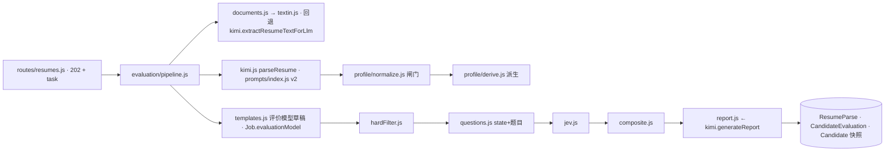

## 0. 结论

- 三层流水线已在 `feature/textin-kimi-jev` 分支完整实现并在本地用**真实** TextIn / Kimi / Jev 跑通:样例简历(PDF)→ TextIn 1.1s → Kimi 结构化 43s → JD 建模(首次,Kimi)+ Jev 判定 0.9s → Kimi 报告 29s,总计约 2 分钟;评估 A 类 96 分,10 条报告引文全部通过原文校验,校园干部 / 竞赛 / 奖学金 / 专业课程 / 三张证书全部抽到。
- 单元测试 41/41(全量 `node --test`:profile 派生与闸门 9 + 评估模块 9 + Jev/TextIn 4 + 既有 19),CI `npm test` 自动纳入。
- **默认关**:`TEXTIN_ENABLED=false`、`JEV_ENABLED=false`、`JEV_MODE=shadow`;不配置任何新变量时,行为与主线一致(旧回退链 + legacy 评估)。
- 用户追加要求(校园干部 / 班干部、奖项证书、专业课程)已进 prompt v2 与 profile schema(`campus.roles / campus.competitions / campus.scholarships / certificates / awards / education[].courses`)。

## 1. 代码结构(as-built)

| 层 | 文件 | 说明 |
|---|---|---|
| 配置 | `server/src/lib/settings.js` | 新增 `textin.* / jev.* / eval.* / kimi.report_prompt / kimi.jd_schema_prompt`,凭证类加密且仅 admin 可写 |
| 文档层 | `lib/textin.js` · `lib/documents.js` | xParse `pdf_to_markdown`;`page_count` 上限 `textin.max_pages`(默认 10);探活发 1 字节非法文件不计费;失败回退旧链 |
| 理解层 | `lib/prompts/index.js` · `lib/kimi.js` · `lib/profile/normalize.js` · `lib/profile/derive.js` · `lib/taxonomy/` | prompt v2 输出 resume.v1;旧 prompt 输出自动升级(`legacyToProfile`);`profileToLegacy` 让 `assembleSummary` / 旧列零改动;10 张词表 JSON(行业/职能/领域/工具/软技能/语言/证书/专业/城市/国家) |
| JD 侧 | `lib/jd/normalize.js` · `lib/evaluation/templates.js` | jdFacts 闸门(引文校验);6 个 HR 模板;`draftEvaluationModel` / `validateEvaluationModel` |
| 规则层 | `lib/evaluation/hardFilter.js` | 11 种 op;字段白名单;三态 |
| 评估层 | `lib/jev.js` · `lib/evaluation/questions.js` · `lib/evaluation/composite.js` | 直连 `POST /v1/systemone`;sha256 缓存(Redis/内存);并发 5;脱敏 + 段落优先级截断;固定题 |
| 报告层 | `lib/evaluation/report.js` · `kimi.generateReport` | 引文归一子串校验 + TextIn detail 反查页码;无 Kimi 时确定性兜底报告 |
| 编排 | `lib/evaluation/pipeline.js` | mode create / full / reextract / reevaluate / report;`task.stages` 进度;Jev 失败 → legacy;shadow 双写 |
| 路由 | `routes/resumes.js` `routes/jobs.js` `routes/candidates.js` `routes/system.js` `routes/share.js` `routes/upload-links.js` | 见 §3 |
| 数据 | `prisma/migrations/20260920120000_textin_kimi_jev_v1` | ResumeParse / CandidateEvaluation 新表;Candidate 6 列;Job 6 列 |
| 运维 | `prisma/backfill-evaluations.js` · `docker-compose.yml` · `.env.example` · `tools/lark-ingest/ingest.mjs`(jpg/png) | |

## 2. 与设计的差异(为什么)

| 设计 | 实际 | 原因 |
|---|---|---|
| 00 号 `Job.requirementSchema` | `Job.jdFacts + Job.evaluationModel`(03 号) | 事实层与评价层分离,合规审计与换模型互不牵连 |
| 硬筛 `unknownPolicy=ignore` → IGNORED 不问 Jev | UNKNOWN 一律交 Jev 再判,`ignore` 只影响计分分母 | 样例里新能源项目经历被误判「未提及」(坑 #53) |
| `pickParseModel` 强制 `moonshot-v1-32k` | `resolveModel` 以账号 `/v1/models` 实时列表为准 | Moonshot 已下线 v1 系列(坑 #50),旧逻辑必 404 |
| 报告按需(C/D 不自动写) | 保留策略 `eval.report_policy`(默认 auto_ab),C/D 无 Kimi 报告时用**确定性兜底报告**填 risks/highlights | 列表与飞书卡片不至于空白;HR 点「生成报告」再花 Kimi |
| 公开页新增 `showEvaluation` 开关 | 复用现有 `candidate.jdMatch` 模块闸 | 不加列不加迁移,语义一致 |
| `/resumes/match` 同步 | 改异步 202 + task | Jev 快但 Kimi 报告 15-30s,避免 Cloudflare 100s |
| 词表由 admin 在 DB 维护 | 先以 JSON 随代码发布 | 首版够用;后续可迁 DB |

## 3. API 清单(新增 / 变更)

| 端点 | 变化 |
|---|---|
| `POST /api/resumes/parse` | body 增 `mode`(`full` / `reextract` 默认 / `reevaluate`);响应不变 |
| `POST /api/resumes/match` | **同步 → 202 + task**;body 增 `engine`(jev / legacy 调试用) |
| `POST /api/resumes/evaluate-batch` | 新:`{jobId, candidateIds[≤200]}` → `{tasks[]}`,串行 3 路 |
| `POST /api/resumes/candidates/:id/report` | 新:按需补报告 |
| `GET /api/resumes/parse-tasks/:id` | task 增 `stages`、`evaluation`、`mode` |
| `GET /api/resumes/llm-status` | 增 `providers{kimi,textin,jev}` |
| `GET /api/candidates` | query 增 `classification / reviewPriority / jobId` |
| `GET /api/candidates/:id/profile` · `GET /:id/evaluations` · `PATCH /:id/evaluations/current/override` | 新 |
| `POST /api/jobs/:id/extract-facts` · `POST /:id/evaluation-model/suggest` · `GET /api/jobs/evaluation/templates` · `GET /api/jobs/taxonomy/:kind` | 新;`POST/PATCH /jobs` 接受 `jdFacts / evaluationModel`(422 校验) |
| `POST /api/resumes/parse-jd` | 响应增 `jdFacts`;文档层优先 TextIn |
| `GET /api/system/providers` · `POST /api/system/settings/textin/test` · `POST /api/system/settings/jev/test` | 新;`PUT /settings/:key` 对布尔/枚举/JSON key 做校验;凭证类 key 仅 admin |
| `GET /api/public/share/:token` | candidate 增 `classification / reviewPriority / evaluation`(受 jdMatch 模块闸) |
| `POST /api/public/upload/:token/presigned-url` | 允许 `image/jpeg` `image/png` |

## 4. 本地验证记录(2026-09-20)

| 项 | 结果 |
|---|---|
| TextIn 探活 / 解析 | PDF 1 页 940ms、DOCX 2 页 887ms,markdown 带标题层级与逐段坐标 |
| Jev 探活 / 判定 | 1 道题 ~1s;11 道题 4.9K token 880ms,$0.0002 |
| Kimi | 账号可用模型 `kimi-k2.6 / kimi-k2.7-code / kimi-k2.7-code-highspeed / kimi-k3`;结构化 43s,JD 事实抽取 + 措辞 ~48s(每岗位一次),报告 29s |
| 全链路 create | 样例简历 → A 类 96 分;硬筛 12 项全 PASS(出差意愿 UNKNOWN → Jev 0.84 满足);报告 10 条引文 0 条丢弃 |
| reevaluate(无 profile 的存量候选人) | 走最小 profile + 固定题,C 类 65 分「信息不足」,耗时 0.5s |
| 人工覆盖 / 分类筛选 / profile 端点 / 模板 / 词表 | 200 |
| 单测 | `node --test` 41/41 |
| 前端 | 候选人详情(评估卡 / 结构化档案 / 异步重评 / 按需报告 / 人工覆盖 / 历史)、ReparseConfirmModal 三档、公开分享页评估块、岗位页评估标准 chip + `JdDescModal` 三 tab + `EvaluationModelEditor`、列表分类 chip / 筛选 / 批量评估、Upload 四段 stepper + 图片上传、LLM 配置弹窗三层配置;`iconMap` 已重生成;`vite build` 通过。**未在浏览器点击验证**(本会话无浏览器工具),风险:交互细节需人工走一遍 |

## 5. 上线步骤(VPS)

1. VPS `/opt/mesa/.env` 追加(值不加引号,坑 #47):`TEXTIN_APP_ID` `TEXTIN_SECRET_CODE` `TEXTIN_ENABLED=true` `JEV_API_KEY` `JEV_ENABLED=true` `JEV_MODE=shadow`。
2. 合并 PR → 自动部署;镜像启动会自动 `prisma migrate deploy`(新表 + 新列,存量零影响)。
3. `docker compose up -d --force-recreate backend`(坑 #8),LLM 配置页三家「测试连接」。
4. **把 `kimi.model` 改成账号实际存在的模型**(坑 #50),否则旧配置会被 `resolveModel` 自动回退但 UI 显示仍是旧名。
5. 回填存量:`docker exec mesa-server node prisma/backfill-evaluations.js`(把旧 jdMatch 包成 legacy 评估行,列表分类筛选立即可用)。
6. 灰度:`JEV_MODE=shadow` 跑 1-2 周(评估表里 `shadow=true` 行为 Jev 结果,`isCurrent` 行仍是 legacy)→ 用 SQL 对比分类分布 → 改 `jev.mode=primary`(settings 30s 生效,无需部署)。
7. 校准:抽 30-50 份脱敏历史简历按 02 号 §10.3 跑 golden set,调整 `eval.thresholds` / 模板权重。

## 6. 成本与限制

- 每份简历:TextIn ≈ 0.05-0.25 T币;Kimi 结构化 ≈ 4.7K 输入(前缀缓存命中约 4.1K)+ **1.0K 输出**(`kimi-k2.6` 关闭思考;若落到不能关思考的 `-highspeed` 变体则输出 5K+,其中 75% 是 reasoning,坑 #57);Jev ≈ 5K token ≈ $0.0002;报告 ≈ 6K 输入 + 1-2K 输出(仅 A/B 自动);JD 事实抽取 + 措辞每岗位一次 ≈ 8K 输入。
- 与旧流水线对比:旧 = 1 次抽取(约 2.7K prompt)+ 1 次 JD 联评;新 = 1 次抽取(11K prompt,但缓存命中后增量很小)+ Jev(不走 Kimi)+ 报告(A/B 时)。关闭思考后 Kimi 输出 token 与旧流水线同量级;真正的增量是首次评估某岗位时的 JD 建模两次调用。
- Jev state 默认脱敏(姓名/电话/邮箱/链接/身份证行),`eval.pii_strip=false` 需 admin;TextIn 必须收原文件 → 隐私政策与交付文档需补第三方处理者。
- 本地无 R2:e2e 用桩 R2 客户端喂本地文件;上传 → R2 → 解析链路依赖生产 R2,已由旧代码路径保证。
- 前端交互未做浏览器点击验证。
