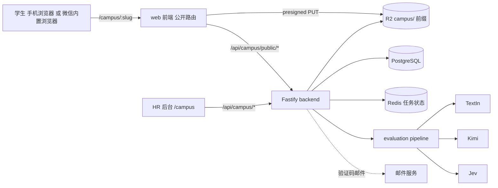
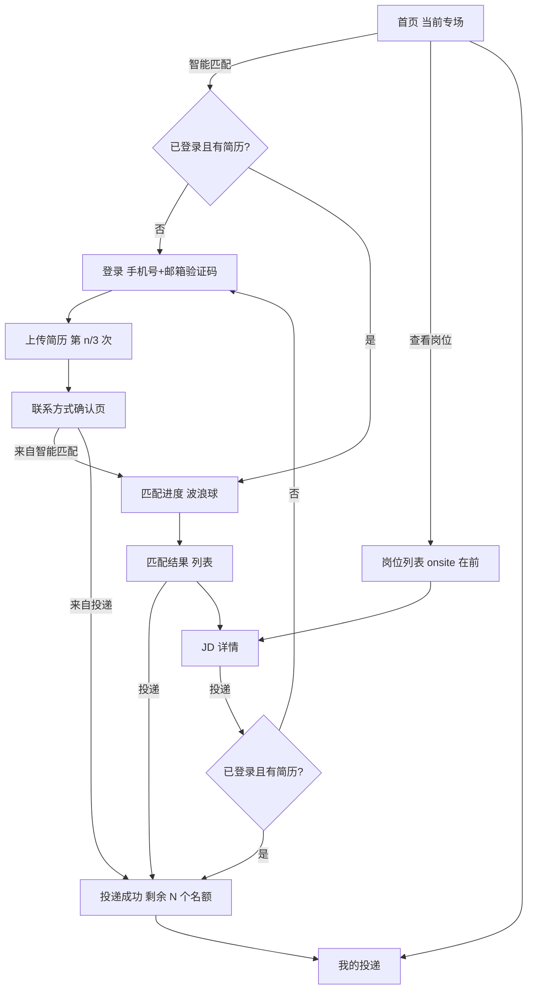
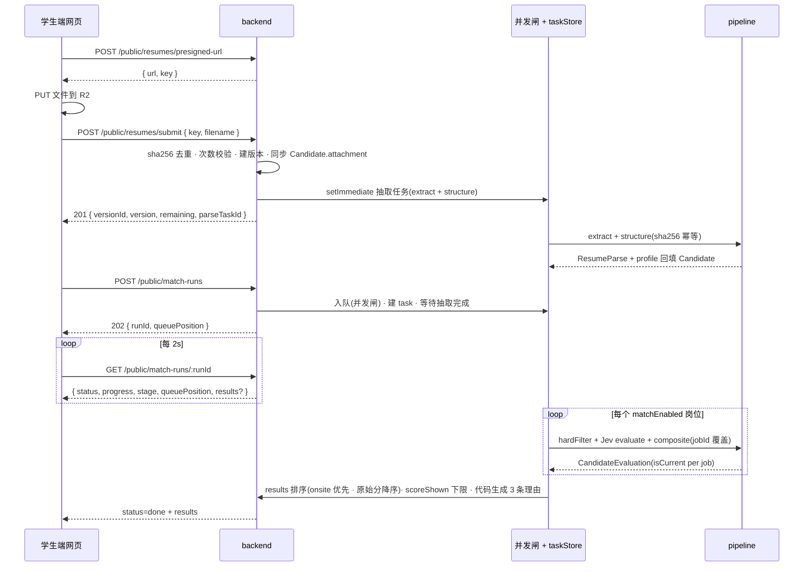
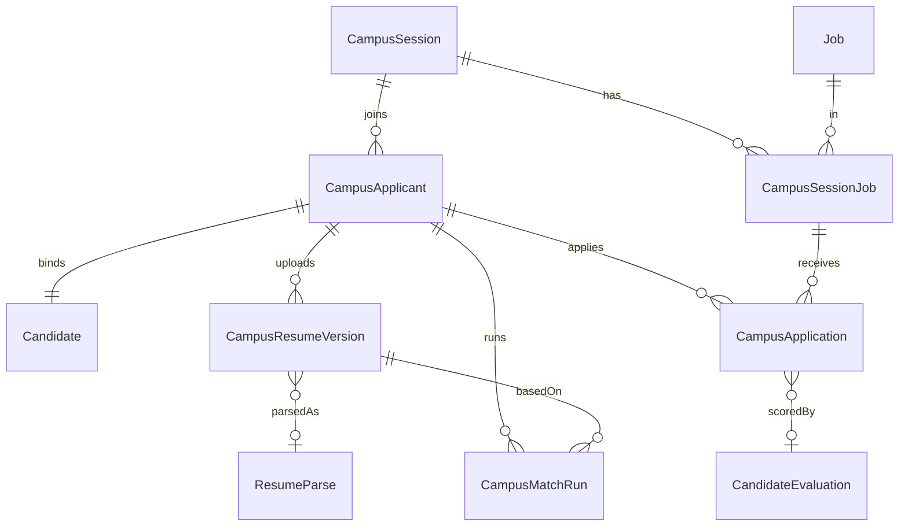
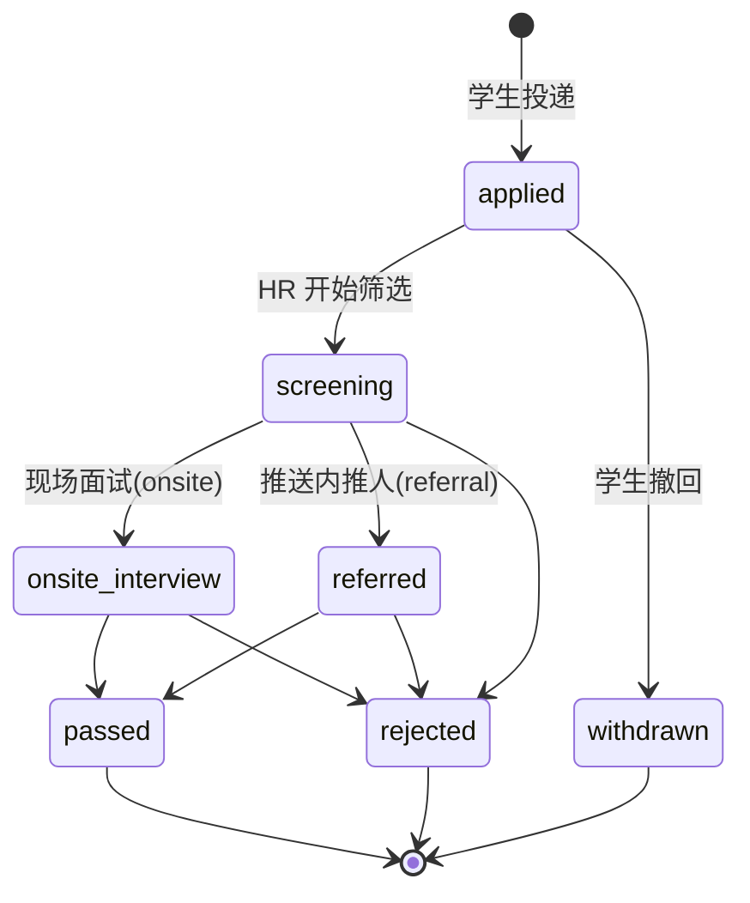

## 0. 结论与边界

- **定位**:校招模块 = 后台(Web `/campus`,pageKey `campus` 已挂好占位)+ **学生端移动网页**(AuthGuard 外的公开路由 `/campus/:slug`,扫码在微信内置浏览器或任意浏览器打开)。不做微信小程序:省掉 ICP 备案、企业主体、AppID 与提审周期,前端代码与现有 React / Tailwind / GSAP / `LiquidLoader` 直接共用。
- **复用优先**:简历存储(R2 presigned 直传,与公开上传链接同款)、三层解析评估(TextIn → Kimi → Jev,已有 `tpl.campus.general` 校招评价模板与 `derived.isFreshGraduate` 应届判定)、异步任务轮询(`parseTaskStore`,规避 Cloudflare 100s)、候选人详情 / 分享 / 面试评价,全部沿用。校招新增的是「专场 / 学生 / 投递 / 简历版本」四类实体和一套学生端公开 API。
- **学生免登录,扫码直达**:后台为每个专场生成三个入口码 / 链接(首页 / 直接投递 / 智能匹配),学生扫到哪个就进哪个流程,不注册不登录。首次上传简历时勾选《个人信息处理告知》即匿名建档,会话保存在当前浏览器;两条路径都**必须先上传简历并确认联系方式**(手机 / 邮箱 / 微信在确认页一次填好),之后才能投递或匹配。
- **四条定稿规则**:每专场最多投 3 岗(可配);简历最多传 3 次、以最新为准、旧版存档;对学生展示的匹配分以 60 为**展示下限**(内部保留原始分与 A/B/C/D);**任何简历上传成功即后台抽取**(TextIn + Kimi 结构化,不评估),直投学生的学校 / 专业 / 学历在台账里即时可见,智能匹配复用抽取结果只跑评估。
- **数据落到现有候选人体系**:每位学生对应一条 `Candidate`(来源 `校招·<专场名>`),投递、匹配、面试评价在现有页面都能看到;台账页是校招视角的汇总,不复制一套候选人管理。
- **分期**:Phase 0 后台台账与配置(无学生端即可用,线下收简历也能登记)→ Phase 1 学生网页「上传 + 直接投递」→ Phase 2 「智能匹配」→ Phase 3 现场面试联动。

<b>网页版相对小程序的两处取舍</b>:① 学生身份没有 openid,采用<b>匿名会话</b>(浏览器 localStorage 保存学生 JWT,30 天),身份信息在确认联系方式页采集;换设备 / 清缓存会产生第二条记录,台账按手机号提示重复,由 HR 合并;② iOS 微信内置浏览器选文件只能从「文件」App 选,不能直接选聊天记录里的简历,页面要给一行指引并提供电脑端上传兜底。详见 §5.1 与 §12。

---

## 1. 背景与目标

### 1.1 现状

- main 已合并「校招」侧边栏入口(PR #220):pageKey `campus`、路由 `/campus`、`pages/Campus.jsx` 占位「建设中」。默认仅 admin 可见,可在用户管理授权。
- 现有能力可直接复用:

| 现有能力 | 位置 | 校招如何用 |
| --- | --- | --- |
| 公开上传(无登录)| `routes/upload-links.js` + `pages/PublicUpload.jsx`,`/api/public/upload/:token` | 学生端上传沿用「presigned PUT R2 → submit 事务建 Candidate」模式,鉴权由 token 链接改为学生会话 JWT;微信内置浏览器兼容经验(302 跳转代替 `window.open`)直接继承 |
| 异步解析任务 | `lib/parseTaskStore.js`(Redis,退化内存)+ `GET /resumes/parse-tasks/:id` | 匹配任务复用同一存储与轮询模式,学生端 2s 轮询 |
| 三层解析评估 | `lib/evaluation/pipeline.js`(extract / structure / evaluate / report 四阶段)| 一次抽取、多岗位评估;校招模板 `tpl.campus.general` 已把年限设 INFO、毕业批次设 MUST、项目 / 校园经历设 CORE |
| 评价模型 / JD 事实 | `Job.jdFacts` + `Job.evaluationModel`,`jd.basics.recruitType = campus` 自动选校招模板 | 参与智能匹配的 JD 在后台一键「抽取 JD 事实 + 生成评价模型」后才可开启匹配 |
| 候选人详情 / 分享 / 面试评价 | CandidateDetail / ShareLink / InterviewEvaluation | 现场面试官扫码评价、HR 分享简报,零改动 |
| 波浪球 | `Primitives.jsx` `LiquidLoader`(三档调色板 red ≤60 / blue 60–80 / violet >80,`loading` 呼吸光晕)| 学生端进度动画与匹配分展示**直接复用组件** |
| 邮箱验证码 | `lib/email.js` + `lib/verificationCodes.js`(登录 / 找回密码已用)| 学生登录发码、限流、过期逻辑复用 |
| Excel 导出 | exceljs(部门统计 / 面试评价 / 绩效密钥导出)| 台账导出 |

### 1.2 目标

1. HR 能在后台建**专场**(如「10 月 8 日 南京理工大学专场」),挂上本场可投递的岗位,区分「现场面试」与「内推」,设置可投递岗位数、简历上传次数、参与智能匹配的 JD。
2. 学生扫展板二维码打开网页即是当前专场首页,两个入口完成投递;不知道投什么时上传简历,系统给出匹配度(现场面试岗位优先)。
3. 后台**台账**一页看全:谁、哪所学校、投了哪 3 个岗、匹配分多少、简历传了几版、联系方式是否确认、当前进展;支持筛选、批量流转、导出。
4. 学生上传的每一版简历都存档可追溯,系统始终以最新版为准;每位投递学生都有简历且上传即抽取,HR 在台账直接看到学校 / 专业 / 学历,不需要事后催传或手动点解析。

### 1.3 设计原则

- **最小改动**:不改现有 Candidate / Job 表语义,校招字段放新表;现有页面零回归。
- **先后台后学生端**:后台 + API 契约先行,学生端按契约开发,契约在本文 §8 固定。
- **解析计费可控**:一份简历只抽取一次(sha256 幂等),评估按岗位数线性,报告层对学生端关闭(用代码从逐项判定生成 3 条理由)。
- **公开端点只回必要字段**:学生端 API 不暴露内部评估明细、不返回其他学生数据、不返回 R2 直链。

---

## 2. 名词与角色

| 名词 | 含义 |
| --- | --- |
| 专场 `CampusSession` | 一次校招活动(学校 + 日期 + 首页文案 + 规则参数 + URL slug)。同一时刻**只有一个**专场处于「上线」状态;首页路由 `/campus/:slug`,`/campus` 公开根路径自动跳当前上线专场 |
| 专场岗位 `CampusSessionJob` | 专场与 `Job` 的关联,带类型 `onsite`(现场面试)/ `referral`(内推,不能现场面试)、是否参与智能匹配、排序 |
| 学生 `CampusApplicant` | 学生端用户,首次上传时匿名建档(手机号为空),确认联系方式后填入手机 / 邮箱 / 微信;绑定一条 `Candidate` |
| 简历版本 `CampusResumeVersion` | 学生每次上传生成一版(v1 / v2 / v3),最新版为当前版 |
| 投递 `CampusApplication` | 学生 × 岗位,来源 `direct`(看 JD 直投)/ `match`(智能匹配后投),带状态机 |
| 匹配任务 `CampusMatchRun` | 一次「以当前简历版本 → 抽取 → 对所有参与匹配岗位评估」的异步任务 |
| 角色 | **学生**(网页,匿名会话,免登录)· **HR / 招聘官**(后台,需 `campus` pageKey)· **admin**(全部 + 专场规则)· **面试官**(沿用面试评价公开页,扫码无登录)|

---

## 3. 总体架构

- **同一前端工程两组路由**:`/campus`(后台,AuthGuard 内)与 `/campus/:slug/*`(学生端,AuthGuard 外,与 `/share/:token`、`/upload/:token` 同层级),学生端页面 lazy mount 不进后台 bundle 主链。
- **两套 API 前缀,同一进程**:`/api/campus/*` 后台(JWT + pageKey `campus`),`/api/campus/public/*` 学生端(学生 JWT,`aud=campus-public`,与后台 JWT 同密钥不同 audience,互不通用)。
- **学生会话(免登录)**:首次上传前勾选告知 → `POST /auth/start` 建占位 `Candidate` + `CampusApplicant`(phone 为空)→ 签 30 天 JWT 存 `localStorage`(`mesa.campus.token.v1`);之后所有请求带该 token。手机 / 邮箱 / 微信在「确认联系方式」页写入学生与 Candidate。无需验证码、无第三方凭证。
- **任务执行**:匹配任务 `setImmediate` 起跑,状态写 `parseTaskStore`;增加一个进程内并发闸(`campus.match.concurrency`,默认 3)避免专场现场几百人同时上传把 Kimi / Jev 打爆,排队中的任务也回「排队位次」给学生端显示。

---

## 4. 业务规则矩阵

需求 9 条 + 本次定稿 3 条,逐一落成规则与可配置项:

| # | 需求 | 规则 | 配置位置 | 默认 |
| --- | --- | --- | --- | --- |
| 1 | 最多投递 3 个岗位 | 每学生在**同一专场**内有效投递(未撤回)≤ `maxApplyJobs`;达上限 409 `campus_apply_quota_exceeded`;同一岗位不可重复投 | 专场 | 3 |
| 2 | 现场面试 / 内推两类岗位 | `CampusSessionJob.kind = onsite \| referral`;JD 卡与匹配结果均显示类型角标;内推岗位投递成功页文案「将由内推人跟进,不安排现场面试」 | 专场岗位 | — |
| 3 | 不知道投什么 → 上传简历智能匹配 | 对 `matchEnabled=true` 的专场岗位逐一评估;结果**先 onsite 后 referral**,组内按原始分降序;只对学生端可见的岗位评估 | 专场岗位 | 开 |
| 4 | 上传后确认联系方式 | 上传完成即进「联系方式确认页」:手机(必填)、邮箱(必填,不验证)、微信号(可选)、姓名 / 学校 / 专业(抽取结果预填),勾选「我确认以上方式可直接联系到本人」后才能发起匹配或投递;`contactConfirmedAt` 记录 | — | 必须 |
| 5 | 只有两个按钮 | 首页仅「智能匹配」「查看岗位投递」;可投递数、匹配参与范围均由后台配置 | 专场 | — |
| 6 | 简历最多上传 3 次,以最新为准,旧版存档 | 同一专场内 `resumeUploadCount ≤ maxResumeUploads`;新版成功后 `currentResumeVersionId` 指向它并同步 `Candidate.attachment`;旧版仅存档;后台可看版本列表与时间、可下载任一版 | 专场 | 3 |
| 7 | **评分最低 60 分 = 展示下限(定稿)** | 对学生展示分 `scoreShown = max(scoreFloor, scoreRaw)`;**内部保留原始分、A/B/C/D、硬筛结果**,台账可切换看原始分;排序与 HR 判断用原始分;硬筛 FAIL 的岗位折叠到「暂不匹配」不显示分数 | 专场 `scoreFloor` | 60 |
| 8 | 抽取 / 匹配阶段进度动画 | `LiquidLoader` 按任务阶段映射进度(§5.5),轮询 2s,排队时显示「前方 N 人」 | — | — |
| 9 | 首页专场可配置 | 专场的 `slug / heroTitle / heroSubtitle / bannerKey / startsAt / endsAt / status`;`GET /public/session/current` 返回当前上线专场;无上线专场时首页显示「暂无进行中的校招专场」 | 专场 | — |
| 10 | **投递与匹配都必须先上传简历(定稿)** | 任一路径在无当前简历版本时先跳上传页;`POST /applications` 与 `POST /match-runs` 后端二道防线:无 `currentResumeVersionId` → 428 `campus_resume_required` | — | 强制 |
| 12 | **上传即抽取(定稿)** | `POST /resumes/submit` 成功后 `setImmediate` 起抽取任务(pipeline `extract + structure`,**不评估**);学生不等待,直接进联系方式确认页;抽取完成回填 Candidate 的学校 / 专业 / 学历 / 姓名并预填确认页;智能匹配复用该结果(sha256 幂等)只跑评估 | — | 强制 |
| 11 | **不做小程序,直接用网页(定稿)** | 学生端为 `/campus/:slug/*` 公开路由;后台专场生成**三个入口码**:首页 `/campus/:slug`、直接投递 `/campus/:slug/jobs`、智能匹配 `/campus/:slug/match`,展板 / PPT / 公众号菜单任选 | — | — |
| 13 | **学生免登录(定稿)** | 不注册不登录;首次上传勾选告知即匿名建档,会话存浏览器 30 天;「我的投递」只在同一浏览器可见,换设备需联系 HR 查询 | 系统 `campus.auth.jwt_ttl` | 30d |
| 14 | **后台任务不随页面中断,可取消(定稿)** | 抽取 / 匹配都是服务器后台任务(状态在 Redis / DB),学生关页、切后台、换页都不中断;进行中的页面(确认页 / 我的投递 / 匹配进度)显示提示条「关闭页面也不会中断,稍后可在我的投递查看」+「取消」。取消为协作式:置任务 `cancelRequested`,流水线在阶段边界(抽取前后 / 评估前 / 落库前)检查并退出,不落库;版本行立即标 `cancelled`,可「重新解析」(不计上传次数)。HR 台账同样可取消 / 重试 | — | — |

---

## 5. 学生端网页(H5)设计

### 5.1 技术与兼容

- **同一 React 工程**:`web/src/pages/campus/public/*`,路由挂在 `App.jsx` AuthGuard 外,与 `PublicUpload.jsx` 同模式;移动端优先布局,桌面端居中 480px 容器。
- **免登录会话**:上传页首次使用时勾选《个人信息处理告知》→ `POST /auth/start` 匿名建档并签 30 天 JWT;token 存 `localStorage`,丢失即视为新学生(记录仍在系统中,HR 可按手机号合并)。
- **上传**:`<input type="file" accept=".pdf,.doc,.docx">` → `POST /resumes/presigned-url` → 浏览器 PUT R2 → `POST /resumes/submit`,与公开上传链接完全一致;≤ 20MB,后缀 + magic bytes 双校验。
- **微信内置浏览器**:iOS 只能从「文件」App 选文件,页面上传按钮下固定一行指引「微信里的简历请先长按 → 用其他应用打开 → 存储到文件」;首页右上角「电脑上传」展示本专场的二维码与短链(复用 `UploadShareLink`,`defaultSource` 写专场名,HR 在台账可把该上传合并到学生记录);所有新开窗口用 `<a target="_blank">` + 后端 302,不用 `window.open`。
- **波浪球**:直接 `import { LiquidLoader }`,无需重写。
- **动效**:GSAP + `prefers-reduced-motion`,与 Reports 一致。

### 5.2 页面与流转

| 页面 | 要点 |
| --- | --- |
| 首页 `/campus/:slug` | 专场 banner + 标题 / 副标题(后台配)+ 两个大按钮;底部小字「我的投递」与「已投 x/3」;右上「电脑上传」二维码;无上线专场时空态 |
| 岗位列表 | 两段:**现场面试岗位**、**内推岗位**;卡片显示岗位 / 部门 / 地点 / 类型角标 / 已投标记 |
| JD 详情 | 复用 `Job` 的 description / responsibilities / requirements / nice / benefits;底部「投递」按钮,达上限时置灰并提示;无简历时按钮文案变「上传简历并投递」 |
| 上传简历 | 显示「第 n/3 次上传,新版将覆盖旧版用于匹配与投递」;选文件 → 进度条;submit 成功即进下一页,抽取在后台跑;失败可重试不计次(只有 submit 成功才计数) |
| 联系方式确认 | 姓名、手机(必填)、邮箱(必填)、微信号;顶部一行小波浪球显示「正在读取简历…」,抽取完成后姓名 / 学校 / 专业 / 学历自动预填供学生确认修改;三条提示语:务必保持畅通 / 最好电话或微信能直接联系本人 / 面试通知通过这些渠道发出;复选框确认 |
| 匹配进度 | `LiquidLoader loading` + 阶段文案 + 排队位次;可退出页面,再进「我的投递」能看到结果 |
| 匹配结果 | 两段(onsite / referral)各岗位:`LiquidLoader size=48` 显示 `scoreShown` + 3 条理由(2 条匹配点 + 1 条待补充);「投递」按钮;硬筛不通过的岗位折叠到「暂不匹配」并写明原因(如毕业批次) |
| 我的投递 | 投递列表与状态(已投递 / 筛选中 / 现场面试 / 内推已推送 / 通过 / 未通过)、可撤回(仅已投递 / 筛选中)、简历版本与剩余上传次数、「重新匹配」按钮(有新版本时高亮);本设备无会话时提示先上传简历或「找回记录」 |
| 找回记录 | 换设备 / 清缓存后:填当时确认过的手机号 + 邮箱 → 邮箱验证码(复用 `verificationCodes`,purpose `CAMPUS_RECOVER`)→ 验证通过把本设备会话接回原记录。**不是登录**:没有账号密码,只匹配「已确认联系方式」的记录;入口在首页底部、上传页、我的投递空态 |

### 5.3 流程 A:看 JD 直接投递

1. `GET /public/session/current` → 首页;`GET /public/session/current/jobs` → 两段列表;`GET /public/jobs/:id` → 详情。
2. 点投递:无会话或无简历 → 上传页(首次勾选告知即匿名建档)→ 联系方式确认页;两者都有且已确认 → 直接投递。前端带 `next` 回到 JD 并自动完成投递。
3. `POST /public/applications { jobId, source: "direct" }` → 201;后端校验专场在线、岗位属于本专场、额度、重复、**有简历**、**已确认联系方式**。
4. `/auth/start` 时事务内创建占位 `Candidate`(name「待解析简历」,source `校招·<专场>`,tags `["校招", <学校>]`,ownerId = 专场创建者),抽取完成后回填姓名 / 学校,确认页写入手机 / 邮箱;投递时 `Candidate.jobId` 若为空则设为本次岗位。
5. submit 成功即起抽取任务(`extract + structure`),学生进确认页时后台已在跑;抽取完成回填 `Candidate` 学校 / 专业 / 学历与 `profile`,台账立即可见。抽取失败(如 .doc 超时)不阻塞投递,台账标「待解析」由 HR 重试。

### 5.4 流程 B:不知道投什么 → 智能匹配

- **上传即抽取,匹配只评估**:submit 起 `mode=reextract`(仅 extract + structure,写 `ResumeParse` + `Candidate.profile`);match-run 起时若该版本抽取仍在跑则等待(进度条停在 60% 以下显示「正在读取简历」),已完成则直接从 evaluate 阶段开始。`pipeline.runPipeline` 需小幅扩展:`opts.jobId` 覆盖、`opts.skipReport=true`、`opts.skipEvaluate=true`。抽取结果以 `ResumeParse(candidateId, fileSha256, provider)` 幂等,再传同一文件不重复计费。
- **理由生成不走 Kimi**:从 `CandidateEvaluation.items` 取 `verdict=满足` 且 tier 最高的 2 项 + 1 项 `未提及 / 不满足`,模板化成「符合:xxx」「可补充:xxx」;报告层 `reportStatus=skipped`,HR 在候选人详情点「生成报告」时再跑。
- **结果快照**:写 `CampusMatchRun.results`,学生端和台账都读快照,不每次重算。
- 匹配完成后学生仍受 3 岗上限,投递用 `source: "match"` 并带 `matchRunId`。

### 5.5 进度动画(波浪球)

| 阶段(task.stages)| 进度区间 | 文案 |
| --- | --- | --- |
| queued(并发闸排队)| 0–5%,不涨 | 「前方还有 N 位同学,请稍候」 |
| extract(TextIn)| 5–30% | 「正在读取你的简历…」 |
| structure(Kimi 结构化)| 30–60% | 「正在理解你的经历与技能…」 |
| evaluate(逐岗位)| 60–95%,每完成一个岗位 +35/N | 「正在和 N 个岗位比对(k/N)…」 |
| done | 100% → 跳结果页 | 「匹配完成」 |
| failed | 球体 red 档 + 文案 | 「这次没成功,再试一次(不计上传次数)」 |
| cancelled | 球体灰 + 文案 | 「已取消」+「重新匹配」 |

- 进度页顶部常驻提示条:「匹配在后台进行,关闭页面也不会中断,稍后可在我的投递查看结果」+「取消匹配」按钮;取消同抽取的协作式机制,`CampusMatchRun.status=cancelled`。

- 抽取已在上传时完成的情况下(多数),匹配进度直接从 60% 起跑,学生等待时间只剩评估阶段(典型 10–30s)。
- 两次轮询之间用时间插值让水位缓慢上涨,但**不越过当前阶段上限**,避免「卡在 99%」。
- 组件即 `LiquidLoader`(`loading=true` 呼吸光晕,`level` 为插值后进度);结果页每个岗位用 `size=48` 静态显示 `scoreShown`。

### 5.6 简历版本规则

- 计数口径:**submit 成功**才 +1;解析失败不计次,可重传;同一 sha256 重复上传提示「与上一版相同」且不计次。
- 新版本上传后:立即起新一轮抽取(每版计 1 次 Kimi 结构化),`currentResumeVersionId` 指向新版,`Candidate.attachment` 同步,`Candidate.documents.resume` 追加一条(旧版保留在列表,标 `v1 / v2`),之前的匹配结果标 `stale=true`,学生「重新匹配」走新版本;已投递记录不受影响,HR 看到的始终是最新版。
- 达上限后上传按钮置灰:「已用完 3 次上传机会,如需更新请联系现场 HR」(HR 可在台账给单个学生加次数)。

---

## 6. 后台(Web `/campus`)设计

路由仍是 `/campus`,页内五个 tab:**台账 · 专场 · 岗位 · 数据 · 设置**。沿用 Tailwind 令牌、`Card` / `Table` / `StatusPill` / `LiquidLoader`。

### 6.1 台账页(默认 tab)

| 区块 | 内容 |
| --- | --- |
| KPI 行 | 本专场:学生数 / 投递数 / 已上传简历 / 已确认联系方式 / 现场面试中 / 已通过(GSAP CountUp,与 NewHire 一致)|
| 筛选 | 专场(默认当前上线)· 岗位 · 岗位类型 · 投递来源(直投 / 匹配)· 状态 · 学校 · 学历 · 毕业年份 · 解析状态(已解析 / 解析中 / 待解析失败)· 是否确认联系方式 · 搜索(姓名 / 手机 / 邮箱 / 学校)|
| 表格列 | 姓名(链到候选人详情)· 学校 / 专业 / 学历 / 毕业年 · 手机 / 邮箱 / 微信(受 `candidate.contact` 模块权限控制打码)· 联系方式确认 ✓ · 投递岗位(最多 3 个 chip,带 onsite / referral 角标与来源)· 匹配分(波浪球小图,hover 显原始分与 A/B/C/D)· 简历 v(n)/上限 · 当前状态 · 最近活动时间 |
| 行操作 | 查看学生详情抽屉 · 推进状态 · 安排现场面试(复用 Interview)· 生成面试评价二维码(复用 InterviewEvaluation)· 分享简报(复用 ShareLink)· 重试解析 / 重新匹配 · 加上传次数 |
| 批量 | 勾选 → 批量推进状态 / 批量安排面试 / 批量重试解析 / 导出 xlsx(exceljs,列同表格 + 原始分 + 各岗位分)|
| 学生详情抽屉 | 基本信息 + 联系方式 + 投递列表(每条:岗位、来源、分数、状态时间线)+ **简历版本列表**(v1 / v2 / v3:时间、文件名、大小、下载、是否当前版、对应解析结果)+ 匹配任务历史 + 「合并电脑端上传」(把 `UploadShareLink` 进来的同名 / 同手机候选人并入)|

### 6.2 专场 tab

- 列表:名称 / 学校 / 日期 / slug / 状态(草稿 · 上线 · 已结束)/ 学生数 / 投递数;「上线」互斥,点上线自动下线其他专场;上线后显示学生端二维码与短链(可下载 PNG 放展板)。
- 编辑表单:名称、学校、slug(自动生成可改)、日期区间、首页标题 / 副标题、banner 图(R2 `campus/banners/`)、`maxApplyJobs`、`maxResumeUploads`、`scoreFloor`、`matchEnabled`(整场开关)、`showSalary`。
- 岗位配置:从 `Job` 列表勾选加入,每行设 `kind`(onsite / referral)、`matchEnabled`、排序;加入时若 `Job.jdFacts` 或 `evaluationModel` 为空,行内显示「未生成评价模型」并提供一键生成(调校招 `/sessions/:id/jobs/:sjId/evaluation-model`,仅需 `campus.manage`),未生成不允许开匹配。
- 预览:右侧手机壳 iframe 直接加载 `/campus/:slug?preview=1`(草稿态也可预览,带 `preview` 参数时后端允许读草稿专场但禁止写操作)。

### 6.3 设置 tab(admin)

- 匹配并发 `campus.match.concurrency`;学生 JWT 有效期 `campus.auth.jwt_ttl`;验证码发送频率上限;联系方式确认页三条提示语文案;电脑端上传兜底开关。
- 权限:pageKey `campus` 看页;新增模块键 `campus.manage`(专场 / 岗位配置)、`campus.export`(导出含联系方式);默认仅 admin。

---

### 6.4 岗位 tab

- 按专场查看与管理 JD,默认当前上线专场;支持新建 JD、编辑 JD、从已有岗位加入、类型切换、参与匹配开关、排序与移除。
- 新建 JD 自动创建共享 `Job` 并加入当前专场;非管理员创建者同时获得该岗位的数据范围,移除绑定后仍可重新加入。已有岗位列表分页加载并遵循账号原有数据范围。
- 岗位卡展示部门、地点、薪资、学历、语言、名额、截止日期、投递数、评价模型状态;展开查看职责、要求、加分项、福利与全文。
- 编辑表单明确提示:改的是共享 Job,系统岗位页和其他共用专场同步生效。移除只解除专场关联;已有投递时不可移除。
- 一键生成 / 重新生成评价模型每次读取最新 JD,用校园招聘模板。仅有 `campus.manage` 的用户也可操作;生成期间若岗位被修改则拒绝保存旧模型。JD 内容变化后需手动重新生成,不自动覆盖已有模型。
- 上线专场提供「学生端预览」链接;只读用户可查看和展开 JD,不能写入。切换专场立即隐藏旧岗位,忽略晚到的旧请求;加载失败显示重试。
- 校验与 API 一致:不静默截断超限条目;保存期间防重复提交;截止日期按用户本地日期回显,未修改日期时保留原时间。

---

## 7. 数据模型

| 模型 | 关键字段 | 说明 |
| --- | --- | --- |
| `CampusSession` | `name slug(unique) school startsAt endsAt status(draft/live/closed) heroTitle heroSubtitle bannerKey maxApplyJobs=3 maxResumeUploads=3 scoreFloor=60 matchEnabled=true showSalary createdBy` | `status=live` 全表唯一(部分唯一索引)|
| `CampusSessionJob` | `sessionId jobId kind(onsite/referral) matchEnabled sortOrder` | `@@unique([sessionId, jobId])` |
| `CampusApplicant` | `sessionId phone? email? candidateId(unique) name wechat school major degree gradYear contactConfirmedAt consentAt consentVersion resumeUploadCount currentResumeVersionId extraUploads tokenVersion lastSeenAt registeredBy` | 匿名建档时 `phone` 为空;`@@index([sessionId, phone])` 非唯一(换设备会产生第二条,台账按手机号提示重复,HR 合并);HR 手工登记仍以手机号查重并跨专场复用 Candidate |
| `CampusResumeVersion` | `applicantId version attachmentKey fileSha256 filename size resumeParseId? uploadedAt` | `@@unique([applicantId, version])`;R2 key `campus/<sessionId>/<applicantId>/v<n>.<ext>` |
| `CampusApplication` | `applicantId sessionJobId jobId source(direct/match) matchRunId? resumeVersionId scoreRaw? scoreShown? evaluationId? status statusChangedAt note withdrawnAt` | `@@unique([applicantId, jobId])`;`resumeVersionId` 记投递时的版本,便于追溯;状态机见 §7.1 |
| `CampusMatchRun` | `applicantId resumeVersionId taskId status(queued/running/done/failed) results Json stale error startedAt finishedAt costs Json` | `results[]`:`{ jobId, kind, scoreRaw, scoreShown, classification, hardFilter, reasons[], evaluationId }` |

- `Candidate` 不加列;校招相关在 `CampusApplicant.candidateId` 反查。候选人列表 / 详情通过 `source` 前缀与 `tags` 识别校招来源;详情页右侧可加一张「校招」小卡(专场 / 投递 / 版本)——放 Phase 3。
- `CandidateEvaluation` 已支持 (candidateId, jobId) 多条,`isCurrent` 按岗位维度维护,不需改表。

### 7.1 投递状态机

- `withdrawn` 释放额度(可再投其他岗位);是否允许撤回见 §14。
- `passed` 时可一键把 `Candidate.status` 置「待入职」,触发现有候选人 → 员工自动转化。

---

## 8. API 契约

### 8.1 学生端公开端点 `/api/campus/public/*`(AuthGuard 外,学生 JWT)

| 方法 | 路径 | 入参 | 出参 / 错误 |
| --- | --- | --- | --- |
| GET | `/session/current` | `?slug=`(可选)| `{ session:{ id,slug,name,school,heroTitle,heroSubtitle,bannerUrl,maxApplyJobs,maxResumeUploads,matchEnabled,endsAt } \| null, me?:{ applied, uploads, hasResume, contactConfirmed } }`;无需登录 |
| GET | `/session/current/jobs` | `?kind=` | `{ onsite:[…], referral:[…] }`,每项 `{ id,title,dept,location,employment,salary?,applied }`;无需登录 |
| GET | `/jobs/:id` | — | JD 详情(白名单字段),非本专场岗位 404;无需登录 |
| POST | `/auth/start` | `{ slug?, consent: true }` | `201 { token, me, session }` 匿名建档;已持有效 token 时 `{ token: null, reused: true }`;422 `campus_consent_required`;专场未开放 410 |
| POST | `/auth/recover/send-code` | `{ slug?, phone, email }` | 匹配本专场已确认联系方式的记录 → 发邮箱验证码;404 `campus_record_not_found`;429 `campus_code_rate_limited`;424 `campus_email_send_failed` |
| POST | `/auth/recover/verify` | `{ slug?, phone, email, code }` | `{ token, me, session }` 接回原记录;400 `campus_code_invalid` |
| GET | `/me` | — | applicant + 版本数 + 投递摘要 |
| PATCH | `/me` | `{ name,wechat,school,major,degree,gradYear }` | applicant |
| POST | `/me/contact-confirm` | `{ phone, email, wechat?, name? }` | 写 `contactConfirmedAt` 并同步 Candidate;422 `campus_phone_invalid / campus_email_invalid` |
| POST | `/resumes/presigned-url` | `{ filename, contentType, size }` | `{ url, key }`;410 `campus_resume_quota_exceeded`;415 / 413 |
| POST | `/resumes/submit` | `{ key, filename, sha256 }` | `201 { versionId, version, remaining, duplicate, parseTaskId }`;事务:建版本 + 首次建 Candidate + 同步 attachment;事务外 `setImmediate` 起抽取任务 |
| GET | `/resumes/:versionId/parse-status` | — | `{ status(pending\|running\|done\|failed\|cancelled\|skipped), error, prefill }`(确认页小波浪球与预填用;done 时 prefill 附 `{ name, school, major, degree, gradYear }`)|
| POST | `/resumes/:versionId/cancel-parse` | — | 取消进行中的抽取(协作式),版本立即标 cancelled |
| POST | `/resumes/:versionId/reparse` | — | 取消 / 失败后重新解析当前版本,不计上传次数;running 时 409 |
| GET | `/resumes` | — | 版本列表(不含下载链接)|
| POST | `/match-runs` | — | `202 { runId, queuePosition }`;403 `campus_match_disabled`;428 `campus_resume_required` / `campus_contact_unconfirmed`;409 `campus_match_in_progress` |
| GET | `/match-runs/:id` | — | `{ status, stage, progress, queuePosition, results?, error? }` |
| POST | `/match-runs/:id/cancel` | — | 取消匹配(协作式,Phase 2)|
| POST | `/applications` | `{ jobId, source, matchRunId? }` | 201;409 额度 / 重复;428 无简历 / 未确认联系方式;410 专场已结束 |
| GET | `/applications` | — | 我的投递 |
| DELETE | `/applications/:id` | — | 撤回(若开放)|

- 限流:`/api/campus/public/*` 按访客 IP 每分钟 90 次(含 2s 轮询);上传次数由业务规则限制。
- 所有 5xx 对外改 4xx(与 Kimi 超时同款策略),让 Cloudflare 透传 JSON。
- `?preview=1` + 后台 JWT 时允许读草稿专场(供专场 tab 预览),写端点一律拒绝。

### 8.2 后台端点 `/api/campus/*`(JWT + pageKey `campus`)

| 资源 | 端点 |
| --- | --- |
| 专场 | `GET/POST /sessions` · `GET/PATCH/DELETE /sessions/:id` · `POST /sessions/:id/live`(互斥上线)· `POST /sessions/:id/close` · `GET /sessions/:id/qrcode.png` |
| 专场岗位 | `GET/POST /sessions/:id/jobs` · `PATCH/DELETE /sessions/:id/jobs/:sjId` · `POST /sessions/:id/jobs/reorder` |
| 台账 | `GET /sessions/:id/ledger`(分页 + 全部筛选,返回聚合行)· `GET /sessions/:id/ledger/export.xlsx` |
| 学生 | `GET /applicants/:id`(含版本 / 投递 / 匹配历史)· `GET /applicants/:id/resumes/:versionId/download`(302 R2 短时 URL)· `PATCH /applicants/:id`(加次数、改联系方式)· `POST /applicants/:id/merge { candidateId }`(并入电脑端上传)|
| 投递 | `PATCH /applications/:id`(状态 + note)· `POST /applications/bulk-status` |
| 匹配 | `POST /applicants/:id/match-runs`(HR 代跑 / 重跑)· `POST /sessions/:id/match-runs/bulk` · `POST /applicants/:id/resumes/:versionId/cancel`(取消抽取)|
| 设置 | 复用 `/system/settings`,新增键 `campus.match.concurrency` / `campus.auth.jwt_ttl` / `campus.auth.code_rate` / `campus.contact_hints` / `campus.pc_upload_enabled` |

所有新端点用 Fastify schema 校验入参,`:id` 走 `whereByIdOrExternal`,写操作记 `AuditLog`。

---

## 9. 智能匹配与评分

| 环节 | 方案 |
| --- | --- |
| 评价模型 | 专场岗位开匹配前必须有 `jdFacts` + `evaluationModel`;`jd.basics.recruitType=campus` 自动选 `tpl.campus.general`(毕业批次 MUST、年限 INFO、项目 / 校园经历 CORE)。专场编辑页可一键为所有岗位生成 |
| 抽取 | **上传即抽取**:走现有 extract(TextIn → pdftotext → Kimi Files 三级回退)+ structure(Kimi,`thinking=disabled`);`ResumeParse` 按 sha256 幂等;失败由 HR 在台账重试 |
| 评估 | 每岗位:hardFilter(代码)→ 题目生成 → Jev(答案缓存 7 天)→ composite;并行度受全局并发闸 |
| 排序 | `kind=onsite` 组 → `referral` 组;组内 `scoreRaw` 降序;硬筛 FAIL 单列「暂不匹配」 |
| 展示分 | `scoreShown = max(session.scoreFloor, scoreRaw)`,结果快照同时存两者;学生端只下发 `scoreShown` |
| 理由 | 代码从 `items` 生成,不调 Kimi;HR 侧报告按需生成 |
| 成本(估)| 每位学生:每个简历版本 TextIn 1 次 + Kimi 结构化 1 次(实测 kimi-k2.6 约 25s / 1K 输出 token,上限 3 版即 3 次)+ Jev N 次(N = 参与匹配岗位数,典型 5–10);Kimi 报告 0 次。专场 300 人 × 8 岗 ≈ 300–400 次 Kimi + 2400 次 Jev。上传即抽取把 Kimi 耗时前移到上传瞬间分散发生,匹配阶段只剩 Jev;抽取任务与匹配任务共用并发闸,并发 3 时上传高峰排队峰值约 300 × 30s / 3 ≈ 50 分钟 —— 需要**提前让学生在专场前几天上传**(专场可设「预热期」提前上线)|

---

## 10. 与现有系统的衔接

| 现有页面 | 校招数据如何出现 | 需改动 |
| --- | --- | --- |
| 候选人列表 / 详情 | 学生即 Candidate,`source=校招·南理工专场`,tags 含「校招」;投递岗位 = `Candidate.jobId`(主投递,取最早或分数最高)| 详情页加「校招」小卡(Phase 3)|
| Upload 页「我接收到的简历」| ownerId = 专场创建者,自动出现且已解析;列表 LiquidLoader「解析中」状态复用 `parsingStartedAt` | 无 |
| 分享简报 / 面试评价 | 直接用 | 无 |
| 面试安排 | 台账「安排现场面试」= 现有 `Interview` 建记录,方式线下、地点取专场地点 | 无 |
| 入职 | `passed` → 候选人状态「待入职」→ 自动 upsert Employee | 无 |
| 报表 | 新增「校招」看板(投递漏斗、学校分布、岗位热度)—— Phase 3 | 新页 |
| 审计 | 专场上线 / 下线、状态批量流转、导出含联系方式、学生合并 | 写 AuditLog |

---

## 11. 安全与合规

- **个人信息**:首次上传前展示《个人信息处理告知》并勾选同意(存 `consentAt` + `consentVersion`);联系方式在台账受 `candidate.contact` 权限打码,导出含联系方式需 `campus.export`。
- **会话**:匿名学生 JWT `aud=campus-public`(30 天),后台中间件拒绝该 audience;`tokenVersion` 支持 HR 单个学生强制下线;token 泄露只影响单个学生的本次会话。
- **身份冒用**:免登录下任何人都可填他人手机号,但只能新建记录、不能读取已有记录(会话与记录一一对应),HR 在台账按手机号发现重复后处理。
- **文件**:后缀 + magic bytes 双校验(pdf / doc / docx),≤ 20MB,R2 `campus/` 前缀与主桶分离;presigned key 由后端生成不可指定;所有外部解析器 / LLM 文本入库前 `deepStripNul`(坑 #54)。
- **防刷**:IP 限流 + 每会话上传 / 投递次数上限;同一文件 sha256 重复上传不计次也不重跑;匹配任务每学生同一时刻只允许 1 个运行中;学生换手机号绕过 3 次上限的成本高于收益,接受。
- **对外最小化**:学生端 API 不返回评估明细、其他学生信息、R2 直链;分数只回 `scoreShown`。

---

## 12. 非功能与基础设施

| 项 | 现状 | 方案 / 风险 |
| --- | --- | --- |
| 域名与备案 | 网页不要求 ICP 备案;公开上传链接已在微信内验证可用 | 无需新域名;若微信对 insovo.top 域名出现「已停止访问」拦截(通常由举报触发),备用短域名 + 302 即可切换 |
| 大陆访问 Cloudflare | 偶发慢 | 学生端静态资源与 API 均经 CF;首屏 bundle 需与后台分 chunk(已 lazy);必要时为 `/campus/*` 开 CF 缓存规则 |
| 峰值并发 | 并发闸 3,Redis 任务状态 | 专场现场建议预热期提前上传;若排队 >10 分钟,首页提示「现场可先直投,匹配结果稍后在『我的投递』查看」 |
| Cloudflare 100s | 已异步化 | 所有长任务 202 + 轮询,沿用 |
| 微信内置浏览器 | iOS 文件选择受限;`window.open` 被拦 | 指引文案 + 电脑端上传兜底;新窗口用 `<a>` + 后端 302(现有做法)|
| 换设备 / 清缓存 | 会话在 localStorage | 学生用「找回记录」(手机号 + 邮箱验证码)自助接回;验证码邮件依赖 Resend,QQ / 163 等学生常用邮箱需确认 SPF / DKIM;台账按手机号提示重复记录,HR 合并(Phase 3)|
| 备份 | 每日 PG 全量 → R2 | 新表自动纳入;R2 `campus/` 与简历同桶 |
| 可观测 | uptime-kuma | 新增 `/api/campus/public/health`(含并发闸水位、排队长度)|

---

## 13. 分期计划

| 阶段 | 范围 | 产出 | 估算 |
| --- | --- | --- | --- |
| **Phase 0 后台** | 5 张新表 + migration;专场 / 岗位配置 + 二维码;台账(筛选 / 详情抽屉 / 状态流转 / 导出);HR 手工登记学生 + 上传简历(线下收简历也能用);权限键 | `/campus` 三 tab 可用 | 4–5 人日 |
| **Phase 1 学生端·上传 + 直投** | 公开路由与页面(首页 / 岗位 / JD / 上传 / 联系方式确认 / 投递 / 我的投递);匿名会话;presigned 上传与版本;**上传即抽取**(pipeline `skipEvaluate`)+ 确认页预填;`/public/*` 端点与限流;隐私告知;后台三入口码 | 学生扫码即可上传简历并投递 ≤3 岗,台账即时见学校 / 专业 | 5 人日 |
| **Phase 2 学生端·智能匹配** | pipeline `jobId` 覆盖 + `skipReport`;并发闸;`CampusMatchRun`(等待 / 复用抽取结果);波浪球进度页;结果页;台账批量重跑 | 上传 → 匹配 → 投递闭环 | 4 人日 |
| **Phase 3 联动** | 候选人详情「校招」卡;批量安排现场面试 + 面试评价二维码;校招报表;`passed` → 待入职;电脑端上传合并 | 校招全流程进入现有招聘链路 | 3–4 人日 |

Phase 0 与 Phase 1 可由同一人串行,无外部前置条件(不需要备案、主体、第三方凭证)。

---

## 14. 待确认问题

1. **上传 3 次的口径**:按专场(本文默认)还是按手机号终身?
2. **是否允许学生撤回投递**以换岗位?默认允许,撤回释放额度。
3. **同一手机号跨专场**:默认每专场一条学生记录、Candidate 复用同一条;若希望每场独立候选人,改为每场新建。
4. **薪资是否对学生展示**:默认按专场开关,内推岗位默认不展示。
6. **硬筛不通过的岗位**(如非目标毕业批次)是否完全隐藏,还是折叠展示并写原因(本文默认折叠展示)。

### 已定稿(v2 / v3)

- 不做小程序,学生端为网页 `/campus/:slug`。
- 60 分为展示下限,不过滤、不影响排序与 HR 判断。
- 投递与智能匹配都必须先上传简历并确认联系方式。
- 任何简历上传成功即后台抽取(extract + structure,不评估),智能匹配复用抽取结果只跑评估。
- 学生免登录:扫码 / 链接直达(首页 / 直接投递 / 智能匹配三入口),首次上传勾选告知即匿名建档。
- 换设备用「手机号 + 邮箱验证码」找回记录(免登录,只接回会话)。

---

## 15. 实施进度

| 阶段 | 状态 | 说明 |
| --- | --- | --- |
| Phase 0 后台 | **已实现(分支 `feature/campus-module`,2026-10-08)** | 6 张表迁移 `20261007161233_campus_module`;`routes/campus.js` 全部 §8.2 端点;`pages/Campus.jsx` 三 tab(台账 / 专场 / 设置)+ `components/campus/*`;权限键 `campus.manage` / `campus.export`;设置键 `campus.*`;pipeline `skipEvaluate`;HR 登记学生 + 代传简历即触发抽取。与设计差异:专场「单一上线」用事务互斥而非部分唯一索引(避免 Prisma 迁移漂移);专场另加 `location`、`showSalaryOnsite / showSalaryReferral` 两开关;学生表加 `registeredBy`,版本表加 `parseStatus / parseError / parseTaskId / uploadedBy` 以驱动台账解析状态;投递 `source` 增加 `hr` |
| Phase 1 学生端·上传 + 直投 | **已实现(同分支,2026-10-08,v4 免登录)** | `routes/campus-public.js` 全部 §8.1 端点(匿名建档 `/auth/start` / 会话 / 岗位 / 简历 presigned+submit / 抽取状态 / 联系确认 / 投递 / 撤回);前端 `pages/campus/public/*` 七页(首页 / 岗位 / JD / 上传含告知勾选 / 联系确认 / 我的投递 / 匹配占位),路由 `/campus/:slug/*` 在 AuthGuard 外,独立 `lib/campusApi.js`;后台专场二维码弹窗三入口码 + 下载 PNG;迁移 `20261008010000_campus_anonymous_student`(phone 可空、去唯一键);「找回记录」`/auth/recover/*` + `pages/campus/public/CampusRecover.jsx`;后台任务提示条 `TaskBanner` + 协作式取消(`parseTaskStore.requestCancel` / pipeline `assertNotCancelled` / `extract.cancelExtraction`,学生 `cancel-parse|reparse`、HR `cancel`)。差异:撤回仅限 applied / screening;`/match` 先放占位页(Phase 2 替换);首页「电脑上传」二维码未做(放 Phase 3);学生 JWT `aud=campus-public`,后台 `authenticate` 显式拒绝该 aud |
| Phase 2 学生端·智能匹配 | **已实现(同分支,2026-10-08)** | `lib/campus/match.js`:`startMatchRun`(门禁 / 开关 / 并发闸排队 / 同学生单任务)→ 版本未解析时任务内先抽取(`executeExtraction`)→ 逐岗位 `runPipeline(mode=reevaluate, detached, skipReport)`(新开关:只写 `CandidateEvaluation(isCurrent=false)`,不动候选人主投递 / 快照)→ 代码生成 3 条理由 → 现场优先 / 原始分降序 / 硬筛 FAIL 与失败沉底 → `CampusMatchRun.results` 快照;协作式取消(岗位之间检查);进度映射 `progressOf`。端点:学生 `POST /match-runs`、`GET /match-runs/latest|:id`、`POST /match-runs/:id/cancel`,HR `POST /applicants/:id/match-runs`(代跑)与 `/match-runs/:runId/cancel`;`/me.latestMatchRun`。前端 `CampusMatch.jsx`:进入即复用未过期结果或自动发起;进度页 LiquidLoader 160px 水位插值 + 阶段文案 + 排队位次 + 后台提示条 / 取消;结果页两段分组、展示分波浪球、理由、投递(`source=match` 带分数)、「暂不匹配」折叠、简历更新后提示重新匹配;首页按钮与「我的投递」卡片联动;HR 抽屉「匹配记录」展示原始分 / 分类 / 成本 + 代跑 / 取消。差异:对学生只下发 `scoreShown`,原始分仅 HR 可见;理由不走 Kimi |
| Phase 3 联动 | **已实现(同分支,2026-10-08)** | ① 候选人详情右栏「校招」卡(`CampusCandidateCard`,`GET /campus/by-candidate/:candidateId`,非校招候选人不显示):专场 / 联系确认 / 版本 / 投递与状态 / 最近匹配球;② 现场面试:抽屉单条「安排现场面试」与台账「批量安排现场面试」(`POST /applications/:id/interview`、`/applications/bulk-interview`),创建 `Interview`(线下 / 专场地点 / 轮次「现场面试」/ 分类「校招」)+ 投递→现场面试 + 候选人→面试中,内推岗位拒绝;面试评价二维码走候选人详情既有入口(抽屉直达链接);③ 通过联动:投递改「已通过」时可勾选同时把候选人置「待入职」并自动建 employee(`advance` 参数,与候选人 PATCH 同口径,单条 / 批量);④ 数据看板 tab(`GET /sessions/:id/stats`):投递漏斗、每日登记、学校 Top10、岗位热度(投递 / 通过 / 匹配来源 / 均分),shadcn charts;⑤ 电脑端上传:专场按需创建公开上传链接(`POST /sessions/:id/pc-upload-link`,新列 `pcUploadToken`,迁移 `20261008020000`),二维码弹窗第四入口「电脑上传」,学生首页「复制电脑上传链接」;台账抽屉「合并电脑端上传」按姓名 / 手机搜索公开上传候选人并入为新版本(次数不足自动加一次,源候选人标「已合并到校招」+ 已淘汰,写备注,触发抽取)|

### 15.1 岗位管理补齐(2026-10-08)

新增岗位 tab 与 JD 表单;专场内岗位面板复用 `useSessionJobs`。新 API、共享岗位行为与权限见 API 手册 §19.2。未增加数据库列或迁移。

验证结果(2026-10-08):后端 `cd server && npm test` 共 56 项通过,其中新增校招岗位回归 11 项;前端 `cd web && npm run build` 通过(保留原有大 chunk 提示);`git diff --check` 通过。Playwright + 本地真实数据库完成 13 项浏览器检查,覆盖超限拦截、新建 / 编辑 / 日期 / 共享提示、已有岗位加入与排序、真实 Kimi 抽取并生成模型、匹配开关、学生端预览、移除 / 重新加入、只读权限、请求乱序、失败重试及原专场面板兼容;无浏览器脚本异常,390px 屏宽无横向溢出。测试账号 / 专场 / 岗位均已清理。发布通过 PR 与 CI/CD 完成。

本次改动文件:

| 范围 | 文件 |
| --- | --- |
| 校招页面与组件 | `web/src/pages/Campus.jsx`、`web/src/components/campus/CampusJobs.jsx`、`JobFormModal.jsx`、`useSessionJobs.js`、`SessionJobsPanel.jsx` |
| 前端接口 | `web/src/lib/api.js` |
| 后端路由与模型 | `server/src/routes/campus.js`、`server/src/routes/jobs.js`、`server/src/lib/campus/jobModel.js`、`server/src/lib/jd/jobText.js` |
| 回归测试 | `server/src/routes/campus-jobs.test.js` |
| 文档 | `delivery-docs/src/02_api.md`、`.claude/skills/mesa-subsystems/SKILL.md`、本 Markdown 源与对应 HTML |

## 附录 A · 后台可配置项清单

| 配置 | 层级 | 默认 | 影响 |
| --- | --- | --- | --- |
| `maxApplyJobs` | 专场 | 3 | 投递额度 |
| `maxResumeUploads` | 专场 | 3 | 上传次数;学生级 `extraUploads` 可单独加 |
| `scoreFloor` | 专场 | 60 | 展示分下限 |
| `matchEnabled` | 专场 / 专场岗位 | 开 | 智能匹配入口与参与岗位 |
| `kind` | 专场岗位 | — | onsite / referral,排序与文案 |
| `showSalary` | 专场 | onsite 开 / referral 关 | JD 卡薪资字段 |
| `slug / heroTitle / heroSubtitle / bannerKey` | 专场 | — | 学生端首页与 URL |
| `startsAt / endsAt / status` | 专场 | — | 上线窗口;`endsAt` 后投递 410 |
| `campus.match.concurrency` | 系统 | 3 | 匹配并发 |
| `campus.auth.jwt_ttl` | 系统 | 7d | 学生会话有效期 |
| `campus.auth.code_rate` | 系统 | 60s / 5 次每小时 | 验证码发送限流 |
| `campus.contact_hints` | 系统 | 三条默认文案 | 联系方式确认页提示 |
| `campus.pc_upload_enabled` | 系统 | 开 | 首页「电脑上传」二维码兜底 |

## 附录 B · 错误码

| 码 | HTTP | 含义 |
| --- | --- | --- |
| `campus_session_inactive` | 410 | 无上线专场 / 已结束 |
| `campus_code_invalid` | 400 | 验证码错误或过期 |
| `campus_code_rate_limited` | 429 | 验证码发送过于频繁 |
| `campus_apply_quota_exceeded` | 409 | 投递额度用完 |
| `campus_duplicate_application` | 409 | 重复投递同一岗位 |
| `campus_resume_required` | 428 | 未上传简历(投递 / 匹配前置)|
| `campus_resume_quota_exceeded` | 410 | 上传次数用完 |
| `campus_file_unsupported` | 415 | 非 pdf / doc / docx 或 magic bytes 不符 |
| `campus_contact_unconfirmed` | 428 | 未确认联系方式 |
| `campus_contact_insufficient` | 422 | 电话与微信都为空 |
| `campus_match_disabled` | 403 | 专场或岗位未开匹配 |
| `campus_match_in_progress` | 409 | 已有运行中的匹配任务 |
| `campus_job_not_in_session` | 404 | 岗位不属于当前专场 |

## 附录 C · 涉及文件(预估)

| 层 | 新增 | 修改 |
| --- | --- | --- |
| server | `routes/campus.js` · `routes/campus-public.js` · `lib/campus/{auth,matchRunner,ledger,reasons}.js` · `prisma/migrations/<ts>_campus_module/` | `schema.prisma`(5 表)· `lib/evaluation/pipeline.js`(`jobId` 覆盖 / `skipReport` / `skipEvaluate`)· `lib/permissionKeys.js`(`campus.manage` / `campus.export`)· `lib/settings.js`(新键)· `index.js` 挂路由 · `.env.example`(无新凭证)|
| web | `pages/Campus.jsx` 填充 · `components/campus/{Ledger,SessionForm,SessionJobs,ApplicantDrawer,PhonePreview}.jsx` · `pages/campus/public/{Home,Login,Jobs,JobDetail,Upload,Contact,Progress,Result,Mine}.jsx` · `lib/campusApi.js`(学生端独立 axios 实例,不走后台 401 拦截)| `App.jsx`(AuthGuard 外新路由)· `lib/permissions.js` 标签 · `scripts/gen-icon-map.mjs` 重跑 |
| docs | 本文;实施后补 `delivery-docs/src/02_api.md` 校招章节、`mesa-subsystems` skill 条目 | — |
